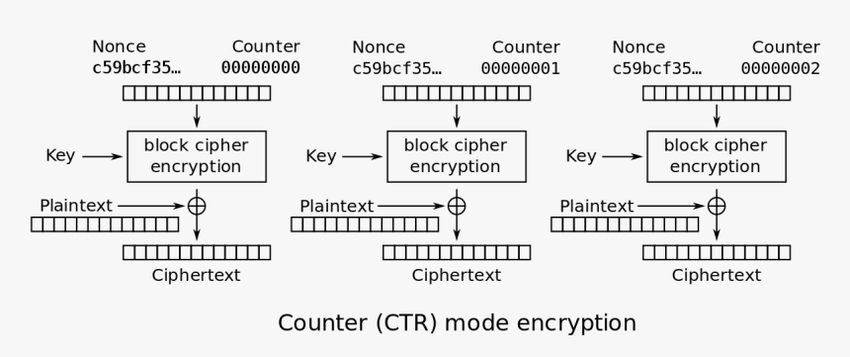

<font size='5'>Traces</font>

​	4<sup>th</sup> March 2025

​	Prepared By: `rasti`

​	Challenge Author: `rasti`

​	Difficulty: <font color=lightgreen>Very Easy</font>

​	Classification: Official

# Synopsis

- `Traces` is a very easy challenge that teaches players about the AES-CTR key/nonce reuse vulnerability. Due to how the protocol works, there are some known plaintext prefixes, common to each user. Knowing these prefixes and by applying the crib dragging technique, the player is able to slowly recover the entire messages and eventually get the flag.


## Description

- TBD


## Skills Required

- Basic knowledge of Python source code analysis
- Good knowledge of how the XOR operation works
- Basic knowledge of how AES works in CTR mode


## Skills Learned

- Learn how to exploit the AES-CTR key/nonce reuse vulnerability
- Learn how to apply the crib dragging technique

# Enumeration

In this challenge, we are provided with one file:

- `server.py` : The script that runs when we connect to the challenge instance.

Its source code is quite verbose so for brevity we omit pasting the entire application code here.

## Source code analysis

Let us start by printing the application help menu.

```python
def display_help(self):
    print()
    print('AVAILABLE COMMANDS:\n')
    bold('- HELP')
    print('\tDisplay this help menu.')
    bold('- JOIN #<channel> <key>')
    print('\tConnect to channel #<channel> with the optional key <key>.')
    bold('- LIST')
    print('\tDisplay a list of all the channels in this server.')
    bold('- NAMES #<channel>')
    print('\tDisplay a list of all the members of the channel #<channel>.')
    bold('- QUIT')
    print('\tDisconnect from the current server.')
```

and the main loop of the application that runs until we choose to quit.

```python
def process_input(self, inp):
    args = inp.split()
    cmd = args[0].upper() if args else None

    if cmd == 'JOIN':
        self.join_channel(args)
    elif cmd == 'LIST':
        self.list_channels()
    elif cmd == 'NAMES':
        self.list_channel_members(args)
    elif cmd == 'HELP':
        self.display_help()
    elif cmd == 'QUIT':
        ok('[!] Thanks for using MiniIRC.')
        return True
    else:
        err('[-] Unknown command.')

server = MiniIRCServer('irc.hackthebox.eu', 31337)

exit_ = False
while not exit_:
    menu()
    inp = input('> ')
    exit_ = server.process_input(inp)
    if exit_:
        break
```

This application is a minimal implementation of the famous IRC protocol which supports only a few basic commands.

The interesting commands are `LIST`, `NAMES` and `JOIN`.

The `list` command, as the name implies, lists all the channels in this server.

```python
def list_channels(self):
    bold(f'\n{"*"*10} LIST OF AVAILABLE CHANNELS {"*"*10}\n')
    for i, channel in enumerate(CHANNELS.keys()):
        ok(f'{i+1}. #{channel}')
    bold('\n'+'*'*48)
```

The `names` command accepts a channel name as argument and lists the members of this channel, unless it is a private channel that requires key to join.

```python
def list_channel_members(self, args):
    channel = args[1] if len(args) == 2 else None

    if channel not in CHANNEL_NAMES:
        err(f':{self.host} 403 guest {channel} :No such channel')
        return

    is_private = CHANNELS[channel[1:]]['requires_key']
    if is_private:
        err(f':{self.host} 401 guest {channel} :Unauthorized! This is a private channel.')
        return

    bold(f'\n{"*"*10} LIST OF MEMBERS IN {channel} {"*"*10}\n')
    members = CHANNEL_NAMES[channel]
    for i, nickname in enumerate(members):
        print(f'{i+1}. {nickname}')
    bold('\n'+'*'*48)
```

Finally, the `join` command accepts two arguments; one mandatory, which is the channel to join and an optional one which is the channel's authentication key, in case it is a private channel.

Below the code for the `join` command is provided.

```python
def output_message(self, msg):
    enc_body = self.encrypt(msg.encode()).hex()
    print(enc_body, flush=True)
    sleep(0.001)

def encrypt(self, msg):
		encrypted_message = AES.new(self.key, AES.MODE_CTR, counter=Counter.new(128)).encrypt(msg)
		return encrypted_message
    
def join_channel(self, args):
    channel = args[1] if len(args) > 1 else None

    if channel not in CHANNEL_NAMES:
        err(f':{self.host} 403 guest {channel} :No such channel')
        return

    key = args[2] if len(args) > 2 else None

    channel = channel[1:]
    requires_key = CHANNELS[channel]['requires_key']
    channel_key = CHANNELS[channel]['key']

    if (not key and requires_key) or (channel_key and key != channel_key):
        err(f':{self.host} 475 guest {channel} :Cannot join channel (+k) - bad key')
        return

    for message in MESSAGES[channel]:
        timestamp = message['timestamp']
        sender = message['sender']
        print(f'{timestamp} <{sender}> : ', end='')
        self.output_message(message['body'])

    while True:
        warn('You must set your channel nickname in your first message at any channel. Format: "!nick <nickname>"')
        inp = input('guest > ').split()
        if inp[0] == '!nick' and inp[1]:
            break

    channel_nickname = inp[1]
    while True:
        timestamp = datetime.now().strftime('%H:%M')
        msg = input(f'{channel_nickname} > ')
        if msg == '!leave':
            break
```

Most of this code is just validity checks which we can safely ignore for the time being.

- There is a loop that iterates over all messages of the selected channel and displays each of these messages in *encrypted* form. Each message is encrypted with AES-256 in CTR mode.
- Then, each user is asked to provide their channel nickname by entering a message in the format `!nick <nickname>`. As we will see, this format will be crucial for our exploitation process.
- Finally, the user is prompted to enter their message until they type `!leave`. In this case, they leave the channel and go back to the main menu.

# Solution

Let us try connecting to the server and listing all the available channels:

```bash
$ nc localhost 1337

***************************************************************************************************
*                                🏰 Welcome to EldoriaNet v0.1! 🏰                                *
*            A mystical gateway built upon the foundations of the original IRC protocol 📜        *
*          Every message is sealed with arcane wards and protected by powerful encryption 🔐      *
***************************************************************************************************

> list

********** LIST OF AVAILABLE CHANNELS **********

1. #general
2. #secret

************************************************
```

If we attempt to join in the secret channel, we get:

```bash
> join #secret 
:irc.hackthebox.eu 475 guest secret :Cannot join channel (+k) - bad key
```

which indicates that it is a key-protected channel. Let us join the general channel and see the encrypted messages.

```bash
> join #general
[23:30] <Doomfang> : 7781fc1822a4a912b960049d00aa
[23:32] <Stormbane> : 7781fc1822a4be09b97f0f9e0fa310
[23:34] <Runeblight> : 7781fc1822a4bf08b868009007aa1d35
[00:00] <Stormbane> : 018ab20d2ca48a12a22d03dc00a802612e33f507bf3af6ca63e0993016d17a24a27e525251cbb128073acf4f5b9471e4bbde9b691ae87211e6beaee07132d138a50c
[00:01] <Doomfang> : 0381f11e3bf79912b9694cdc26ac06612e32e055bb78fbda72aecd391d882832a97c5001108ddd391b78d14f429473e6f4c49e7254ec3a03fbf0bdf7382bc53ee04e2d47f7c5943ae80ae8
... <REDACTED> ...
[00:12] <Stormbane> : 018ab51828eaca09f67903970bed142f237af74ead33ea91378c882c5482282da57a48445f9f9524003ddf07519f7af1f7918c7e5ce46815b2eab6f76164c43ea1412714f696d7
[00:13] <Doomfang> : 1788e71e2ce0c35d9b6214994eac192d7a2ee44bb52bb9cb78e0993016d17833a96d5f551acb8f221c70924f62847af1f9dd877c52ff3650e2f2bbf36b21902fac472d46a3919130be03b82c6fe237cd2617f0
[00:14] <Runeblight> : 0381f11e3bf79912b9694cdc27ea18613e33f644b136f7da74b4843614d1662eb7351e6819cb892516649c07518771b4e8d48b751afe695cb2e9bbb27531c338e0462547e2958930ff1df72271af3acc3d13aa91e05e79
[00:53] <Doomfang> : 7783f01a3fe1
[00:53] <Stormbane> : 7783f01a3fe1
[00:53] <Runeblight> : 7783f01a3fe1
You must set your channel nickname in your first message at any channel. Format: "!nick <nickname>"
guest >
```

We notice something odd. Even though the messages are encrypted with AES-CTR, the three last messages and the first half of the first three messages are identical. Let us recall how AES-CTR works.



The ciphertext is obtained as:
$$
C_0 = P_0 \oplus E_K(\text{Nonce || CTR0})\\
C_1 = P_1 \oplus E_K(\text{Nonce || CTR1})\\
\vdots\\
C_n = P_N \oplus E_K(\text{Nonce || CTRN})
$$
In other words, the ciphertext and the plaintext are linearly related with a XOR operation. In this challenge, the key $K$, the nonce $\text{Nonce}$ and the counter $\text{CTRi}$  are reused for each message. This means that $E_K(\text{Nonce || CTRi})$ is the XOR keystream and is reused per message which leads to the following:
$$
C_0 = P_0 \oplus K\\
C_1 = P_1 \oplus K\\
\\
C_0 \oplus C_1 = P_0 \oplus P_1
$$
As a result, XORing the ciphertexts together leads to a linear relation of the corresponding plaintexts which might eventually leak information about the individual messages. At this point, knowing $l$ bytes of $P_0$ results in knowledge of $l$ bytes of $P_1$. This is where the known prefix `!nick <nickname>` comes useful. By listing the nicknames of the general channel, we see that they are `Doomfang`, `Stormbane` and `Runeblight`. We know for each user, that their first message has this specific prefix so we can go ahead hardcoding $P_2 = \text{!nick Runeblight}$. Then, we can use this to get the first few bytes of all the other messages. Assuming the messages are written in the English language, we can slowly make sense of the rest of the messages based on the context, the grammar and the spelling. This technique is known as **Crib Dragging**.

# Exploitation

Let us go ahead and retrieving the encrypted messages of the general channel.

```python
if len(sys.argv) > 1:
    host, port = sys.argv[1].split(':')
    io = remote(host, port, level='debug')
else:
    io = process(['python', 'challenge/server.py'], level='debug')

io.sendlineafter(b'> ', b'join #general')
raw_response = io.recvuntil(b'guest > ').strip().decode()
enc_data = list(map(bytes.fromhex, re.findall(r'[\da-f]{6,}', raw_response)))
```

Now, for convenience, let us write a function named `xor_all` that essentially does the following:
$$
P_i = P_o \oplus C_o \oplus C_i
$$
for given $o$ and $0 \leq i < L$, where $L$ the number of messages.

```python
def xor_all(known, off):
    for i, enc in enumerate(enc_data):
        mn = min(len(enc_data[off]), len(enc), len(known))
        print(i, xor(enc_data[off], enc, known)[:mn])

known = b'!nick Runeblight'
xor_all(known, 2)
```

Running this code for the known prefix `!nick Runeblight`, we get:

```
0 b'!nick Doomfang'
1 b'!nick Stormbane'
2 b'!nick Runeblight'
3 b"We've got a new "
4 b'Understood. Has '
5 b"Not yet, but I'm"
6 b'This channel is '
7 b'Here is the pass'
8 b'Got it. Only sha'
9 b'Yes. Our last mo'
10 b"I'm checking our"
11 b'Keep me updated.'
12 b"I'll compare the"
13 b'If everything is'
14 b"Hold on. I'm see"
15 b"We can't take an"
16 b'Agreed. Move all'
17 b"Understood. I'm "
18 b'!leave'
19 b'!leave'
20 b'!leave'
```

After applying the crib dragging a few times, we obtain the following messages:

```
0 b'!nick Doomfang'
1 b'!nick Stormbane'
2 b'!nick Runeblight'
3 b"We've got a new tip about the rebels. Let's keep our chat privat"
4 b'Understood. Has there been any sign of them regrouping since our'
5 b"Not yet, but I'm checking some unusual signals. If they sense us"
6 b"This channel is not safe for long talks. Let's switch to our pri"
7 b'Here is the passphrase for our secure channel: %mi2gvHHCV5f_kcb='
8 b'Got it. Only share it with our most trusted allies.'
9 b'Yes. Our last move may have left traces. We must be very careful'
10 b"I'm checking our logs to be sure no trace of our actions remains"
11 b"Keep me updated. If they catch on, we'll have to act fast."
12 b"I'll compare the latest data with our backup plan. We must erase"
13 b'If everything is clear, we move to the next stage. Our goal is w'
14 b"Hold on. I'm seeing strange signals from outside. We might be wa"
15 b"We can't take any risks. Let's leave this channel before they tr"
16 b'Agreed. Move all talks to the private room. Runeblight, please c'
17 b"Understood. I'm disconnecting now. If they have seen us, we must"
18 b'!leave'
19 b'!leave'
20 b'!leave'
```

The message with id `7` looks interesting as it contains a secret passphrase which turns out to be the secret key for the `secret` channel. By joining the secret channel, we see another list of encrypted messages.

```
> join #secret <REDACTED_KEY>
[00:10] <Doomfang> : 62adfdaadb4f8740c1d79d39c569
[00:12] <Stormbane> : 62adfdaadb4f905bc1c8963aca602d
[00:14] <Runeblight> : 62adfdaadb4f915ac0df9934c2692068
[00:26] <Runeblight> : 14a6b4bad800b643ca9a903dce7e68735b902ada822b54494bb7c98513360a49719f2586d0c5377ab8cfa63a1b4bb763f31eedc1491549fea5141280e2e7ff00799e5093cfd53f21b8b9b0b9d9be3c04f93aba7d4a4304f4fc9168ea03c2fcaed4833a31ad11cafcad552002

... <REDACTED> ...

[01:09] <Runeblight> : 62aff1a8c60a
[01:09] <Stormbane> : 62aff1a8c60a
[01:09] <Doomfang> : 62aff1a8c60a
You must set your channel nickname in your first message at any channel. Format: "!nick <nickname>"
guest >
```

Repeating the same process as before, we reach at a point where we have the following messages in plaintext:

```
0 b'!nick Doomfang'
1 b'!nick Stormbane'
2 b'!nick Runeblight'
3 b'We should keep our planning here. The outer halls are not secure, and too many eyes watch the open channels.'
4 b"Agreed. The enemy's scouts grow more persistent. If they catch even a whisper of our designs, they will move against us. We must not allow their "
5 b"I've been studying the traces left behind by our previous incantations, and something feels wrong. Our network of spells has sent out signals to "
6 b"I'm already cross-checking our spellwork against the ancient records. If this beacon was part of an older enchantment, I'll find proof. But if it"
7 b"We cannot afford hesitation. If this is a breach, then the High Council's forces may already be on our trail. Even the smallest mistake could doo"
8 b'Exactly. And even if we remain unseen for now, we need contingency plans. If the Council fortifies its magical barriers, we could lose access to '
9 b'Yes, but we must treat it only as a last resort. If we activate it too soon, we risk revealing its location. It is labeled as: HTB{Crib_Dragging_'
10 b'Good. No record of it must exist in the written tomes. I will ensure all traces are erased, and it shall never be spoken of openly. If the enemy '
11 b'Agreed. The more we discuss it, the greater the risk. Every moment we delay, the Council strengthens its defenses. We must act soon before our wi'
12 b'We should end this meeting and move to a more secure sanctum. If their mages or spies are closing in, they may intercept our words. We must not t'
13 b'!leave'
14 b'!leave'
15 b'!leave'
```

The message with id `9` contains the flag and after several applications of the technique, we are able to decrypt the entire ciphertext.

## Getting the flag

1. We noticed that the messages are encrypted with AES-256 in CTR mode.
2. From the patterns identified in the ciphertexts, we understand that something is wrong with the message encryption process.
3. More specifically, the AES key and the nonce/ctr are reused which leads to the same XOR keystream being applied.
4. This leads to a AES-CTR key/nonce reuse vulnerability.
5. The crib dragging technique can be applied to initially obtain the key for the secret channel.
6. After joining the secret channel we reapply the same technique to decrypt the secret messages; one of which contains the flag.

 
