 <font size='10'>Silent Trap</font>

24<sup>th</sup> Feb 2025

Prepared By: bquanman

Challenge Author(s): bquanman

Difficulty: <font color=green>Easy</font>

Classification: Official

# Synopsis

An easy forensics challenge involving the analysis of a malware that uses mailbox as its command and control (C2) server.

## Description

A critical incident has occurred in Tales from Eldoria, trapping thousands of players in the virtual world with no way to log out. The cause has been traced back to Malakar, a mysterious entity that launched a sophisticated attack, taking control of the developers' and system administrators' computers. With key systems compromised, the game is unable to function properly, which is why players remain trapped in Eldoria. Now, you must investigate what happened and find a way to restore the system, freeing yourself from the game before it's too late.

## Skills Required

* Basic IMAP protocol
* Email/Network Forensics
* Reverse dotnet executable

## Skills Learned

* IMAP authentication, IMAP commands
* Examining network traffic to retrieve essential data
* Applying AES decryption methods to uncover attacker activities

# Enumeration

### [1/6]. What is the subject of the first email that the victim opened and replied to?

A preliminary analysis of the PCAP file shows that the majority of captured packets are **TCP communications** between two IP addresses: **192.168.91.173** and **192.168.91.133**. The IP **192.168.91.173** corresponds to the **mail server (mail.korptech.net)**, while **192.168.91.133** is likely associated with the victim's computer.

Follow the **HTTP stream** to streamline the analysis of network traffic.  

In **Stream 1**, all emails currently present in the victim's **INBOX** are exposed, offering crucial insight into their email communications.

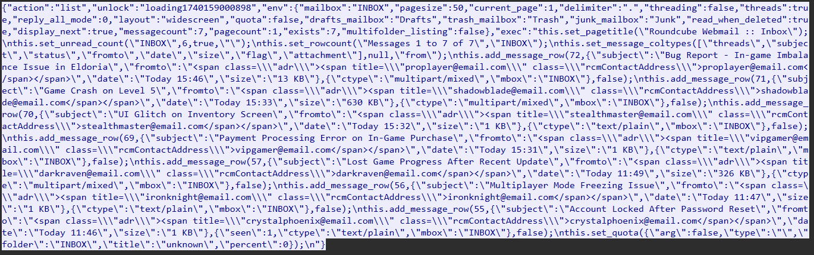

**Stream 4** indicates that the victim is previewing an email with the subject **"Game Crash on Level 5."** The email appears to be a **support request** from a player named **ShadowBlade**.
Saving the aforementioned content in an **HTML file** improves readability and enhances visual organization.

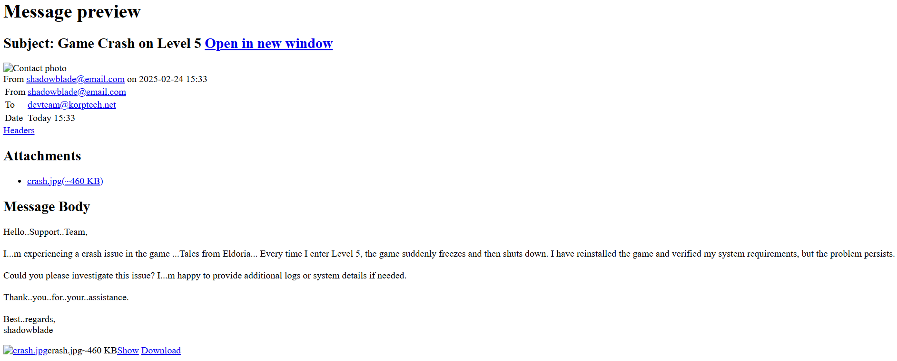

The following streams reveal the process of drafting a reply email to the player **ShadowBlade**.  

As a result, the answer to the first question is: **"Game Crash on Level 5."**

### [2/6]. On what date and time was the suspicious email sent?

The content of **Stream 8** indicates that the victim previewed the next email, which included an attachment named **Eldoria_Balance_Issue_Report.zip**.

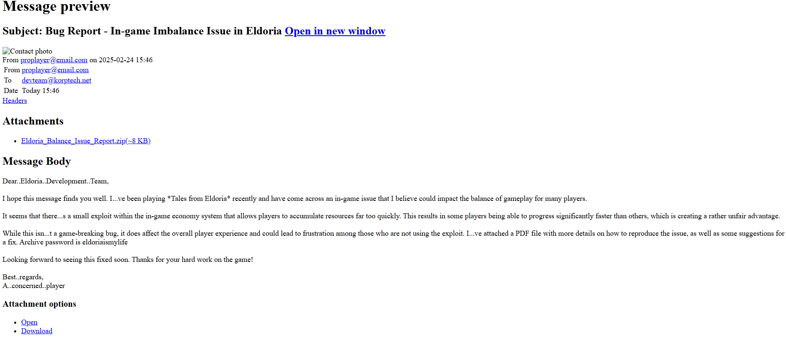

Stream 12 includes the request to download the aforementioned file.

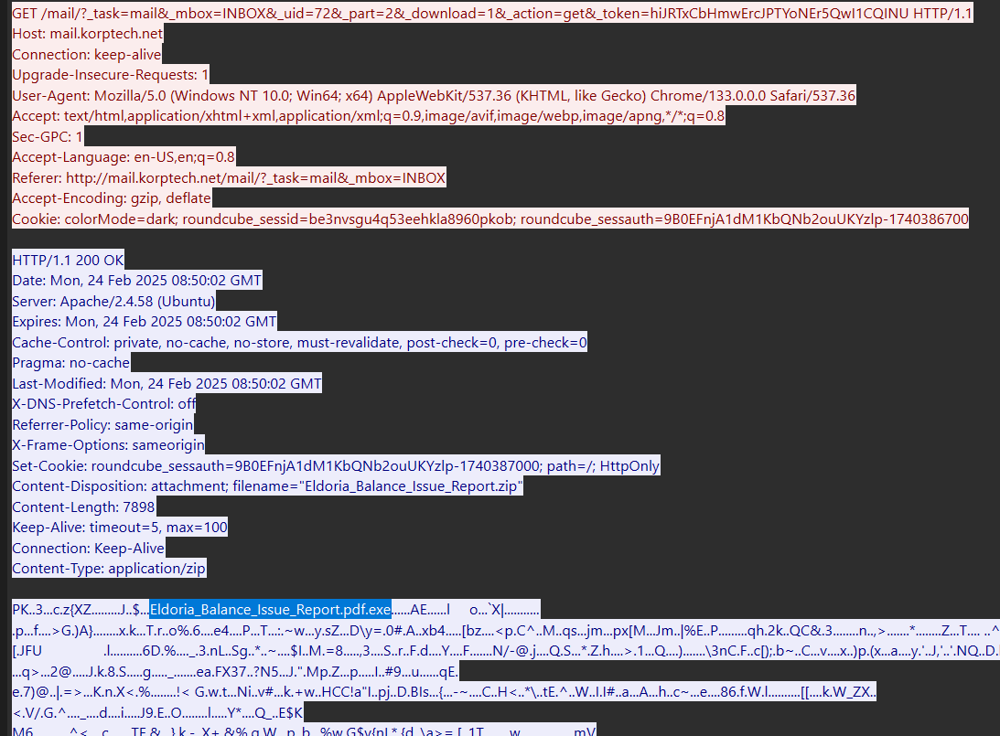

Inside the archive, there is a file named **Eldoria_Balance_Issue_Report.pdf.exe**, which employs a **file extension masquerading technique**. This tactic disguises the executable file as a **PDF document**, making the email attachment highly suspicious.

The **timestamp** of this email in the mailbox is **`2025-02-24_15:46`**, which serves as the answer to the **second question**.

### [3/6]. What is the MD5 hash of the malware file?

Extract the **archive file** from the **PCAP** and **unzip it** using the password **`eldoriaismylife`**, which was provided in the email.  

This process allows us to **easily retrieve the malware file** and compute its **hash** for further analysis.

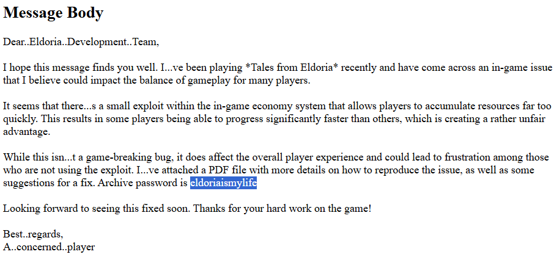

```bash
$ md5sum Eldoria_Balance_Issue_Report.pdf.exe
c0b37994963cc0aadd6e78a256c51547  Eldoria_Balance_Issue_Report.pdf.exe
```

### [4/6]. What credentials were used to log into the attacker's mailbox?

The following packets primarily consist of **IMAP protocol traffic**.  

To fully understand this activity, we first need to **analyze the malware file** that was attached to the email—**the same file the victim downloaded and executed**. This analysis will help determine its impact and potential communication with the mail server.

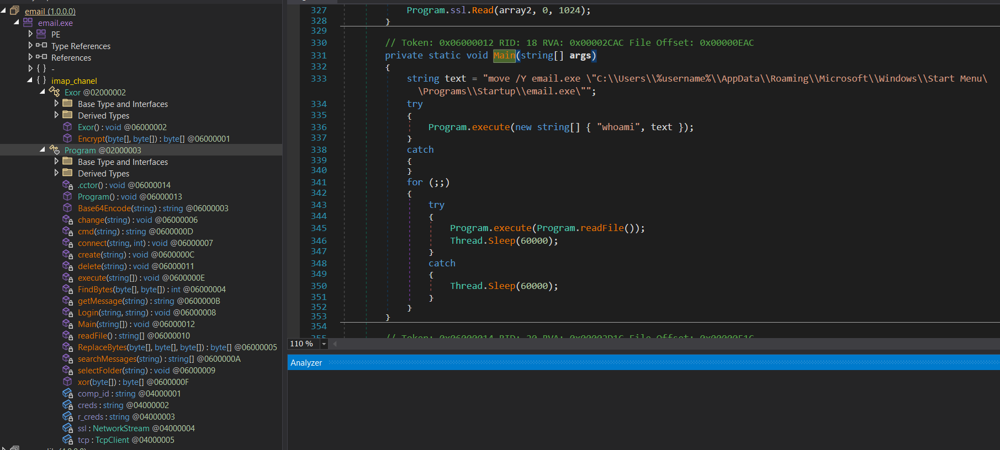

The program is **compact** and structured in a **clear format**, making it relatively straightforward to analyze.  

It consists of **two classes**, which will be examined to understand their functionality and role within the malware.

- `Exor`: Handles XOR encryption/decryption, actually RC4.
- `Program`: Executes the main functionality of the program.

Some **key functions** that require analysis include:  

- **IMAP-related operations** – Investigating how the program interacts with the mail server.  
- **Remote command execution** – Understanding how the malware may execute commands remotely.  

Analyzing these functions will help determine the malware's capabilities.

- `connect`: Establishes a connection to the IMAP server on port 143.
- `Login`: Logs into the email account using the **LOGIN** command
- `searchMessages`: Searches for emails with a subject containing a specific string to find emails that contain commands to be executed.
- `getMessage`: Retrieves the content of an email based on its UID to download, decrypt, and execute its contents.
- `create`: Creates a new email to send the results of the executed command, used to return the output to the IMAP server.
- `cmd`: Executing a system command using Command Prompt.
- `execute`: Fetches commands from an email, executes them on the system, and sends back the results encoded in Base64 with XOR (RC4) encryption.
- `readFile`: Connect to the IMAP server on port 143, log in to the email account using the provided credentials, select a folder (Drafts or INBOX.Drafts), find the email with an ID matching comp_id, decrypt the email content (Base64 + RC4).
- `xor`: contains RC4 key

The execution flow is the following:

1. **Login to Email Account** – The program authenticates using **hardcoded credentials**.  
2. **Scan Drafts Folder** – It searches for **emails containing encrypted execution commands**.  
3. **Decrypt and Execute Commands** – The extracted commands are **decrypted and executed** on the victim’s machine via **cmd**.  
4. **Send Results Back** – The execution results are **encrypted** and sent back via **email** to a **preconfigured address**.  

This workflow allows the attacker to **remotely execute commands** on the compromised system while maintaining **stealthy communication** through email drafts.

Whenever the attacker wants to execute a remote command on the victim's machine, they simply create an email with a specific subject, insert the encrypted command in the body, and save it in Draft folder. The malware will then process the command and return the results to the attacker's mailbox.

The credentials hardcoded in the program's source code are:

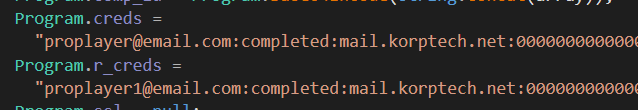

Additionally, you can also find it in the network packets. Although, certain Wireshark versions contain a bug where credentials are not correctly parsed in specific preview windows.

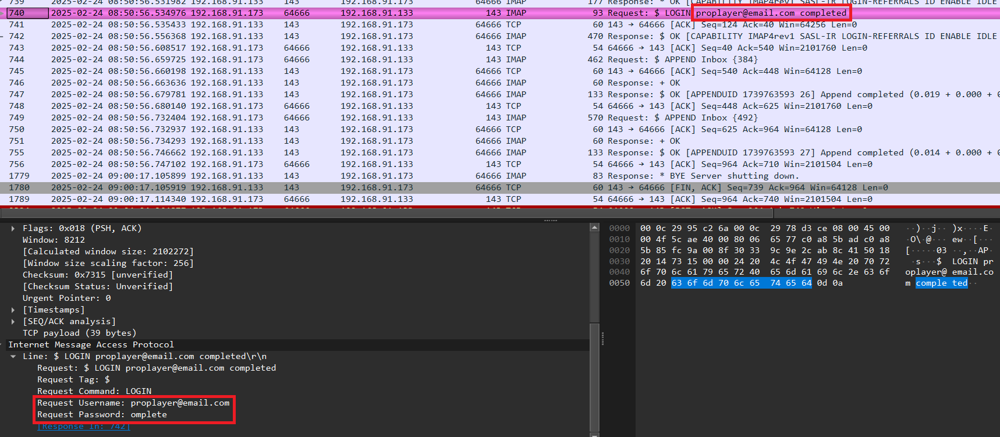

=> Answer: `proplayer@email.com:completed`

### [5/6]. What is the name of the task scheduled by the attacker?

To answer this question, we need to decrypt the commands and responses extracted from the malware’s communication.

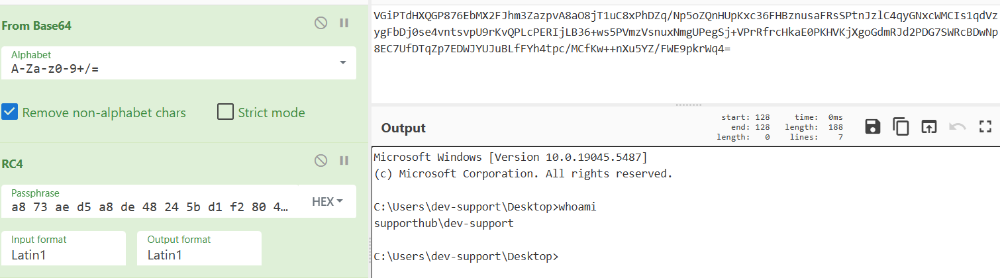

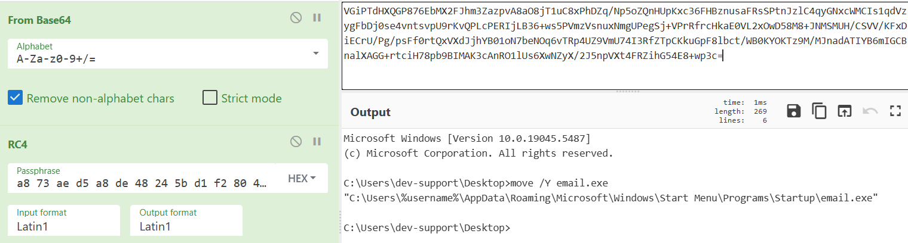

The first two **decrypted commands** are identical to the **initial execution commands** embedded in the malware’s **source code**. These commands are automatically executed when the victim’s computer is first **infected**, likely serving as part of the malware’s **initial setup** or persistence mechanism.

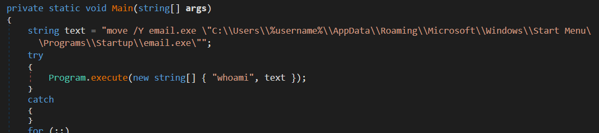

Some of the subsequent commands issued by the attacker were used for system exploration, likely to gather information about the compromised machine.

By TCP Stream 35, the decrypted data reveals the creation of a scheduled task named "Synchronization".

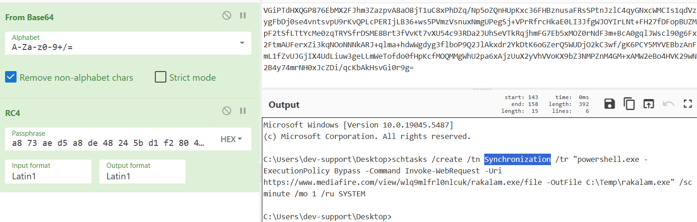

The URL is no longer active, preventing us from determining **exactly** what was downloaded onto the victim's system. However, based on the malware's behavior, it is likely that the downloaded file served as **another persistence mechanism**.

=> `Synchronization`

### [6/6]. What is the API key leaked from the highly valuable file discovered by the attacker?

The attacker then attempted to search for sensitive information using the commands: `dir C:\ /s /b | findstr "password"` and `dir C:\ /s /b | findstr "credential"`.

Finally, upon discovering the credentials file, the attacker managed to steal the API key stored within it.

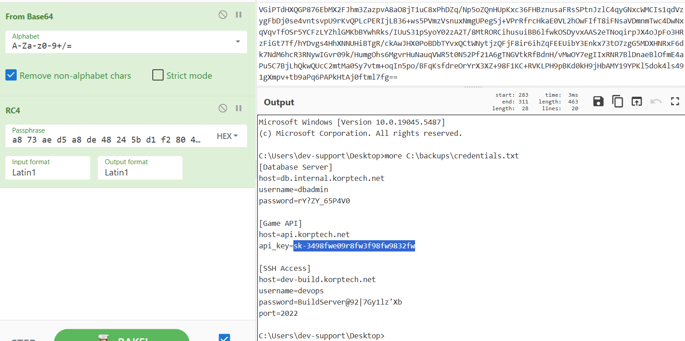

=> Answer: `sk-3498fwe09r8fw3f98fw9832fw`.