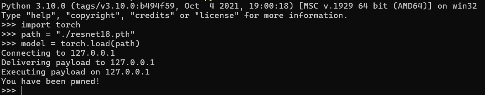
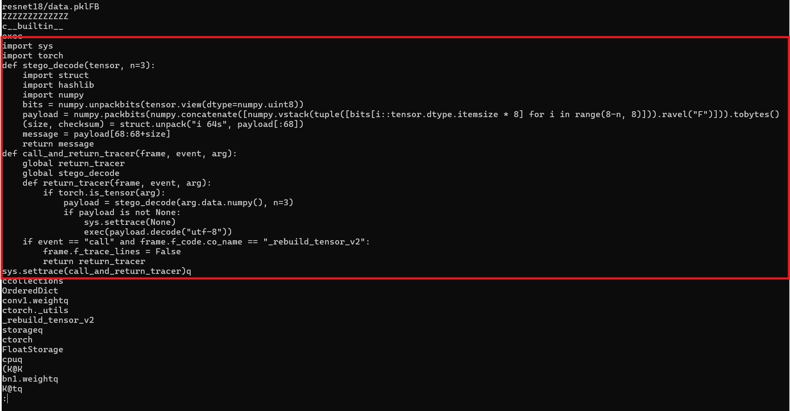
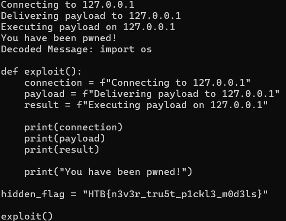

# Crystal Corruption


## Description
* In the Library of Loria, an ancient crystal (resnet18.pth) containing a magical machine learning model was activated. Unknown to the mage who awakened it, the artifact had been tampered with by Malakar’s followers, embedding malicious enchantments. As Eldoria’s forensic mage, analyze the corrupted model file, uncover its hidden payload, and extract the flag to dispel the dark magic.

## Objective
* In this challenge, you are given a seemingly innocent machine learning model file, `resnet18.pth`. However, loading the model triggers suspicious activities. Your task is to analyze the model, understand the hidden mechanics, and extract the embedded payload to discover the flag.
  
## Difficulty
* `Medium`

## Flag
* `HTB{n3v34_tru5t_p1ckl3_m0d3ls}`

## Challenge
* The challenge begins with a machine learning model file named `resnet18.pth`. When loaded with `torch.load`, the model executes a script that performs suspicious activities, hinting at a steganography or backdoor implementation within the model. On further analysis you discover embedded pickle injection code within the model that interacts suspiciously with the model's data layers. This leads you to suspect that the model has been tampered with to include hidden payloads.


## Solver

### Step 1: Loading and Examination

I used `torch.load` to load the model:



We can see code execution upon model loading. 
There are many issues about pickle file vulnerabilities specific to Python, where deserializing can execute arbitrary code embedded within the file. This type of attack was detailed in a blog post by Trail of Bits, which discussed [exploiting machine learning models through pickle file attacks](https://blog.trailofbits.com/2024/06/11/exploiting-ml-models-with-pickle-file-attacks-part-1/). This background gave me the idea that the model might have a malicious payload hidden inside.

### Step 2: Analyzing the Model

After safely loading the model, my next move was to analyze the structure and contents of the model file. Running `strings` on the binary revealed suspicious strings that seemed like remnants of a pickle injection attack, prompting further investigation into the of the model.



### Step 3: Decoding the Hidden Message

Assuming that a steganographic technique was used to embed data into the model's layers, I decided to focus on extracting data from the tensor's least significant bits. Here’s the approach I took:

1. **Extract tensor data**: Iterate through each parameter tensor in the model.
2. **Bit manipulation**: For each tensor, convert the tensor data to its binary form and attempt to extract hidden bits.
3. **Reassemble and decode**: Reconstruct the extracted bits into bytes and attempt to decode them into a readable format.

Here's the Python code that demonstrates this process:

```

import numpy as np

def stego_decode(tensor, n=3):
    # Convert tensor data to numpy array for manipulation
    tensor_np = tensor.numpy()
    bits = np.unpackbits(tensor_np.view(dtype=np.uint8))

    # Extract the least significant bits
    payload_bits = np.concatenate([bits[i::tensor_np.dtype.itemsize * 8] for i in range(8-n, 8)])

    # Reassemble bits into bytes
    payload_bytes = np.packbits(payload_bits).tobytes()

    try:
        # Attempt to decode the bytes into a string
        decoded_message = payload_bytes.decode('utf-8')
        print("Decoded Message:", decoded_message)
    except UnicodeDecodeError:
        print("Failed to decode payload.")

# Applying the decoding function to each tensor in the model
for name, param in model.items():
    print(f"Decoding data from tensor: {name}")
    stego_decode(param)

```

The output:



Executing the above script revealed some strings that seemed to be the script. Upon closer examination, it was a simple Python script designed to mimic an attack by printing "You have been pwned!" This confirmed the suspicion of a malicious payload hidden within the model.

The flag is `HTB{n3v34_tru5t_p1ckl3_m0d3ls}`
