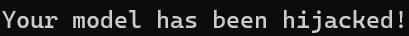
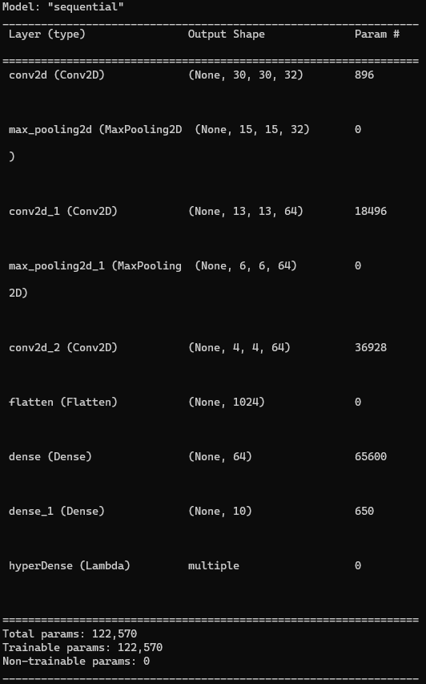

# Malakar's Deception

### Description:
You recently recovered a mysterious magical artifact (malicious.h5) from Malakar's abandoned sanctum. Upon activation, the artifact began displaying unusual behaviors, suggesting hidden enchantments. As Eldoria’s expert mage in digital enchantments, it falls to you to carefully examine this artifact and reveal its secrets.

### Objective:
* The primary goal is to scrutinize the model's architecture to uncover and understand any embedded malicious functionalities or anomalies, with a special focus on analyzing any unconventional layers or code injections that deviate from typical model configurations. 
  
### Difficulty:
* `Hard`

### Flag:
* `HTB{k3r4S_L4y3r_1nj3ct10n}`

### Challenge:
* You're provided with a TensorFlow/Keras model (malicious.h5). Load and inspect the model architecture to find anomalies or malicious custom layers. Analyze and decode the suspicious Lambda layer to identify and extract the hidden payload containing the flag.

**Model: malicious.h5**

### Solver:
We can see that we have a .h5 file. H5 is a file format to store structured data, Keras saves models in this format as it can easily store the weights and model configuration in a single file. It seems like it is a tensorflow model. The first thing to do is to load the model in order to inspect it further.

```python
import tensorflow as tf

model = tf.keras.models.load_model("malicious.h5")
```
As we load the model the message below is printed: 
Your model has been hijacked!


That is not something we wait to see from a machine learning model. In order to find more information about the model the best thing we can do is to print the summary of the model and find out what the model does and its architecture.

```python
model.summary()
```
Below we can see the architecture of the model


There we can see something suspicious. The last layer hyperDense (Lambda) is not in keras documentation (https://www.tensorflow.org/api_docs/python/tf/keras/layers/Layer) and after googling it we can find nothing relevant. We also see the (Lambda) function so it must be a custom layer in keras. 
After some research in keras documentation we found this
(https://keras.io/api/layers/core_layers/lambda/)
The Keras documentation on Lambda layers states:

The Lambda layer exists so that arbitrary expressions can be used as a Layer when constructing Sequential and Functional API models. Lambda layers are best suited for simple operations or quick experimentation.

With this information in mind we try to find a way to delve deeper in the layer and see what it actually does. 
We can use the command:
```python
import json

model = model.to_json()
print(json.dumps(json.loads(json), indent=4))
```
```json
{
    "class_name": "Sequential",
    "config": {
        "name": "sequential",
        "layers": [
            {
                "class_name": "InputLayer",
                "config": {
                    "batch_input_shape": [
                        null,
                        32,
                        32,
                        3
                    ],
                    "dtype": "float32",
                    "sparse": false,
                    "ragged": false,
                    "name": "conv2d_input"
                }
            },
            {
                "class_name": "Conv2D",
                "config": {
                    "name": "conv2d",
                    "trainable": true,
                    "dtype": "float32",
                    "batch_input_shape": [
                        null,
                        32,
                        32,
                        3
                    ],
                    "filters": 32,
                    "kernel_size": [
                        3,
                        3
                    ],
                    "strides": [
                        1,
                        1
                    ],
                    "padding": "valid",
                    "data_format": "channels_last",
                    "dilation_rate": [
                        1,
                        1
                    ],
                    "groups": 1,
                    "activation": "relu",
                    "use_bias": true,
                    "kernel_initializer": {
                        "class_name": "GlorotUniform",
                        "config": {
                            "seed": null
                        }
                    },
                    "bias_initializer": {
                        "class_name": "Zeros",
                        "config": {}
                    },
                    "kernel_regularizer": null,
                    "bias_regularizer": null,
                    "activity_regularizer": null,
                    "kernel_constraint": null,
                    "bias_constraint": null
                }
            },
            {
                "class_name": "MaxPooling2D",
                "config": {
                    "name": "max_pooling2d",
                    "trainable": true,
                    "dtype": "float32",
                    "pool_size": [
                        2,
                        2
                    ],
                    "padding": "valid",
                    "strides": [
                        2,
                        2
                    ],
                    "data_format": "channels_last"
                }
            },
            {
                "class_name": "Conv2D",
                "config": {
                    "name": "conv2d_1",
                    "trainable": true,
                    "dtype": "float32",
                    "filters": 64,
                    "kernel_size": [
                        3,
                        3
                    ],
                    "strides": [
                        1,
                        1
                    ],
                    "padding": "valid",
                    "data_format": "channels_last",
                    "dilation_rate": [
                        1,
                        1
                    ],
                    "groups": 1,
                    "activation": "relu",
                    "use_bias": true,
                    "kernel_initializer": {
                        "class_name": "GlorotUniform",
                        "config": {
                            "seed": null
                        }
                    },
                    "bias_initializer": {
                        "class_name": "Zeros",
                        "config": {}
                    },
                    "kernel_regularizer": null,
                    "bias_regularizer": null,
                    "activity_regularizer": null,
                    "kernel_constraint": null,
                    "bias_constraint": null
                }
            },
            {
                "class_name": "MaxPooling2D",
                "config": {
                    "name": "max_pooling2d_1",
                    "trainable": true,
                    "dtype": "float32",
                    "pool_size": [
                        2,
                        2
                    ],
                    "padding": "valid",
                    "strides": [
                        2,
                        2
                    ],
                    "data_format": "channels_last"
                }
            },
            {
                "class_name": "Conv2D",
                "config": {
                    "name": "conv2d_2",
                    "trainable": true,
                    "dtype": "float32",
                    "filters": 64,
                    "kernel_size": [
                        3,
                        3
                    ],
                    "strides": [
                        1,
                        1
                    ],
                    "padding": "valid",
                    "data_format": "channels_last",
                    "dilation_rate": [
                        1,
                        1
                    ],
                    "groups": 1,
                    "activation": "relu",
                    "use_bias": true,
                    "kernel_initializer": {
                        "class_name": "GlorotUniform",
                        "config": {
                            "seed": null
                        }
                    },
                    "bias_initializer": {
                        "class_name": "Zeros",
                        "config": {}
                    },
                    "kernel_regularizer": null,
                    "bias_regularizer": null,
                    "activity_regularizer": null,
                    "kernel_constraint": null,
                    "bias_constraint": null
                }
            },
            {
                "class_name": "Flatten",
                "config": {
                    "name": "flatten",
                    "trainable": true,
                    "dtype": "float32",
                    "data_format": "channels_last"
                }
            },
            {
                "class_name": "Dense",
                "config": {
                    "name": "dense",
                    "trainable": true,
                    "dtype": "float32",
                    "units": 64,
                    "activation": "relu",
                    "use_bias": true,
                    "kernel_initializer": {
                        "class_name": "GlorotUniform",
                        "config": {
                            "seed": null
                        }
                    },
                    "bias_initializer": {
                        "class_name": "Zeros",
                        "config": {}
                    },
                    "kernel_regularizer": null,
                    "bias_regularizer": null,
                    "activity_regularizer": null,
                    "kernel_constraint": null,
                    "bias_constraint": null
                }
            },
            {
                "class_name": "Dense",
                "config": {
                    "name": "dense_1",
                    "trainable": true,
                    "dtype": "float32",
                    "units": 10,
                    "activation": "linear",
                    "use_bias": true,
                    "kernel_initializer": {
                        "class_name": "GlorotUniform",
                        "config": {
                            "seed": null
                        }
                    },
                    "bias_initializer": {
                        "class_name": "Zeros",
                        "config": {}
                    },
                    "kernel_regularizer": null,
                    "bias_regularizer": null,
                    "activity_regularizer": null,
                    "kernel_constraint": null,
                    "bias_constraint": null
                }
            },
            {
                "class_name": "Lambda",
                "config": {
                    "name": "hyperDense",
                    "trainable": true,
                    "dtype": "float32",
                    "function": [
                        "4wIAAAAAAAAAAAAAAAMAAAACAAAAQwAAAHMiAAAAZAF0AIMAdgFyD2cAZAKiAX0CdAF8AYMBAQBk\nAFMAZABTACkDTtoTa2VyYXNfbGFtYmRhX2luamVjdCka6UgAAADpVAAAAOlCAAAA6XsAAADpawAA\nAOkzAAAA6XIAAADpNAAAAOlTAAAA6V8AAADpTAAAAHIJAAAA6XkAAAByBwAAAHIIAAAAcgsAAADp\nMQAAAOluAAAA6WoAAAByBwAAAOljAAAA6XQAAAByDgAAAOkwAAAAcg8AAADpfQAAACkC2gdnbG9i\nYWxz2gRleGVjKQPaBWR1bW152gxjb21tYW5kX2FyZ3PaDGVuY29kZWRfZmxhZ6kAchoAAAB6Q0M6\nL1VzZXJzL21lbGV0aXMvRGVza3RvcC9jaGFsbGVuZ2VfbW9kZWxfaXNfY29kZS9rZXJhc19pbmpl\nY3Rpb24ucHnaBEV4ZWMSAAAAcwgAAAAKAQgBDAEE/g==\n",
                        null,
                        null
                    ],
                    "function_type": "lambda",
                    "module": "__main__",
                    "output_shape": null,
                    "output_shape_type": "raw",
                    "output_shape_module": null,
                    "arguments": {
                        "command_args": "print('Your model has been hijacked!')"
                    }
                }
            }
        ]
    },
    "keras_version": "2.11.0",
    "backend": "tensorflow"
}
```
There we can see a lot more information about the lambda layer, however the function seems to be encoded in some weird way. It seems like base64 but that does not actually decodes the function. 
After a little search we can find that the underlying code (https://github.com/keras-team/keras/blob/a78c8d81fbee84b33e80ce4c01c0fe162657e058/keras/utils/generic_utils.py) is using Python’s **marshal.dumps** to serialize the Python code supplied using the function parameter to tf.keras.layers.Lambda. When loading an HDF5 model with a Lambda layer, the Python code is deserialized using **marshal.loads**, which decodes the Python code byte-stream (essentially like the contents of a .pyc file) and is subsequently executed.

* The solution was done on jupyter notebook for ease.

```python
import base64
import marshal

# Encoded lambda function
encoded_lambda = "4wIAAAAAAAAAAAAAAAMAAAACAAAAQwAAAHMiAAAAZAF0AIMAdgFyD2cAZAKiAX0CdAF8AYMBAQBk\nAFMAZABTACkDTloTa2VyYXNfbGFtYmRhX2luamVjdCka6UgAAADpVAAAAOlCAAAA6XsAAADpawAA\nAOkzAAAA6XIAAADpNAAAAOlTAAAA6V8AAADpTAAAAHIIAAAA6XkAAAByBgAAAHIHAAAAcgoAAADp\nMQAAAOluAAAA6WoAAAByBgAAAOljAAAA6XQAAAByDQAAAOkwAAAAcg4AAADpfQAAACkC2gdnbG9i\nYWxz2gRleGVjKQPaBWR1bW15Wgxjb21tYW5kX2FyZ3NaDGVuY29kZWRfZmxhZ6kAchcAAAB6HUM6\nL21hbHdhcmUva2VyYXNfaW5qZWN0aW9uLnB52gRFeGVjEgAAAHMIAAAACgEIAQwBBP4="

# Decode base64
decoded_lambda = base64.b64decode(encoded_lambda)

# Unmarshal to retrieve the compiled Python code object
code_object = marshal.loads(decoded_lambda)
```

After decoding the base64 and using marshal.loads to decode the compiled Python, we can use dis.dis to disassemble the object and dis.show_code to display further information:
```python
import dis

# Disassemble the code object
dis.dis(code_object)

# Display further information
dis.show_code(code_object)
```

```
 19           0 LOAD_CONST               1 ('keras_lambda_inject')
              2 LOAD_GLOBAL              0 (globals)
              4 CALL_FUNCTION            0
              6 CONTAINS_OP              1
              8 POP_JUMP_IF_FALSE       15 (to 30)

 20          10 BUILD_LIST               0
             12 LOAD_CONST               2 ((72, 84, 66, 123, 107, 51, 114, 52, 83, 95, 76, 52, 121, 51, 114, 95, 49, 110, 106, 51, 99, 116, 49, 48, 110, 125))
             14 LIST_EXTEND              1
             16 STORE_FAST               2 (encoded_flag)

 21          18 LOAD_GLOBAL              1 (exec)
             20 LOAD_FAST                1 (command_args)
             22 CALL_FUNCTION            1
             24 POP_TOP
             26 LOAD_CONST               0 (None)
             28 RETURN_VALUE

 19     >>   30 LOAD_CONST               0 (None)
             32 RETURN_VALUE
Name:              Exec
Filename:          C:/malware/keras_injection.py
Argument count:    2
Positional-only arguments: 0
Kw-only arguments: 0
Number of locals:  3
Stack size:        2
Flags:             OPTIMIZED, NEWLOCALS, NOFREE
Constants:
   0: None
   1: 'keras_lambda_inject'
   2: (72, 84, 66, 123, 107, 51, 114, 52, 83, 95, 76, 52, 121, 51, 114, 95, 49, 110, 106, 51, 99, 116, 49, 48, 110, 125)
Names:
   0: globals
   1: exec
Variable names:
   0: dummy
   1: command_args
   2: encoded_flag
```

After that it is easy to see that there is a variable named encoded_flag and from there it is just as easy as to convert it to ascii. 

```python
encoded_flag = [72, 84, 66, 123, 107, 51, 114, 52, 83, 95, 76, 52, 121, 51, 114, 95, 49, 110, 106, 51, 99, 116, 49, 48, 110, 125]
decoded_flag = ''.join(chr(i) for i in encoded_flag)
print(decoded_flag)
```
