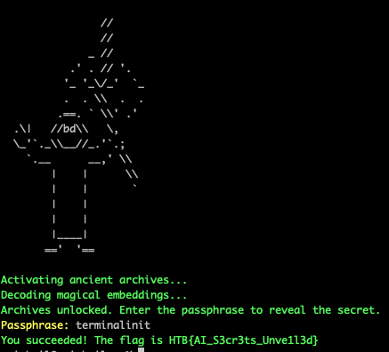

# Reverse Prompt

## Description
* A mysterious file (gtr_embeddings.npy) containing magical embeddings was found deep within ancient archives. To reveal its secret, you need to reverse-engineer the embeddings back into the original passphrase. Act quickly before the hidden magic fades away.

## Objective
* In this challenge, players are presented with a file containing encoded data and must reverse-engineer it to recover a secret passphrase. The task involves understanding and utilizing Generative AI technologies and vector embeddings to decode and retrieve hidden information. The ability to reverse embeddings poses significant risks for systems that store sensitive data in this format, thinking it is secure. If such embeddings can be decoded, it could potentially lead to data breaches if malicious actors access these vector databases.

## Difficulty
`Hard`

## Flag
`HTB{AI_S3cr3ts_Unve1l3d}`

## Challenge
* Participants are given a `.npy` file named `gtr_embeddings.npy`, which contains a tensor representing an encoded string. The encoding was performed using a transformer model from the `sentence-transformers/gtr-t5-base` and processed to generate embeddings. The challenge is to decode these embeddings back into the original text.

## Solver

### Step 1: Understanding the Challenge
Participants must first understand that the provided embeddings represent text data that has been transformed into a high-dimensional vector space. The embeddings must be decoded back into text to retrieve the original message, which contains the secret passphrase.

They have to understand how vec2text works and look at papers like this one:
`https://arxiv.org/pdf/2310.06816`

### Step 2: Loading and Decoding Embeddings
To start, participants need to set up their environment and install the necessary Python libraries, then load the embeddings and prepare them for decoding. Next using the corrector to decode the embeddings which can be tricky part as there are many correctors to choose from. The `gtr` in the name of the given file can hint that the tokenizer used to create this embedding was `gtr-t5-base`. After a little search in the library or hugging face someone can easily find the `gtr-base` corrector. 


```python
import vec2text
import torch
import numpy as np

# Load the embeddings from the file
embeddings = np.load('gtr_embeddings.npy')

# Convert the numpy array back to a PyTorch tensor and ensure it is on the GPU
embeddings_tensor = torch.from_numpy(embeddings).to('cuda')

# Load the corrector trained for the specific model used during the embedding process
corrector = vec2text.load_pretrained_corrector("gtr-base")

# Invert the embeddings to text
decoded_text = vec2text.invert_embeddings(
    embeddings=embeddings_tensor.cuda(),
    corrector=corrector,
    num_steps=40,
    sequence_beam_width=4
)
print(decoded_text)  # This should print the original secret message
```

The decoded text is something that looks like this: `['The secret passphrase is: terminalinit ']`
`Note:` Reversed text can be a little different based on the parameters of the model used. 

### Step 3: Use the Decoded Passphrase
Participants can now use the decoded passphrase to access the system via network:

Use `nc ip port`
Then enter the passphrase when prompted
`Passphrase: terminalinit`
If correct, the system will respond with:
`Congratulations! The flag is HTB{AI_S3cr3ts_Unve1l3d}`


