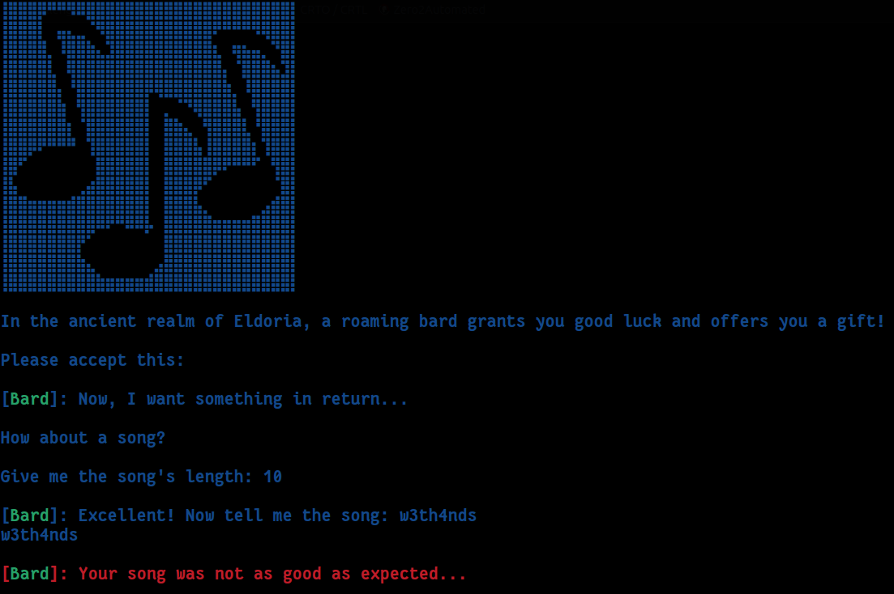

    	<font size="6">Blessing</font>

​		23<sup>th</sup> April 2023 / Document No. DYY.102.XX

​		Prepared By: w3th4nds

​		Challenge Author(s): w3th4nds

​		Difficulty: <font color=green>Easy</font>

​		Classification: Official

 


# Synopsis

Blessing is an easy difficulty challenge that features reading a leaked address, abusing `scanf("%lu")` to give a negative number, resulting in `malloc` return 0 and then satisfy the condition to get flag.

# Description

In the realm of Eldoria, where warriors roam, the Dragon's Heart they seek, from bytes to byte's home. Through exploits and tricks, they boldly dare, to conquer Eldoria, with skill and flair.

## Skills Required

- `malloc`, `scanf`

## Skills Learned

* `malloc` returns 0 when fails.

# Enumeration

First of all, we start with a `checksec`:  

```console
pwndbg> checksec
    Arch:     amd64-64-little
    RELRO:    Full RELRO
    Stack:    Canary found
    NX:       NX enabled
    PIE:      PIE enabled
    RUNPATH:  b'./glibc/'
```

### Protections 🛡️

As we can see:

| Protection | Enabled  | Usage   |
| :---:      | :---:    | :---:   |
| **Canary** | ✅      | Prevents **Buffer Overflows**  |
| **NX**     | ✅       | Disables **code execution** on stack |
| **PIE**    | ✅      | Randomizes the **base address** of the binary |
| **RelRO**  | **Full** | Makes some binary sections **read-only** |

The program's interface:



From the interface, the only thing we can get is a leak, which is not shown here as it gets deleted after 1 second. Apart from that, we cannot find an obvious bug in the program.

### Disassembly

Starting with `main()`:

```c
000015c2  int32_t main(int32_t argc, char** argv, char** envp)

000015c2  {
000015ce      void* fsbase;
000015ce      int64_t canary = *(uint64_t*)((char*)fsbase + 0x28);
000015dd      setup();
000015e2      banner();
000015e7      uint64_t length = 0;
000015f4      int64_t* rax_1 = malloc(0x30000);
00001601      *(uint64_t*)rax_1 = 1;
00001612      printstr("In the ancient realm of Eldoria,…");
0000162d      printf(&data_263a, rax_1);
00001637      sleep(1);
00001637      
0000166e      for (int64_t i = 0; i <= 0xd; i += 1)
0000166e      {
00001655          printf(&data_263d);
0000165f          usleep(0xea60);
0000166e      }
0000166e      
0000167a      puts(&data_2641);
000016ac      printf("%s[%sBard%s]: Now, I want someth…", "\x1b[1;34m", "\x1b[1;32m", "\x1b[1;34m");
000016c7      __isoc99_scanf(&data_26b1, &length);
000016d3      int64_t buf = malloc(length);
00001709      printf("\n%s[%sBard%s]: Excellent! Now t…", "\x1b[1;34m", "\x1b[1;32m", "\x1b[1;34m");
0000171e      read(0, buf, length);
00001732      *(uint64_t*)((buf + length) - 1) = 0;
00001749      write(1, buf, length);
00001749      
00001758      if (*(uint64_t*)rax_1 != 0)
00001793          printf("\n%s[%sBard%s]: Your song was no…", "\x1b[1;31m", "\x1b[1;32m", "\x1b[1;31m");
00001758      else
0000175f          read_flag();
0000175f      
000017a1      *(uint64_t*)((char*)fsbase + 0x28);
000017a1      
000017aa      if (canary == *(uint64_t*)((char*)fsbase + 0x28))
000017b2          return 0;
000017b2      
000017ac      __stack_chk_fail();
000017ac      /* no return */
000015c2  }
```

There are some interesting things here:

* We get a leak of the address returned from `malloc`: 

  ```c
  0000167a      puts(&data_2641);
  ```
  
* `__isoc99_scanf(&data_26b1, &length);` reads an `unsigned long integer`.

* The `length` we give to `scanf`, is used to allocate memory to another buffer: `local_18 = malloc(local_30);`

* We write up to the given `length`  bytes to this buffer: `read(0,buf,length);`

* The last  byte of the buffer (in reality, `length - 1`) is assigned to 0:
  `*(uint64_t*)((buf + length) - 1) = 0;`

* Then, it checks if the address of the first allocated buffer is 0. If it is, it will call `read_flag()`.
  ```c
  0000171e      read(0, buf, length);
  00001732      *(uint64_t*)((buf + length) - 1) = 0;
  00001749      write(1, buf, length);
  00001749      
  00001758      if (*(uint64_t*)rax_1 != 0)
  00001793          printf("\n%s[%sBard%s]: Your song was no…", "\x1b[1;31m", "\x1b[1;32m", "\x1b[1;31m");
  00001758      else
  0000175f          read_flag();
  ```

#### Debugging 

There are some things we need to take into consideration. From the `man` page of `malloc`:

> RETURN VALUE
>        The malloc() and calloc() functions return a pointer to the allocated memory, which is suitably aligned for any built-in type.   On
>        error,  these  functions return NULL.  NULL may also be returned by a successful call to malloc() with a size of zero, or by a suc‐
>        cessful call to calloc() with nmemb or size equal to zero.

So, `malloc` can return 0 if the size (which we control), is 0 or if it fails. `malloc` fails when a negative value is given. Thus, the leaked address we get e.g. `0x7fad99950010`, will result in an integer overflow. 

```console
>>> 0x7fad99950010
140383582748688
>>> 4294967295
```

This address as a decimal number is `140383582748688`. The `UINT_MAX` value is `4294967295`.

#### Exploitation path

The goal is to call `read_flag()`. To do so, we need to make `*(uint64_t*)((buf + length) - 1) = 0;` true. The only place we have access over this address, is this: ` *(uint64_t*)((buf + length) - 1) = 0;`

Well, we don't have exact access there, but we can tamper with the leaked address. If we enter the `leaked address + 1` as size, it will result in a negative number, making `malloc` fail and return 0. After `malloc` returns zero, `*local_18` will be 0. Then, we have `leaked address + 1`. When we combine it with this one `*(uint64_t*)((buf + length) - 1) = 0;`, it will make the leaked address == 0, passing the comparison and giving the flag.

