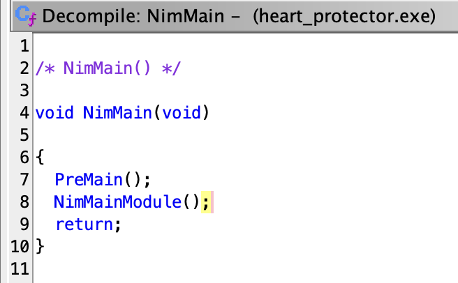
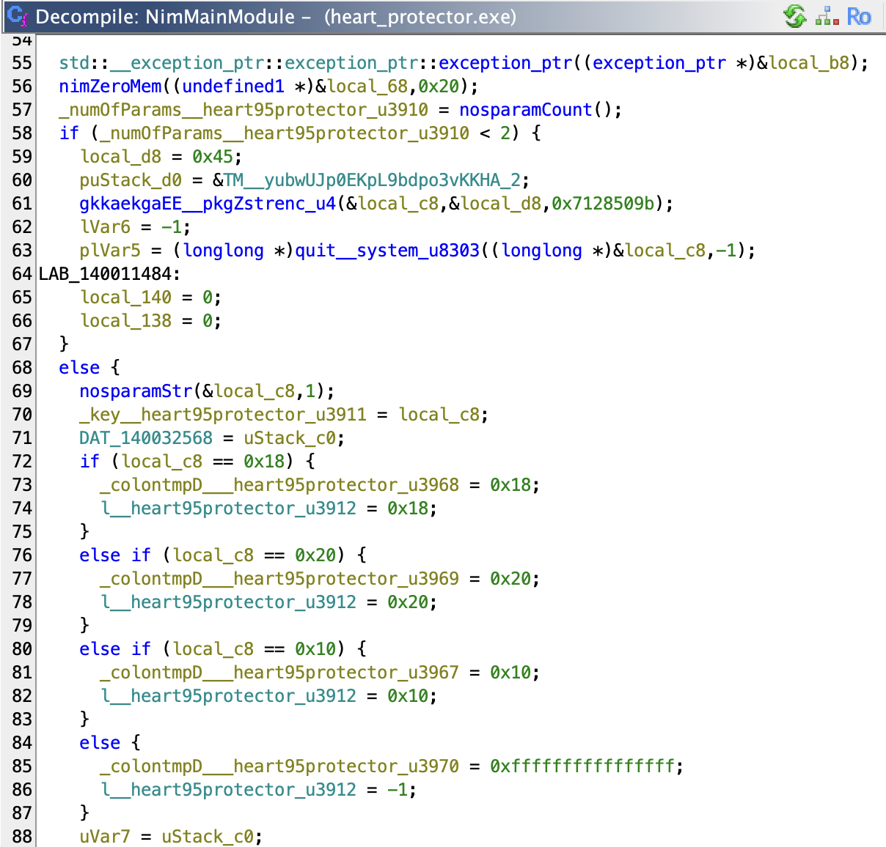
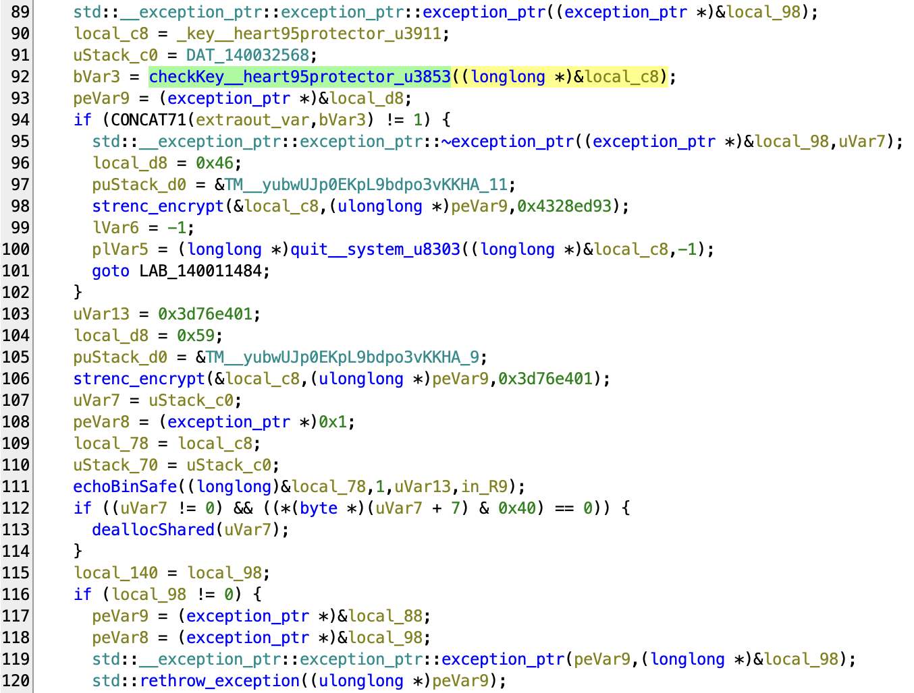
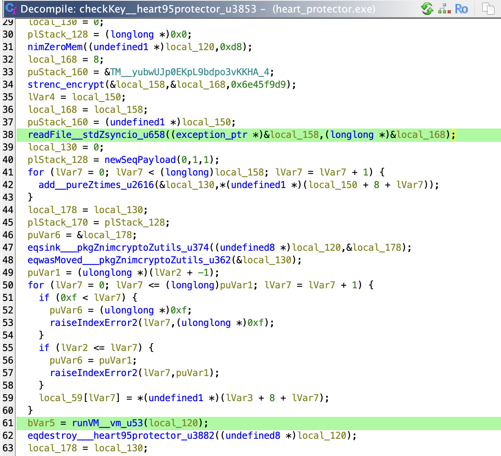
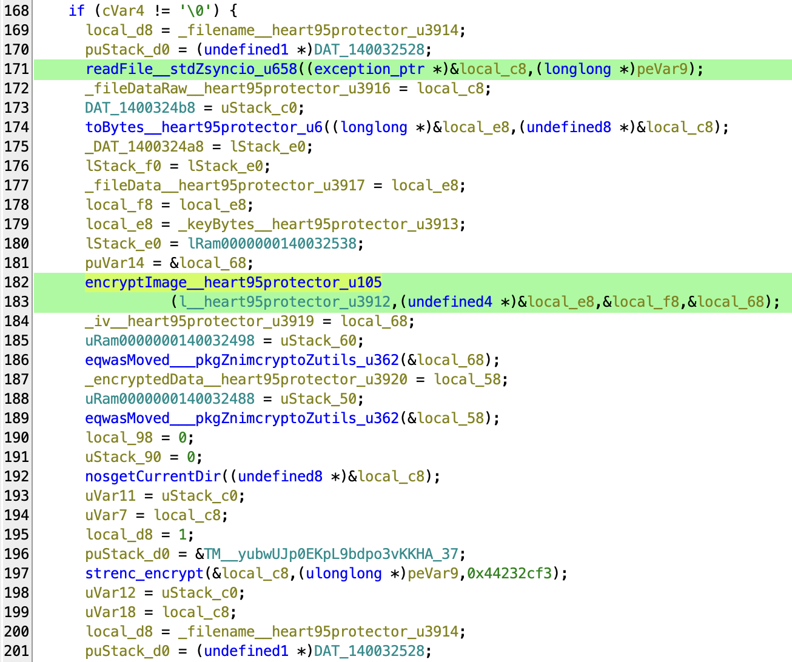
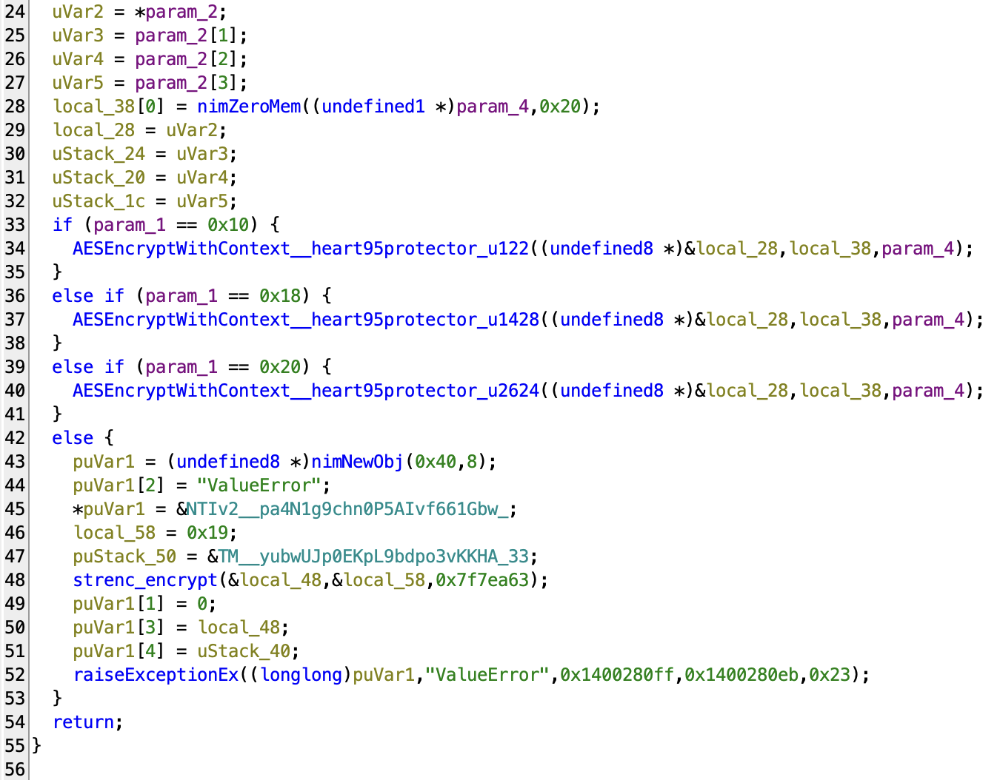
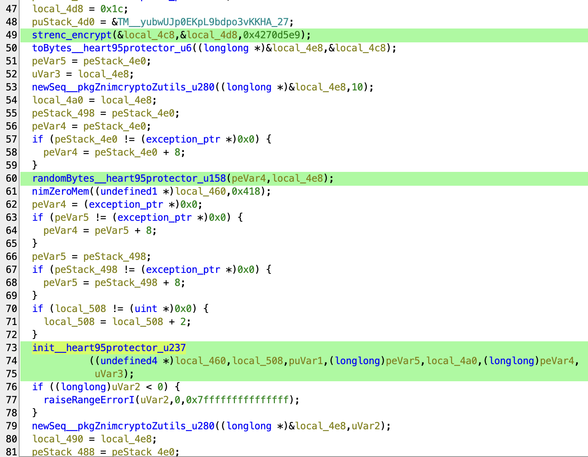

<font size='5'>Heart Protector</font>

​	14<sup>th</sup> March 2025

​	Prepared By: `rasti`

​	Challenge Author: `rasti`

​	Difficulty: <font color=red>Hard</font>

​	Classification: Official

# Synopsis

- `Heart Protector` is a hard reversing challenge. The players will have to reverse engineer the provided windows executable, written in `Nim`, and manage to obtain the AES symmetric key by analyzing the embedded virtual machine. Knowing the key, they can write a python or Nim script to decrypt `heart.png.malakar` using AES in GCM mode.


## Description

- Deep within the arcane forges of Eldoria, an ancient construct—woven from enchanted code and sealed by cryptic sigils—guards a powerful secret. Its core holds the Heart of Eldoria, concealed within layers of illusion and deception. Only those who unravel its intricate workings can restore what was lost. Will you be the one to break its curse?


## Skills Required

- Familiar with virtual machine obfuscation
- Know how to use reverse engineering tools such as Ghidra
- Familiar with reading decompiled code
- Good knowledge of the assembly language
- Know about popular packers such as UPX

## Skills Learned

- Learn how to write emulators for virtual machines
- Learn about common api hashing functions
- Learn how to write Nim for basic cryptographic tasks
- Learn how to deal with string encryption techniques
- Learn how to do UPX unpacking
- Learn about the AES-GCM mode

# Enumeration

In this challenge we are provided with three files.

```
rev_heart_protector$ file *
code.bin:            data
heart.png.malakar:   data
heart_protector.exe: PE32+ executable (console) x86-64, for MS Windows
```

Apart from `heart_protector.exe`, the files `code.bin` and `heart.png.malakar` are identified as just data so we need to inspect them furtherly.

Based on the filename and the contents of `heart.png.malakar`, we can guess that most likely this is an encrypted PNG image.

```
rev_heart_protector$ xxd heart.png.malakar

00000000: 5917 f092 01e3 5b7b ce22 5767 7d30 1da6  Y.....[{."Wg}0..
00000010: 19d7 54d4 72b8 021d 709b 5ace c8fc 1221  ..T.r...p.Z....!
00000020: 540c da30 8a50 e978 b37e d3bb bd18 847e  T..0.P.x.~.....~
00000030: 6442 a5e9 80a9 241e 8d01 8a22 6f7f 4ae3  dB....$...."o.J.
00000040: 1aee 3aeb 60ed fae7 fe27 972f a1d6 af36  ..:.`....'./...6
00000050: 3cdd 1778 38b4 5450 3d45 a9c9 7aa7 cc0e  <..x8.TP=E..z...
00000060: d9a0 d8ce b403 3e4c 8572 335f 8411 bd69  ......>L.r3_...i
00000070: 1959 39b1 0605 18e7 3061 e2b7 b5a2 b89d  .Y9.....0a......
00000080: c482 7233 484a c8e7 489c a85c d6bb 462f  ..r3HJ..H..\..F/
00000090: 08e6 f000 9a7b 85fd fe80 2ab3 c970 656d  .....{....*..pem
000000a0: ef99 3c51 b8d1 88d0 3d4d d150 aec7 84c4  ..<Q....=M.P....
000000b0: 0014 8249 cbd5 cfba 4a58 2c3d 26ae d1e8  ...I....JX,=&...
000000c0: 9a07 14a2 b905 54f3 8a57 bfef 0140 b883  ......T..W...@..
000000d0: dd95 aafc 4630 62bc 7607 a14a a26c 7d1e  ....F0b.v..J.l}.
000000e0: 319f 16e2 7c8d 87d9 d26c 392f 9d00 78ae  1...|....l9/..x.
000000f0: 131d c70a 456c 09e3 4e3a 77c6 b47e 79b6  ....El..N:w..~y.
00000100: a5b6 87bd 3c7f c3da ee50 246e 509c 474c  ....<....P$nP.GL
<REDACTED>
```

Finally, `code.bin` also contains raw data:

```
rev_heart_protector$ xxd code.bin

00000000: 4d4c 4b52 2e17 0b00 0000 0000 0b01 0000  MLKR............
00000010: 0000 0102 0002 000e 0215 1200 0700 0100  ................
00000020: 0000 0c00 1000 0000 1321 020b 0100 0000  .........!......
00000030: 000b 0210 0000 000b 0301 0000 0016 fd01  ................
00000040: 0c00 d1cb 8675 1321 020b 0105 0000 000b  .....u.!........
00000050: 0203 0000 000b 0301 0000 0016 fd01 0000  ................
00000060: 0b01 0a00 0000 0b02 0300 0000 0b03 0200  ................
00000070: 0000 16fd 0100 000b 0089 0000 000b 0104  ................
00000080: 0000 0001 0201 1a00 0200 000b 0100 0000  ................
00000090: 000b 0000 0000 0001 0201 0b03 0100 0000  ................
000000a0: 0e01 14b5 000a 0401 1803 d300 0000 0304  ................
000000b0: 0e04 15a8 0019 0203 0400 0202 010c 0103  ................
000000c0: 0000 0011 9700 0700 4d07 0000 0b01 ec7b  ........M......{
000000d0: 0900 0801 0400 0000 1a00 0100 000b 0000  ................
000000e0: 0000 000b 010b 0000 000b 0202 0000 0001  ................
000000f0: 0501 0400 0509 000d 0000 0004 0102 0c01  ................
00000100: 0f00 0000 11ef 0000 000b 002f 0200 000b  .........../....
<REDACTED>
```

A more experienced CTF player can make an educated guess that this file contains executable code for a custom **virtual machine**.

At this point it is safe to assume that the windows binary is used to encrypt `heart.png` so let us dive into the internals of the binary to understand how it works. We will use ghidra for our static analysis.


# Solution

As a common best practice, we first run `strings` on the binary to check for any interesting strings that could potentially help us in our analysis.

```
rev_heart_protector$ strings heart_protector.exe | less
!This program cannot be run in DOS mode.
UPX0
UPX1
UPX2
3.96
UPX!
8MZu
cP<H
PE4ti8
xtuD
wEzy?8x8f
D$ ^U
AUATUWVSH
|F^Lp
t^LEX
=>([
[^_Q
]A\A]
$K8L
@uU?4
!V"\
[Ei^L
cSdl
NpyZZ
AVc2@
-.bA
$(MA
H;7|
Rl$X6
p&d,
pd8|
t$x0V
3ip*F
t%dVh
:
```

One of the first few strings indicate that the binary is UPX-packed. UPX is a very popular packer used to compress and shrink the size of the original binary.

We can unpack the packed binary with the `upx` tool directly using the command `upx -d -k heart_protector.exe`.

```
rev_heart_protector$ upx -d -k heart_protector.exe
                       Ultimate Packer for eXecutables
                          Copyright (C) 1996 - 2024
UPX 4.2.4       Markus Oberhumer, Laszlo Molnar & John Reiser    May 9th 2024

        File size         Ratio      Format      Name
   --------------------   ------   -----------   -----------
    783919 <-    350767   44.75%    win64/pe     heart_protector.exe

Unpacked 1 file.
```

Let us rerun strings on the uncompressed binary. Among the thousands of strings, one might stumble upon `syncio.nim`, `system.nim`, `oserrors.nim` and `cmdline.nim`. However, even if the player misses those and proceeds with static analysis, they will find related strings there. More on that later.

With some research, one will find out that Nim [^1] is a Python-style programming language that supports compilation into several languages, such as C, Objective C, C++, JavaScript.

This is an important piece of information that we will need for our static analysis. Moving on to Ghidra. We create a new project and import the `heart_protector.exe` binary. The main function looks as follows:



It is basically a wrapper of the actual main which is inside `NimMainModule`.



As the source code was not initially written in the C language, the decompiled code is Ghidra's best try to convert Nim to C pseudocode. This adds some difficulty into our static analysis. Apart from that, in line 61, we can see the module `strenc` [^2] being used. This a nim module used for encrypting the string literals. Unfortunately, due to many people using this module for developing malware, the original author deleted the original project and now only copies of it exist.

Continuing our static analysis, in line 92, we see an interesting function being called, namely `checkKey` which we assume that receives the symmetric key as an argument.



Attempting to run the binary, we get the following:

```
C:\Users\r4sti\Desktop>heart_protector.exe
[-] The spell needs to be casted as: heart_protector.exe <key> <file>

C:\Users\r4sti\Desktop>heart_protector.exe AAAAAAAA heart.png.malakar
syncio.nim(855)          readFile
Error: unhandled exception: cannot open: code.bin [IOError]

C:\Users\r4sti\Desktop>
```

The key is passed as the first argument when calling the executable and the file to be encrypted is passed as the second. However, an error is thrown that the file `code.bin` is not present in our current directory. After copying the provided `code.bin` file, we get a different error message that the key is invalid.

```
C:\Users\r4sti\Desktop>heart_protector.exe AAAAAAAA heart.png.malakar
[-] The ancient wards reject this key... The path remains sealed. 🔒
```

## Analyzing the virtual machine

At this point, it is safe to assume that `code.bin` is somehow used for validating the key.



Indeed, we find the call to `readFile` inside `checkKey` which most likely reads `code.bin`.

<center><small>Of course, one can double-check all of this information using a debugger. This writeup showcases a static analysis approach.</small></center>

Last but not least, this function calls `runVM` from the `vm.nim` module. Virtual machines are used as an obfuscation technique. Usually, a custom CPU instruction set and a custom assembly-like code is developed for performing a specific task. The purpose is to make the task of reverse engineering harder for the analyst. A common approach to defeat this protection is writing an emulator for the virtual machine so that one can parse it independently of the binary. This is helpful as the analyst can add print statements and figure out the execution flow of the virtual machine. We will showcase how a python emulator would look like for the first few opcodes of this virtual machine.

```python
from pwn import u8, u16, u32
from hashlib import sha256
import os

def ror(a, r):
    return 0xffffffff & ((a >> r) | (a << (32-r)))

def rol(a, r):
	return ror(a, 32-r)

code = open('code.bin', 'rb').read()

DEBUG = False

PC = 5	# skip "MLKR." header
finish = False
MEM_SIZE = 128
MP = 0
REGS_NUM = 7

memory = [0 for _ in range(MEM_SIZE)]
regs = [0 for _ in range(REGS_NUM)]
RET_ADDRESS_STACK = []
flags = {
    'zf': 0,    # zero flag
    'sf': 0,    # sign flag
    'cf': 0,    # carry flag
    'tf': 0     # trap flag
}

while not finish:
    opcode = code[PC]

    if DEBUG:
        print(f'PC @ 0x{PC:x}')
        print(f'[OP={opcode}]')
    
    if opcode == 0:
        # store
        arg1 = code[PC+1]
        memory[MP] = regs[arg1]
        MP += 1
        if DEBUG:
            print(f'store R{arg1}')
        PC += 2

    elif opcode == 1:
        # load
        arg1 = code[PC+1]
        arg2 = code[PC+2]
        regs[arg1] = memory[regs[arg2]]
        if DEBUG:
            print(f'load R{arg1},M[R{arg2}]')
        PC += 3

    elif opcode == 2:
        # inc
        arg1 = code[PC+1]
        regs[arg1] += 1
        if DEBUG:
            print(f'inc R{arg1}')
        PC += 2

    elif opcode == 3:
        # dec
        arg1 = code[PC+1]
        regs[arg1] -= 1
        if DEBUG:
            print(f'dec R{arg1}')
        PC += 2

    elif opcode == 4:
        # add
        arg1 = code[PC+1]
        arg2 = code[PC+2]
        regs[arg1] = (regs[arg1] + regs[arg2]) & 0xffffffff
        if DEBUG:
            print(f'add R{arg1},R{arg2}')
        PC += 3
```

Having emulated the VM, one might see that at some point, the constant value `0x811c9dc5` is loaded into a register. By researching this constant, we find the 32-bit hash function `FNV1` [^3].

We can implement this hash function in python as:

```python
def fnv1(data):
    val = 0x811c9dc5
    for c in data:
        val = ((0x1000193 * val) ^ c) & 0xffffffff
    return val
```

Along with `FNV1`, there is also another hash function used named `add_ror13` and can be implemented with Python as:

```python
def add_ror13(data):
		val = 0
		for i in data:
				val += i
				val = ror(val, 0xd)
		return val
```

From our emulator, we deduce that the key should be a hex string and is validated in five different groups of key characters. The order is provided below:

1. $10, 12, 14$
2. $0,1,2,3$
3. $5,6,7$
4. $4$
5. $11,13,15$

After the process of each group, the final values are compared against some target values appended to the end of `code.bin` (in little endian). More specifically, the starting offset of the target values is `0x22f`.

```
00000200: 9d1c 810b 0400 0000 0001 0501 1800 9301  ................
00000210: 0001 1a00 0504 0103 0204 0d04 0213 0902  ................
00000220: 1c0b 0000 0000 001c 0b00 0100 0000 1c53  ...............S
00000230: fdc9 edd1 9eca 1e51 2c9a 69b9 0000 0040  .......Q,.i....@
00000240: 0d10 cb                                  ...
```

The values are `0xedc9fd53`, `0x1eca9ed1`, `0x699a2c51`, `0x000000b9` and `0xcb100d40`.

The key groups are processed as follows:

- $\text{FNV1}(K_{10,12,14})$
- $(621548 << 4) \oplus (\sum^{j = 3}_{j = 0}(K_j \cdot 211^j) - 1869)$​
- $\text{FNV1}(K_{5,6,7})$
- $K_4 \oplus 137$
- $\text{FNV1}(K_{11,13,15})$

We can then write a python code to recover the plaintexts used to produce the target values.

```python
import itertools
from pwn import u32

code = open('code.bin', 'rb').read()

enc_start = 0x22f
enc_data = code[enc_start:enc_start+4*5]

target_value_start = 0x42
target_value = u32(code[target_value_start:target_value_start+4])

enc_parts = [u32(enc_data[i:i+4]) for i in range(0, len(enc_data), 4)]

key = [-1 for _ in range(16)]

key[4] = enc_parts[3] ^ 137
key[8] = 50
key[9] = 97

alph = '0123456789abcdef'

for comb in itertools.product(alph, repeat=3):
    inp = ''.join(comb).encode()
    h1 = fnv1(inp)
    h2 = add_ror13(inp)
    if h1 == enc_parts[0]:
        key[10:15:2] = list(map(ord,comb))
    if h1 == enc_parts[2]:
        key[5:8] = list(map(ord,comb))
    if h2 == enc_parts[-1]:
        key[11:16:2] = list(map(ord,comb))

key0123_encoded = (enc_parts[1] ^ rol(621548, 4)) + 1869

key0123 = ''
P = 211

for i in range(4):
    key[i] = key0123_encoded % P
    key0123_encoded //= P
    
key = bytes(key)
```

It turns out that multiple keys are extracted from this method so an additional target value `0x7586cbd1` is embedded into the VM code so that the player can determine the correct key.

```python
assert fnv1(key) == 0x7586cbd1

key = key.decode()
print(f'{key = }')
```

## Decrypting the encrypted image

Having figured out the key, what is left is to decrypt the image `heart.png.malakar`.

Back to the main method, after the call to `checkKey`, there is the following code.



In line 171, `readFile` is used to read the raw bytes of our second argument, which is the file to be encrypted (in our case `heart.png`).

In line 182, `encryptImage` is called which is responsible for encrypting the provided image.



The cipher that encrypts the image is AES-128. What is left is figure out the encryption mode. Let us inspect `AESEncryptWithContext`.



With the help of the `nimcrypto` Nim module's source code and potentially the help of a debugger, one should identify that the image is encrypted using AES in GCM mode. This mode requires the following data:

- Initialization Vector (IV)
- Additional Authentication Data (AAD)

Starting with the AAD, they are passed as a string literal which is decrypted on the runtime as `HTB_CA2K25_f0r_l0rd_m4l4k4r!`. One might find that using a debugger or manually decrypting the string.

The IV is actually constructed at line 53 as 10 random bytes. Even though the IV in AES should always be 16 bytes, looking at the `nimcrypto` module source code [^4], one can see that if the length of the IV is not exactly 12 bytes, it is first hashed using the `ghash` algorithm and the hash is then used as the IV. However, we still do not know the 10 bytes of the IV and bruteforcing them is out of question as the bruteforce would be completed after the end of the CTF. Looking at the raw data of the encrypted image, we would expect their length to be a multiple of 16 as AES was used to encrypt it but in fact, that is not the case.

```
rev_heart_protector$ xxd heart.png.malakar

<REDACTED>
000b2e00: 0066 d3e3 b7d0 4fc8 e5aa ce3b 1ae1 c0f8  .f....O....;....
000b2e10: 8087 ad08 ecc0 fd7d 0035 5182 1d96 95d1  .......}.5Q.....
000b2e20: a9c6 6deb 3759 6d5f 6230 eeba e816 f63a  ..m.7Ym_b0.....:
000b2e30: c47d 44df c02f 7e08 f2ca eebf 29b6 0912  .}D../~.....)...
000b2e40: 13c2 3f07 616f a098 0914 47ba 453d 63ac  ..?.ao....G.E=c.
000b2e50: 9016 f522 06d9 efd8 b2c9 0ea6 0406 74af  ..."..........t.
000b2e60: 2ce1 0778 82c9 4020 9e4a ce48 2d09 c6b4  ,..x..@ .J.H-...
000b2e70: fecc d8ba 9ba7 0121 30d8 e889 3ab6 0c74  .......!0...:..t
000b2e80: 6f0f a211 e64a 46d4 5cca 656c 62a3 7bdc  o....JF.\.elb.{.
000b2e90: 05fe 03ac 07b0 c5d3 ccb1 e6f5 f9dc 0d67  ...............g
000b2ea0: 29e4 fbfb 29cc f832 d504 0e98 3bf5 2791  )...)..2....;.'.
000b2eb0: b4
```

With some static analysis, the player can determine that the IV is the first ten bytes of `heart.png.malakar`. Now, we have all the components to decrypt the image. One could implement it in python to mimic the functionality of `nimcrypto` or use the same module since there is already an implementation of `ghash`. We choose the second option.

```nim
import nimcrypto

proc toBytes(s: string): seq[byte] =
    return @(s.toOpenArrayByte(0, s.high))

let key = toBytes("<REDACTED>")
let AAD = toBytes("...")

let encFileDataRaw = toBytes(readFile("heart.png.malakar"))

var IV = encFileDataRaw[0 .. 9]

var decryptContext: GCM[aes128]
decryptContext.init(key, IV, AAD)

var plainText = newSeq[byte](len(encFileDataRaw)-10)

decryptContext.decrypt(encFileDataRaw[10 .. ^1], plaintext)

let Header: array[4, byte] = [137'u8, 80'u8, 78'u8, 71'u8]

if plaintext[0 .. 3] == Header:
    writeFile("heart.png", plaintext)
```

Running this nim script, creates a file `heart.png` in our current directory which contains the flag.


[^1]: https://nim-lang.org/
[^2]: https://github.com/nim-meta/strenc
[^3]: https://en.wikipedia.org/wiki/Fowler%E2%80%93Noll%E2%80%93Vo_hash_function
[^4]: https://github.com/cheatfate/nimcrypto/blob/master/nimcrypto/bcmode.nim#L1001
