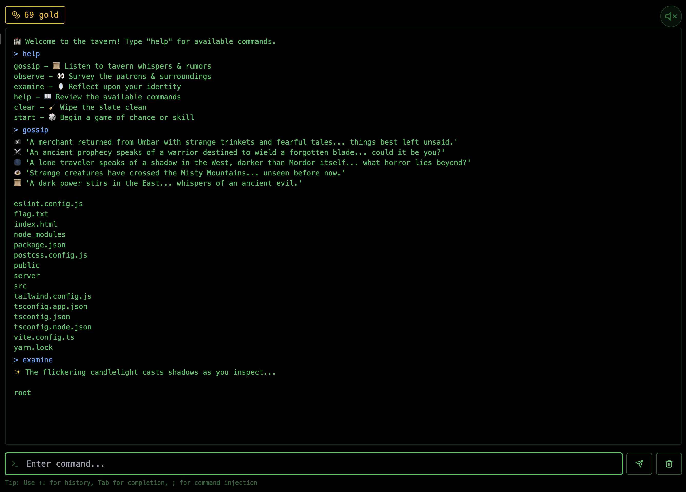
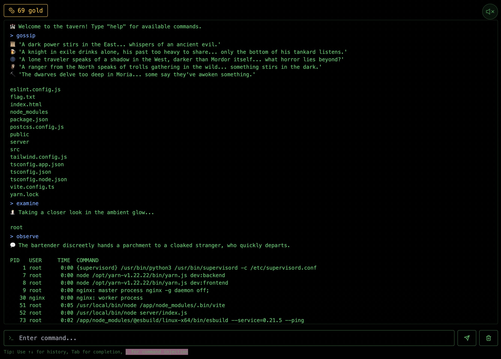
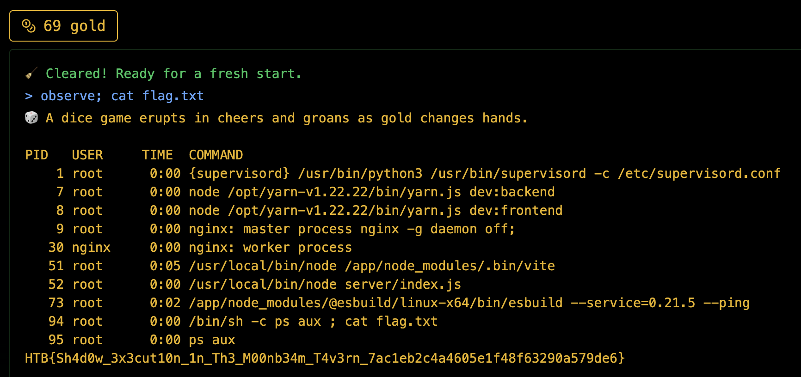

<font size='5'>Whispers of the Moonbeam</font>


24<sup>th</sup> March 2025

Prepared By: makelaris

Challenge Author: makelaris

Difficulty: <font color='green'>Very Easy</font>


# Synopsis

Whispers of the Moonbeam is a very easy web challenge. Players will determine that terminal commands are system commands and execute command injection in order to get the flag.

## Skills Required

- Knowledge of Linux commands

## Skills Learned

- Performing command injection

# Solution

When we visit the site, we're greeted with a terminal application that accepts comamnds.



Typing commands like `gossip`, `observe` and `examine` will seemingly provide us linux command outputs, indicating it's running system commands. There's also a hint to use `;` for command injection.



We see the `flag.txt` on the `gossip` command, we can use command injection to `cat flag.txt`, using this payload:

```sh
observe; cat flag.txt
```

And we get the flag!
